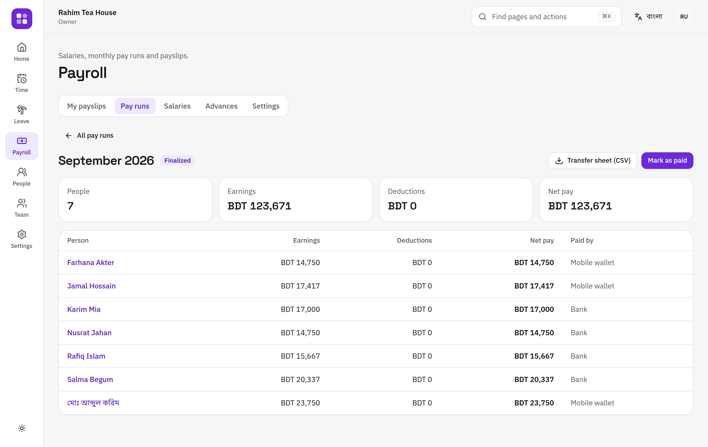
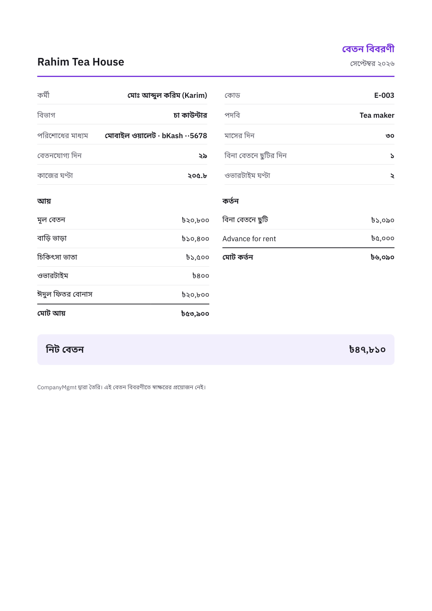
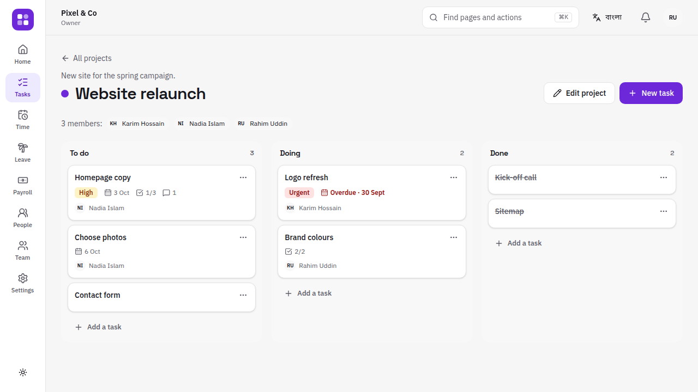
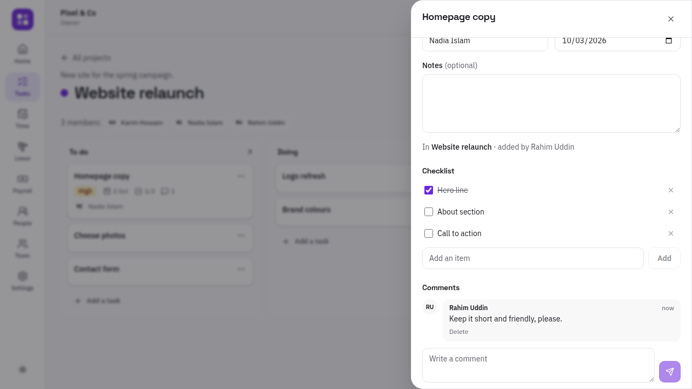
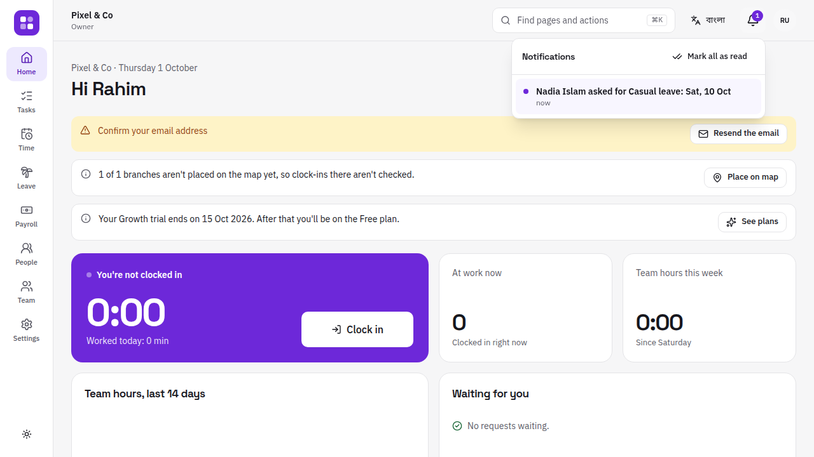
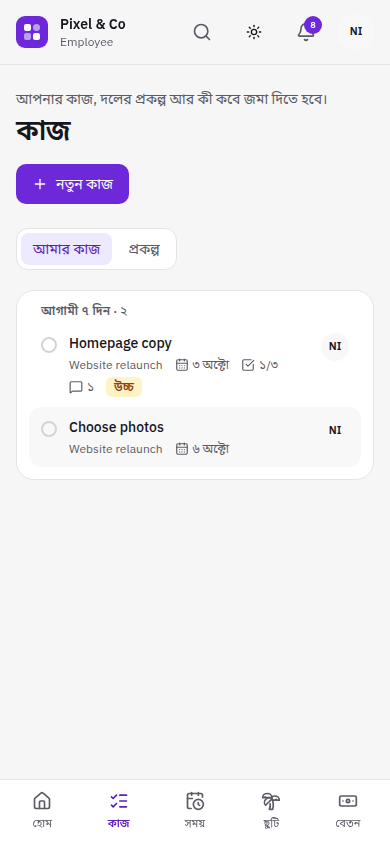
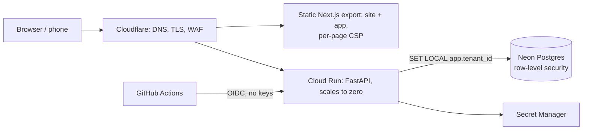

# CompanyMgmt

**One place to run a company: people, attendance, leave, payroll, tasks and projects, for
every business from a tea stall with two staff to an agency with many branches.**
Multi-tenant SaaS in English and বাংলা, with clock-ins checked against each branch's
location, built so a permission-aware AI assistant can sit on top of it later.


> **Status:** Milestones 1 and 2 are built and tested (accounts, people, attendance,
> leave, payroll, data rights), and Milestone 3 is under way: the foundations for AI,
> notifications, tasks and projects, announcements, and documents and policies are done;
> an approvals inbox and onboarding checklists come next. It isn't live yet; deployment is
> scripted and waits on cloud accounts ([deploy runbook](docs/runbooks/deploy.md)).
> [Roadmap](docs/IMPLEMENTATION_PLAN.md#9-phased-roadmap) · [progress](docs/PROGRESS.md).

## What it does today

- **Sign up in two minutes.** Pick your language and business type; the workspace switches
  on only what you need, with a 14-day trial of the Growth plan.
- **Clock in from any phone, at work.** One big button. Each branch has an area on the
  map; clock-ins outside it are refused or flagged (the owner chooses), with a clear
  message such as "You're about 1.2 km from Gulshan kiosk". Locations are saved only at
  clock-in and clock-out, rounded to about 11 m. Overnight shifts count towards the day
  they started, and every branch keeps its own time zone.
- **Fair fixes.** Forgot to clock out? People ask for a correction; a manager approves or
  rejects it; everything is recorded. Nobody can approve their own request.
- **Monthly timesheets** per person per day, with a spreadsheet export that is safe to open
  in Excel (Bangla names intact, formulas neutralised).
- **Leave.** People ask for leave from their phone and see what's left before they send it.
  Managers approve in one tap; the team calendar shows who is away (colleagues see that
  someone is away, not why). Balances handle mid-year joiners, monthly accrual and
  carry-over; the work week and public holidays don't count. Bangladesh workspaces start
  near the Labour Act 2006 (casual, sick, earned, maternity), Friday off.
- **Payroll.** Salaries (basic, house rent, medical, conveyance; monthly, hourly or daily)
  paid by cash, bank or bKash-style wallets. Each month is a pay run: draft → approval →
  finalized → paid, built from attendance (overtime), unpaid leave, festival bonuses,
  advances and one-off items. Whoever prepares it can't finalize it. Payslips download as
  PDF in English or Bangla; a transfer sheet lists who to pay where. Salary tax is an
  editable table, off until the owner checks it.
- **Tasks and projects.** Projects with members and a home department, planned on a board
  (To do, Doing, Done) with drag and drop and a keyboard-friendly move menu. Tasks have an
  assignee, due date, priority, checklist and comments. "My work" lists each person's open
  tasks, overdue first, on its own page and on the home screen. Members work on their
  projects; managers run the projects of their own departments.
- **Announcements.** Post news to everyone, some branches or some departments, pin what
  matters, and see who has read it ("read by 12 of 30", and who hasn't yet). Managers post
  to their own teams only.
- **Documents and policies.** Publish the handbook, policies, how-tos and forms, choose
  who reads each (everyone, some roles, some departments), keep every version, and ask
  people to acknowledge the policies that matter ("acknowledged by 12 of 30"). Uploads
  are checked by their content and always download as files.
- **Notifications.** A bell in the header tells people what needs them and what was decided:
  leave and time-fix requests go to whoever can approve them for that person's department,
  decisions go back to the person, payslips announce themselves (without the run's totals),
  and tasks tell their assignee and their creator. Nobody is told about their own actions.
  A daily email lists what someone hasn't read yet, in their language, and can be turned off.
- **People and departments.** Profiles, a department tree and branches. Managers see only
  their own part of the tree.
- **Staff without email.** Add a cashier with a username; they sign in with the workspace
  code and must choose their own password on first sign-in.
- **Roles.** Owner, Admin, Manager, Accountant, Cashier, Employee, plus custom roles.
  Nobody can grant a permission they don't hold.
- **Security you can see.** Two-step verification (which a workspace can require for
  owners and admins), a list of signed-in devices, and an audit log with a built-in
  integrity check.
- **Your data stays yours.** Owners export everything as a ZIP and can restore it into a
  new workspace; everyone can download what a workspace holds about them. Deleting a
  workspace can be undone for 30 days, then everything is erased and the owner gets a
  signed certificate. Nightly encrypted backups are kept for 30 days.
- **Your look.** Light by default, dark mode, and four accent colours; every screen
  passes WCAG 2.2 AA checks in both modes.

| | |
|---|---|
|  |  |
|  |  |
|  |  |
|  |  |
|  |  |
|  | |

<p align="center">
  
  
  
  
  
</p>

## How it's built



| Layer | Choice | Why |
|---|---|---|
| API | Python 3.12, FastAPI, SQLAlchemy 2 (async, psycopg 3), Alembic | Typed, fast to build, generates an OpenAPI contract |
| Data | PostgreSQL 16 with **forced row-level security** on every tenant table | Isolation enforced by the database, not only by code |
| Web | Next.js 16 (App Router, static export), React 19, TypeScript, Tailwind 4, Radix primitives, TanStack Query, i18next | One app for the site and the product; static files, so free to host; typed client generated from the API |
| Hosting | Cloud Run + Neon + Cloudflare Pages | Everything scales to zero: about $1/month with no customers (the domain) |
| Infra | OpenTofu, GitHub OIDC → least-privilege service accounts | Reproducible, no long-lived keys |

A modular monolith: `platform` (accounts, workspaces, roles, plans), `people`,
`attendance`, `leave`, `payroll`, `tasks`, `announcements`, `documents`, `notifications` and `privacy` (exports,
imports, deletion). Each module only depends on the ones below it, and none depends on the
AI layer; import-linter enforces both in CI. Business logic lives in typed service
functions that the routes call.

### Ready for AI, without AI yet

The assistant (Milestones 6–7) will never touch the database. It will see what the person
asking may see, and nothing else:

- **Capability registry.** Every module describes what it can do as typed capabilities
  (`people.search`, `leave.balances`, `tasks.my_work`, `payroll.my_payslips`…), each with
  input and output schemas, the permission and module it needs, and whether it reads or
  changes data. They are listed and called under `/v1/ai`, as the signed-in person, with
  the same checks as the API. Capabilities that change data are refused until
  propose-and-confirm exists.
- **A test proves it:** every read capability gives exactly the same answer, or the same
  refusal, as its REST route for an owner, a department-scoped manager and an employee.
- **Context builder.** One call turns a request into the facts a model needs: workspace,
  role, permissions, department scope, branch, language, time zone and today's date there.
- **Domain events.** Important changes (leave decisions, time fixes, payroll, task
  assignments and comments) are written to an append-only event log in the same
  transaction as the change. Notifications are built from it now; automations and a weekly
  brief will read it later.

### Tenant isolation, three layers

1. **App:** the workspace comes from the signed token, and membership and role are
   reloaded on every request (so a role change applies immediately).
2. **Database:** every tenant table has `FORCE ROW LEVEL SECURITY` with a policy on
   `app.tenant_id`, set per transaction. The API's database role doesn't own the tables
   and can't bypass RLS. With no workspace set, queries return nothing.
3. **References:** composite foreign keys `(tenant_id, id)`, so a row can never point at
   another workspace's row.

A test calls **every API route that takes an id** with another workspace's ids (the routes
are discovered automatically, so new ones are covered) and checks that nothing leaks or
changes.

### Security (OWASP ASVS 5.0 Level 2 target)

Argon2id passwords checked against 100k breached passwords · 10-minute EdDSA access tokens
kept in memory · rotating refresh tokens in an httpOnly, SameSite=Strict cookie, where
reusing an old one ends the session · TOTP two-step verification with recovery codes ·
step-up confirmation for sensitive actions · rate limits with a CAPTCHA after repeated
failures · append-only, hash-chained audit log · AES-256-GCM field encryption bound to
each record · strict security headers and CSP · CSV formula-injection protection. Status
and evidence for each item: [docs/security/asvs-l2.md](docs/security/asvs-l2.md).

### Tests

- **205 API tests**, 93% line and branch coverage (CI gate: 85%), all against a real
  Postgres: auth, isolation, workspaces, people, attendance, location checks, leave,
  payroll (pay maths checked with Hypothesis; 500 people run in about a second), data
  export, import, deletion and audit retention, plans, notifications and the daily
  digest, domain events, tasks and projects, announcements, documents (including unsafe uploads), and capability
  parity with the API.
- **Browser journeys** (Playwright) on desktop and phone, against the production build
  with its real security headers: sign up → add staff → staff signs in in Bangla and
  clocks in → owner sees the timesheet; a staff member 2 km away is refused and let in at
  the branch; staff ask for leave and the owner approves it (and hears about it from the
  bell); the owner runs payroll and staff download their payslip; a manager plans a project
  on a board and staff work through their tasks; an owner posts news and sees who has read it; staff read and acknowledge a policy; an owner exports, imports, deletes and
  restores a workspace; forms keep what was typed on a slow connection; dark mode and
  accents. 13 scenarios, each on desktop and phone. **axe WCAG 2.2 AA** checks, a
  no-sideways-scrolling check and a CSP-violation check run on every page visited.
- Edge cases (overnight shifts, daylight saving, leap days, double clicks, stale edits,
  Bangla and RTL names, replayed tokens…) are mapped to their tests in
  [docs/testing/edge-cases.md](docs/testing/edge-cases.md).
- 25 web unit tests (Vitest) for dates, time zones, money, location and the API client.
- CI also runs ruff, mypy `--strict`, ESLint, TypeScript, a migration drift
  check, an API contract check, gitleaks, pip-audit, npm audit, Trivy and CodeQL.

## Run it locally

Requirements: Python 3.12 with [uv](https://docs.astral.sh/uv/), Node 22, PostgreSQL 16.

```bash
cp .env.example .env
scripts/dev-db.sh                                   # local roles and databases
cd api && uv sync && uv run alembic upgrade head
uv run uvicorn app.main:app --reload                # http://localhost:8000
uv run python -m scripts.demo_seed                  # optional: a demo workspace
cd ../web && npm install && npm run dev             # http://localhost:3000
```

Before pushing, run everything CI runs: `scripts/check.sh` (add `E2E=1` for the browser
tests).

## Project documents

- [Implementation plan](docs/IMPLEMENTATION_PLAN.md): audit of the original university
  project, product scope, architecture, security, testing, billing, costs, roadmap.
- [Progress](docs/PROGRESS.md) · [Deploy runbook](docs/runbooks/deploy.md) ·
  [Restore runbook](docs/runbooks/restore.md)

This started as a group project for CSE327 at North South University (the original is
preserved in [327_Company_Management_System](https://github.com/omikhan4901/327_Company_Management_System)).
CompanyMgmt is a ground-up rewrite as a real product.

## License

Copyright © 2026 Mehboob Ehsan Khan. All rights reserved. The source is public for
portfolio purposes; it is not open-source licensed.
