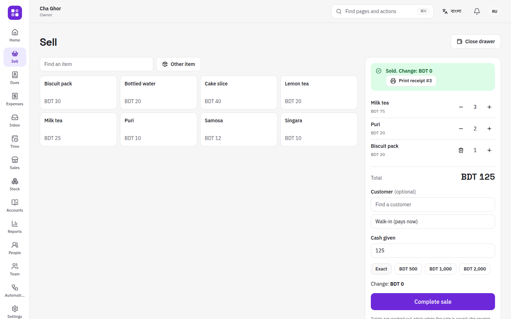
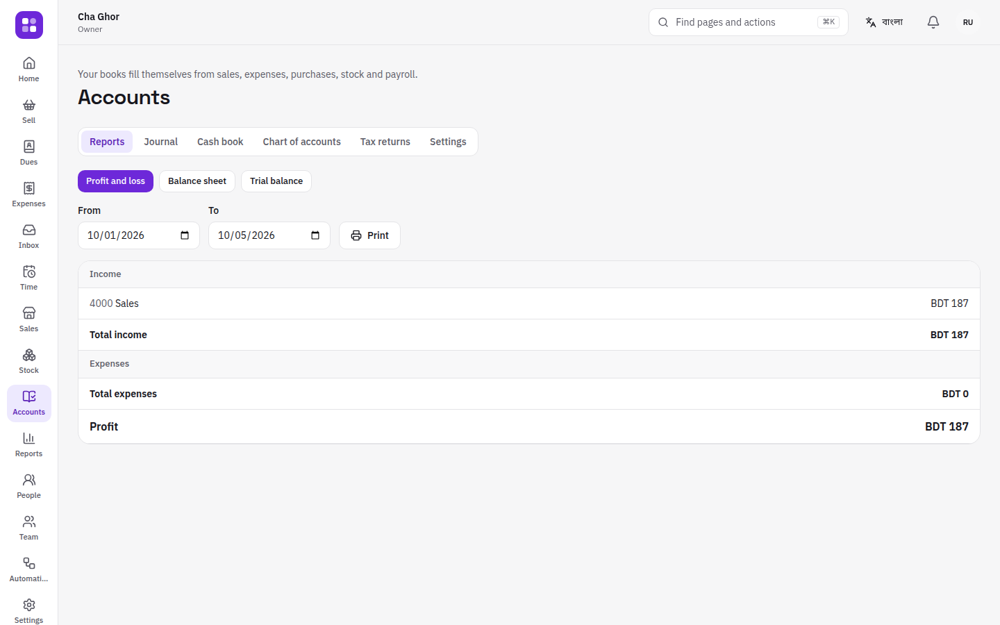
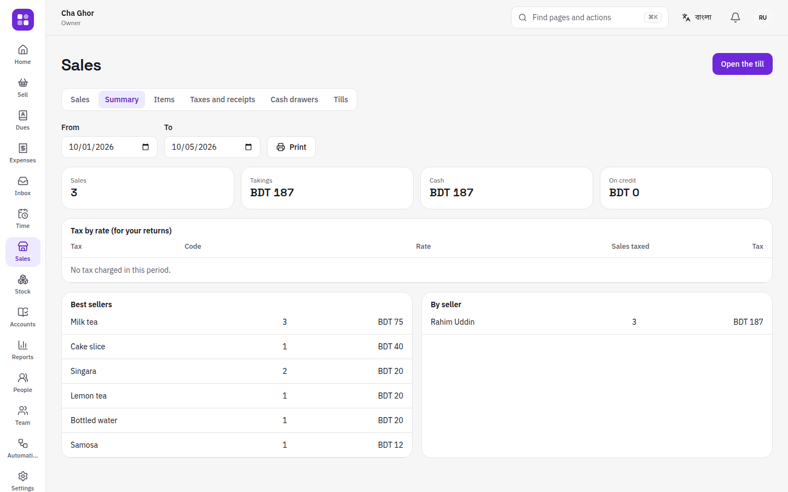
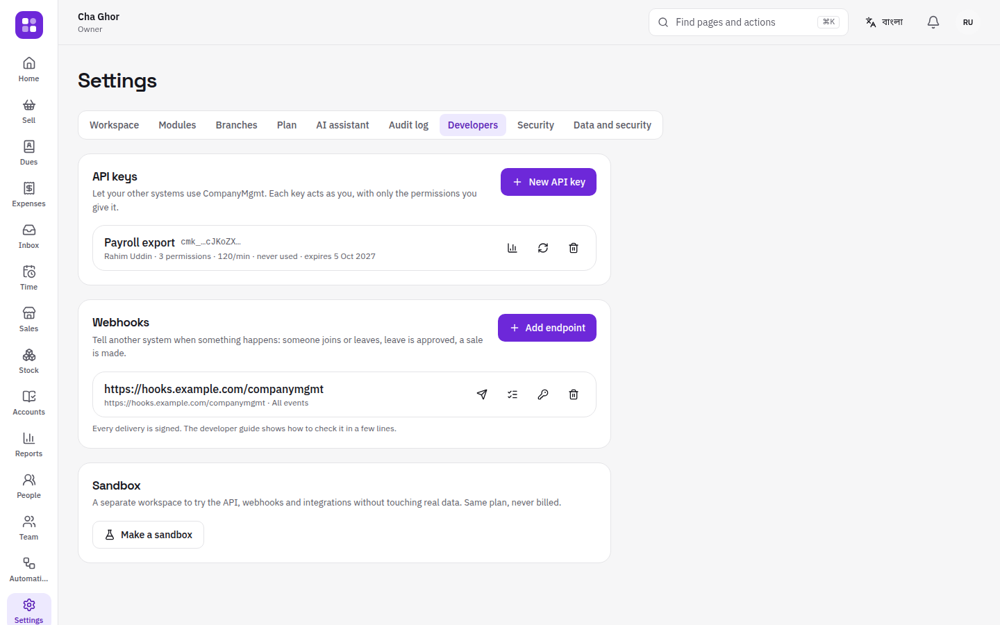
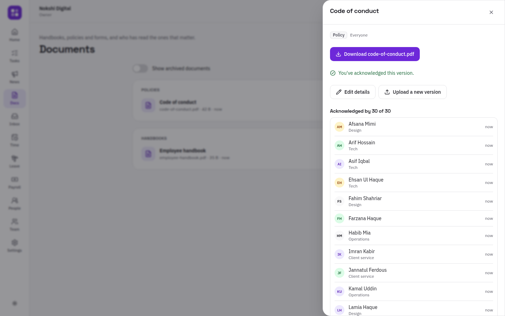
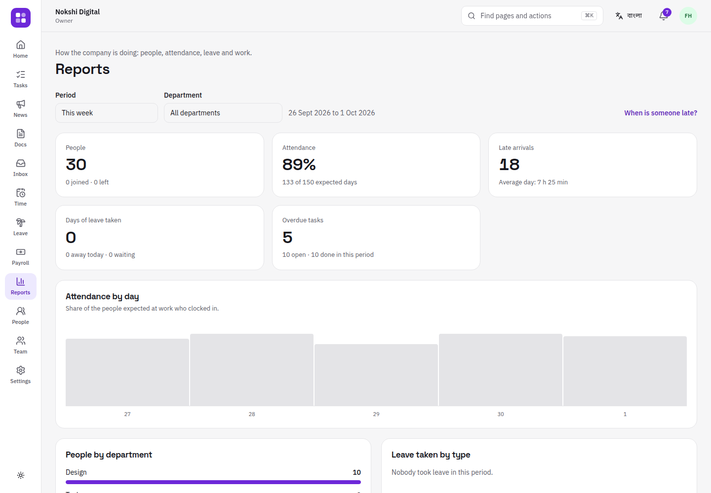
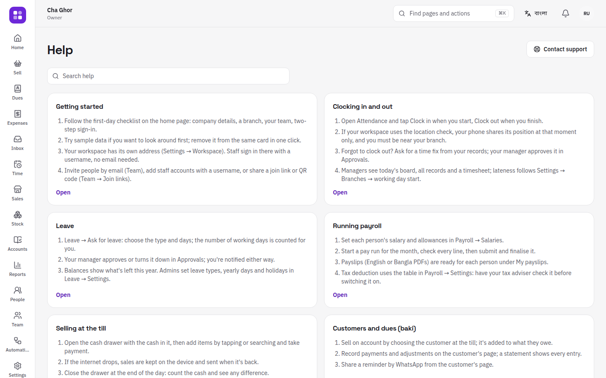
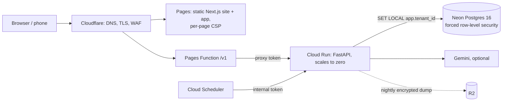

# CompanyMgmt

**One place to run a company: people, attendance, leave, payroll, tasks, a till, customers'
dues, stock and the books — for every business from a tea stall with two staff to a
company with many branches.** Multi-tenant SaaS in English and বাংলা, with clock-ins
checked against each branch's location, double-entry books that keep themselves, an AI
assistant that only sees what the person asking may see, and an API for other systems.


> **Status (5 October 2026): feature-complete and tested, not yet live.** Every planned
> milestone is built except billing (M5, on hold by the owner's decision). 321 API tests
> on a real Postgres at 91% coverage, 33 web unit tests, and browser journeys on desktop
> and phone with accessibility and CSP checks. Going live takes about an hour with the
> owner's cloud accounts and costs about $1 a month until there are customers.
>
> **Start with the [handbook](docs/handbook/README.md)**: running it, how every part
> works, the user flows, going live cheaply, and adding features yourself.

## What it does

**People and time**
- **Clock in from any phone, at work.** Each branch has an area on the map; clock-ins
  outside it are refused or flagged ("You're about 1.2 km from Gulshan kiosk"). Locations
  are saved only at clock-in and clock-out. Overnight shifts, time zones, fair time fixes
  with approval, monthly timesheets.
- **Leave** with balances that explain themselves (accrual, carry-over, mid-year joiners),
  a team calendar that shows who is away but not why, and Bangladesh Labour Act defaults.
- **Payroll** from attendance, leave, bonuses and advances; draft → approval → finalized →
  paid with four eyes; payslip PDFs in English or Bangla; a transfer sheet for cash, bank or
  mobile wallets.

**Work**
- **Tasks and projects** on boards, "My work" for everyone, **onboarding checklists** that
  start themselves when someone joins.
- **Announcements** with read receipts; **documents and policies** with versions and
  acknowledgements; **one approvals inbox**; **reports** (attendance rate, lateness, leave,
  overdue work) by email weekly or monthly, with early-warning **signals**.
- **Automations**: "every working day at 10, tell managers who hasn't clocked in"; "when
  someone joins, create their laptop task".

**The shop and the books**
- **A till** that works offline, prints receipts from the browser, handles returns, voids
  and cash drawers, and runs on a shared device with **cashier PINs**.
- **Taxes are the workspace's own** (names, rates, inclusive or exclusive, compound): no
  country's rules are guessed.
- **Customers' dues** ("baki khata") with credit limits, statements and WhatsApp reminders;
  **expenses** with receipt photos and petty cash.
- **Stock** per branch with weighted average cost, purchases, suppliers, transfers and counts.
- **Double-entry books** that post themselves from every sale, purchase, payment, expense and
  pay run: trial balance, profit and loss, balance sheet, ledgers, and tax-return templates
  the workspace's accountant designs.

**AI, optional and contained**
- Switched on by one key (Gemini), then by each workspace's owner, feature by feature.
- "Ask my company" answers with numbered sources, using only what the asker may see.
- It can **propose** tasks, leave or posts; nothing happens until the person confirms.
- Writing help in both languages, document summaries, a weekly brief, automation drafts.

**For larger companies and developers**
- API keys with chosen permissions, signed webhooks, idempotency keys, a stable versioned
  API with TypeScript and Python SDKs ([developer guide](docs/api/README.md)).
- Company sign-in (OpenID Connect), SCIM provisioning, passkeys, a network allowlist,
  audit log export, sandbox workspaces.

**Everyone's data stays theirs**
- Exports and restores, personal data downloads, deletion with a 30-day undo and a signed
  certificate, nightly encrypted backups.

| | |
|---|---|
|  |  |
|  |  |
|  |  |
|  |  |
|  |  |
|  |  |
|  |  |
|  |  |

<p align="center">
  
  
  
  
</p>

## Plans

| Free | Starter | Growth | Business | Enterprise |
|---|---|---|---|---|
| $0 · 5 people · 2 modules | $9/mo · 15 people · 4 modules | $29/mo · 50 people · all modules · custom roles | $79/mo · 150 people included · API & webhooks | by agreement · company sign-in & SCIM |

Every workspace starts with a 14-day Growth trial. (Online payment, milestone M5, is on
hold; plans and limits are enforced.)

## How it's built



| Layer | Choice |
|---|---|
| API | Python 3.12, FastAPI, SQLAlchemy 2 async, Alembic — a modular monolith of 20 modules with import boundaries enforced |
| Data | PostgreSQL 16 with **forced row-level security** on every tenant table, a non-owner app role, composite foreign keys |
| Events | an append-only domain event log and a transactional outbox: modules react to each other without depending on each other |
| Web | Next.js 16 static export, React 19, TypeScript, Tailwind 4, Radix, TanStack Query, i18next; types generated from the API |
| AI | Gemini behind a provider port; the model only reaches data through permission-checked capabilities, as the asker |
| Hosting | Cloud Run + Neon + Cloudflare Pages + R2: about **$1/month** with no customers |
| Infra | OpenTofu, least-privilege service accounts, Secret Manager, budget alerts |

**Security** (OWASP ASVS 5.0 level 2 target, [evidence](docs/security/asvs-l2.md)):
three layers of tenant isolation proven by a test that calls every id route with another
workspace's ids; Argon2id with a breached-password check; 10-minute EdDSA tokens in memory
and rotating httpOnly refresh cookies with theft detection; TOTP, passkeys and OIDC;
step-up for sensitive actions; rate limits with a CAPTCHA; a hash-chained audit log;
AES-256-GCM field encryption; SSRF-safe webhooks; per-page CSP; formula-safe exports.

**Tests:** 321 API tests on a real Postgres (91% line and branch coverage; property tests
for pay maths and for the books always balancing), capability parity between the AI and
the REST API, a public-API breaking-change check, 33 web unit tests, and Playwright
journeys on desktop and phone (a 30-person agency's week, a shop day from the till to the
books, and more) with axe WCAG 2.2 AA and CSP checks on every page. Status and what still
needs real services: [docs/UNTESTED.md](docs/UNTESTED.md).

## Run it locally

Python 3.12 + [uv](https://docs.astral.sh/uv/), Node 22 and PostgreSQL 16 (details and
troubleshooting: [handbook chapter 2](docs/handbook/02-run-locally.md)):

```bash
cp .env.example .env
scripts/dev-db.sh                                   # local roles and databases
cd api && uv sync && uv run alembic upgrade head
uv run uvicorn app.main:app --reload                # http://localhost:8000/docs
uv run python -m scripts.demo_seed                  # optional: a demo tea house
cd ../web && npm install && npm run dev             # http://localhost:3000
```

Before every push: `scripts/check.sh` (add `E2E=1` for the browser journeys). It's the
only gate: GitHub Actions are switched off.

## Documentation

| | |
|---|---|
| [Handbook](docs/handbook/README.md) | the complete guide: run, understand, operate, extend |
| [Implementation plan](docs/IMPLEMENTATION_PLAN.md) | the original plan, and §12: what each milestone built and why |
| [Progress](docs/PROGRESS.md) | dated log, owner decisions, what's blocked on the owner |
| [Going live](docs/handbook/10-production.md) · [Deploy runbook](docs/runbooks/deploy.md) | production at the lowest cost |
| [API guide](docs/api/README.md) · [SDKs](sdk/README.md) | for customers' developers |
| [Security policy](SECURITY.md) · [ASVS checklist](docs/security/asvs-l2.md) · [AI threat model](docs/security/ai.md) | security |
| [Legal review](docs/legal/REVIEW.md) | the drafts' gaps and questions for a lawyer |

This started as a group project for CSE327 at North South University (the original is
preserved in [327_Company_Management_System](https://github.com/omikhan4901/327_Company_Management_System)).
CompanyMgmt is a ground-up rewrite as a real product.

## License

Copyright © 2026 Mehboob Ehsan Khan. All rights reserved. Not open-source licensed.
