# CompanyMgmt

**Attendance and team management for every business, from a tea stall with two staff to a
company with many branches.** Multi-tenant SaaS in English and বাংলা, with clock-ins
checked against each branch's location.

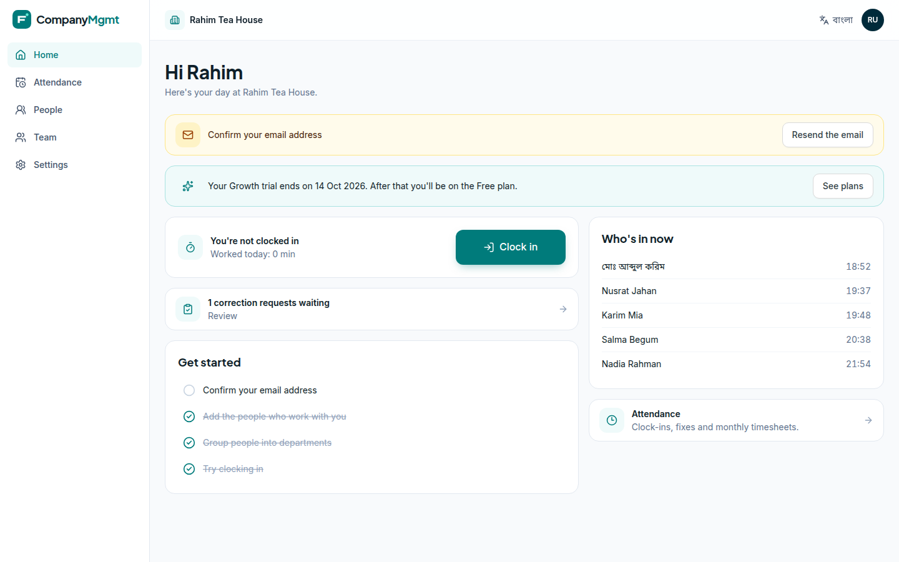

> **Status:** Milestones 1, 1.5 and 1.6 are built and tested. It isn't live yet;
> deployment is scripted and waits on cloud accounts ([deploy runbook](docs/runbooks/deploy.md)).
> Leave and payroll come next, then tasks, announcements and documents, then a
> permission-aware AI assistant ([roadmap](docs/IMPLEMENTATION_PLAN.md#9-phased-roadmap),
> [progress](docs/PROGRESS.md)).

## What it does today

- **Sign up in two minutes.** Pick your language and business type; the workspace switches
  on only what you need, with a 14-day trial of the Growth plan.
- **Clock in from any phone, at work.** One big button. Each branch has an area on the
  map; clock-ins outside it are refused or flagged (the owner chooses), with a clear
  message such as "You're about 1.2 km from Gulshan kiosk". Locations are saved only at
  clock-in and clock-out, rounded to about 11 m. Overnight shifts count towards the day
  they started, and every branch keeps its own time zone.
- **Fair fixes.** Forgot to clock out? People ask for a correction; a manager approves or
  rejects it; everything is recorded. Nobody can approve their own request.
- **Monthly timesheets** per person per day, with a spreadsheet export that is safe to open
  in Excel (Bangla names intact, formulas neutralised).
- **Leave.** People ask for leave from their phone and see what's left before they send it.
  Managers approve in one tap; the team calendar shows who is away (colleagues see that
  someone is away, not why). Balances handle mid-year joiners, monthly accrual and
  carry-over; the work week and public holidays don't count. Bangladesh workspaces start
  near the Labour Act 2006 (casual, sick, earned, maternity), Friday off.
- **People and departments.** Profiles, a department tree and branches. Managers see only
  their own part of the tree.
- **Staff without email.** Add a cashier with a username; they sign in with the workspace
  code and must choose their own password on first sign-in.
- **Roles.** Owner, Admin, Manager, Accountant, Cashier, Employee, plus custom roles.
  Nobody can grant a permission they don't hold.
- **Security you can see.** Two-step verification, a list of signed-in devices, and an
  audit log with a built-in integrity check.
- **Your look.** Light by default, dark mode, and four accent colours; every screen
  passes WCAG 2.2 AA checks in both modes.

| | |
|---|---|
| 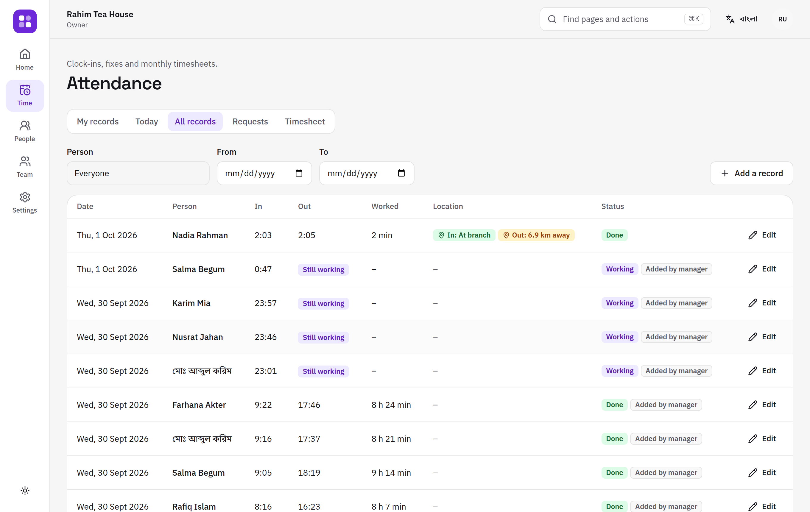 | 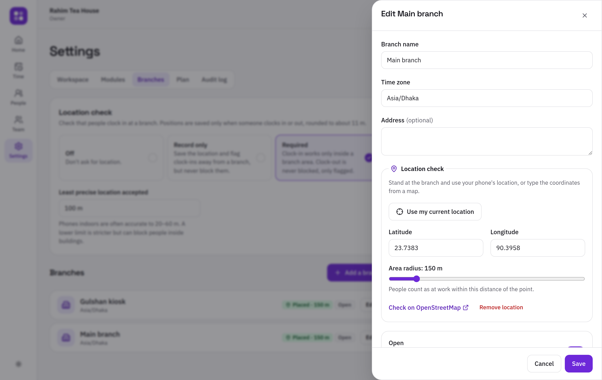 |
| 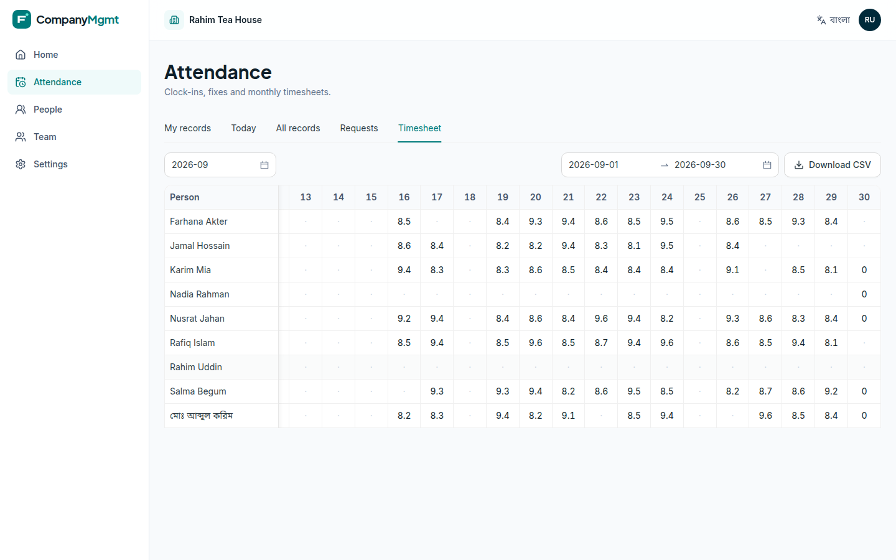 | 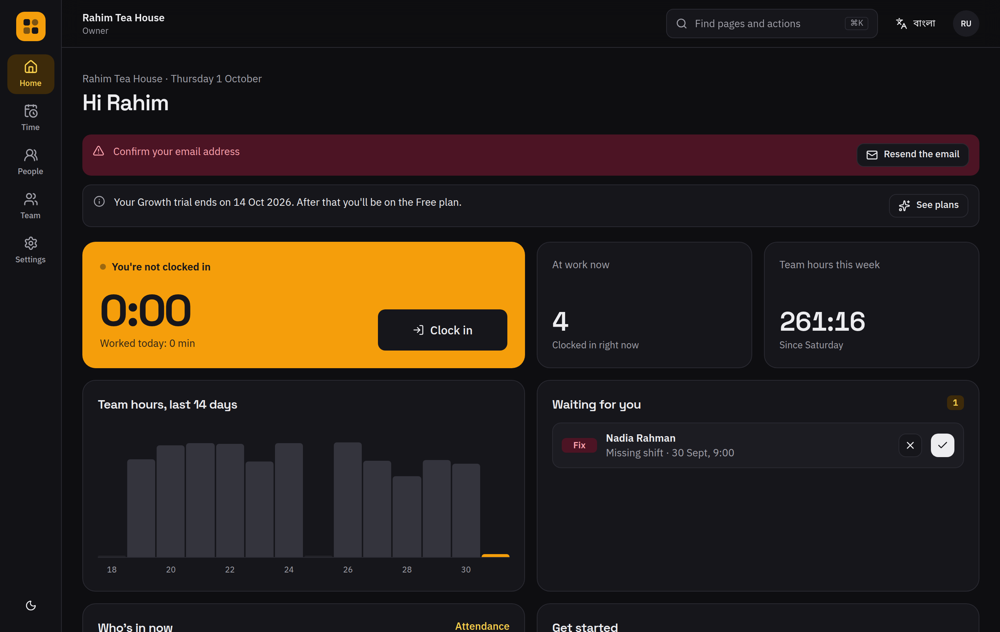 |
| 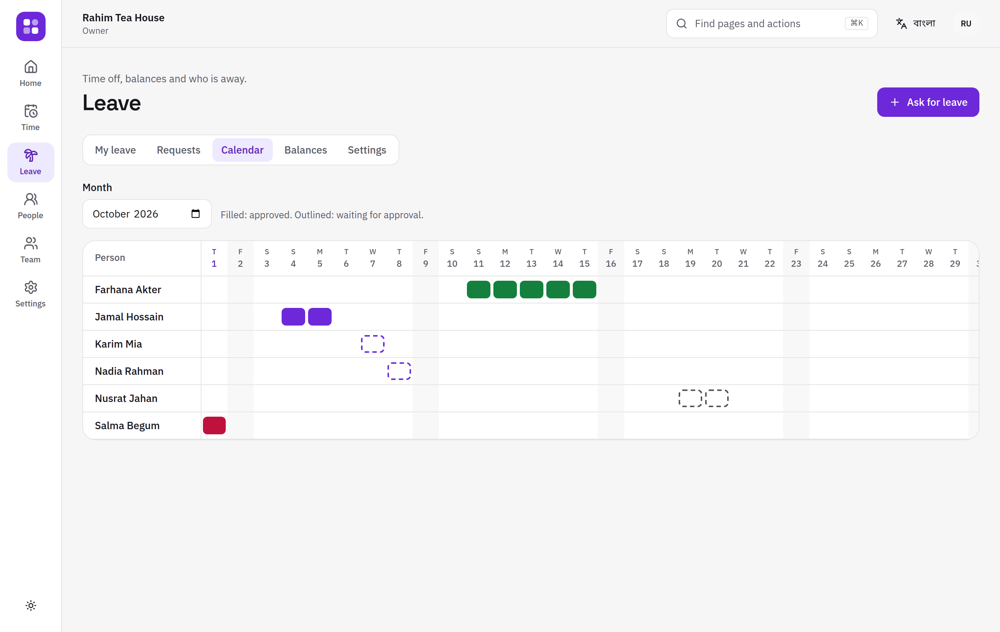 | 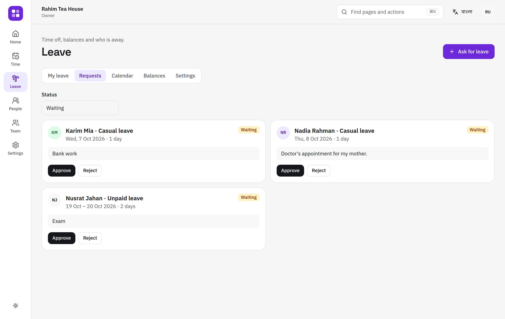 |

<p align="center">
  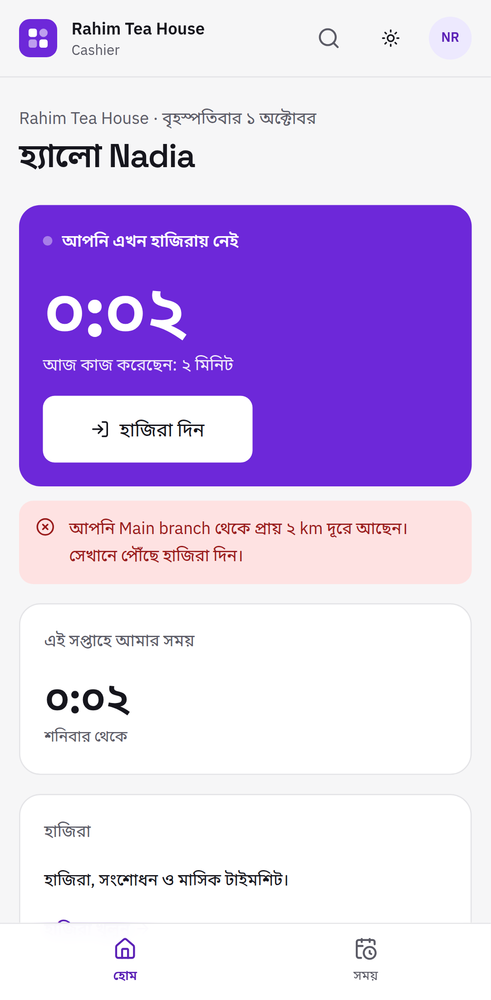
  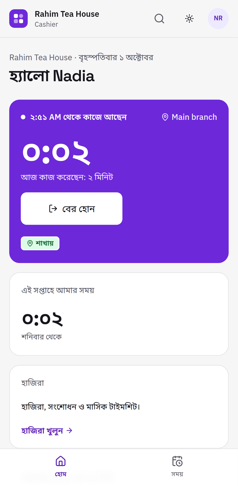
  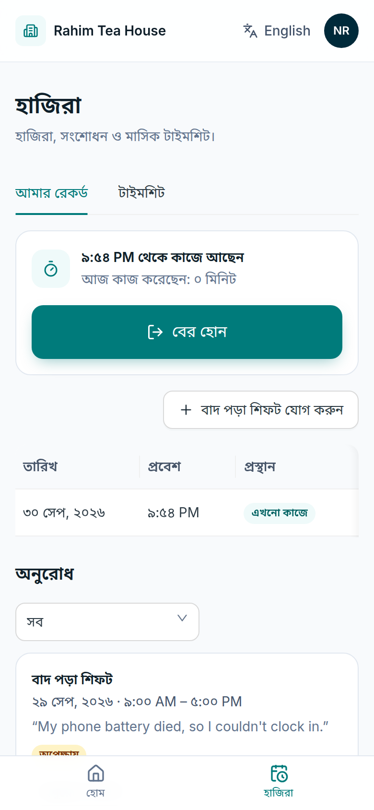
  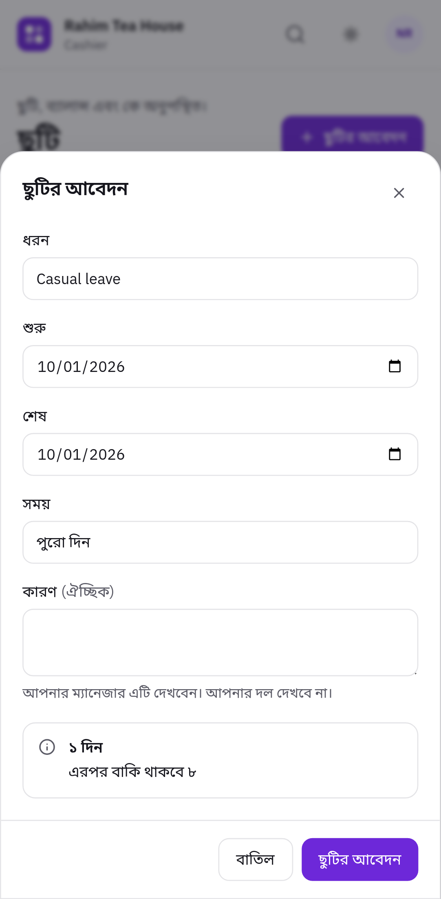
</p>

## How it's built

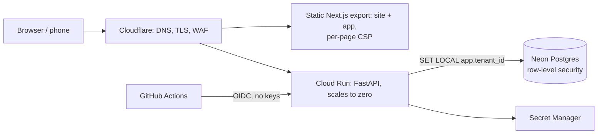

| Layer | Choice | Why |
|---|---|---|
| API | Python 3.12, FastAPI, SQLAlchemy 2 (async, psycopg 3), Alembic | Typed, fast to build, generates an OpenAPI contract |
| Data | PostgreSQL 16 with **forced row-level security** on every tenant table | Isolation enforced by the database, not only by code |
| Web | Next.js 16 (App Router, static export), React 19, TypeScript, Tailwind 4, Radix primitives, TanStack Query, i18next | One app for the site and the product; static files, so free to host; typed client generated from the API |
| Hosting | Cloud Run + Neon + Cloudflare Pages | Everything scales to zero: about $1/month with no customers (the domain) |
| Infra | OpenTofu, GitHub OIDC → least-privilege service accounts | Reproducible, no long-lived keys |

A modular monolith: `platform` (accounts, workspaces, roles), `people`, `attendance`, with
module boundaries enforced in CI by import-linter.

### Tenant isolation, three layers

1. **App:** the workspace comes from the signed token, and membership and role are
   reloaded on every request (so a role change applies immediately).
2. **Database:** every tenant table has `FORCE ROW LEVEL SECURITY` with a policy on
   `app.tenant_id`, set per transaction. The API's database role doesn't own the tables
   and can't bypass RLS. With no workspace set, queries return nothing.
3. **References:** composite foreign keys `(tenant_id, id)`, so a row can never point at
   another workspace's row.

A test calls **every API route that takes an id** with another workspace's ids (the routes
are discovered automatically, so new ones are covered) and checks that nothing leaks or
changes.

### Security (OWASP ASVS 5.0 Level 2 target)

Argon2id passwords checked against 100k breached passwords · 10-minute EdDSA access tokens
kept in memory · rotating refresh tokens in an httpOnly, SameSite=Strict cookie, where
reusing an old one ends the session · TOTP two-step verification with recovery codes ·
step-up confirmation for sensitive actions · rate limits with a CAPTCHA after repeated
failures · append-only, hash-chained audit log · AES-256-GCM field encryption bound to
each record · strict security headers and CSP · CSV formula-injection protection. Status
and evidence for each item: [docs/security/asvs-l2.md](docs/security/asvs-l2.md).

### Tests

- **135 API tests**, 91% line and branch coverage (CI gate: 85%), all against a real
  Postgres: auth, isolation, workspaces, people, attendance, location checks, leave, plans.
- **Browser journeys** (Playwright) on desktop and phone, against the production build
  with its real security headers: sign up → add staff → staff signs in in Bangla and
  clocks in → owner sees the timesheet; a staff member 2 km away is refused and let in at
  the branch; staff ask for leave and the owner approves it; dark mode and accents. **axe WCAG 2.2 AA** checks, a no-sideways-scrolling
  check and a CSP-violation check run on every page visited.
- Edge cases (overnight shifts, daylight saving, leap days, double clicks, stale edits,
  Bangla and RTL names, replayed tokens…) are mapped to their tests in
  [docs/testing/edge-cases.md](docs/testing/edge-cases.md).
- CI also runs ruff, mypy `--strict`, ESLint, TypeScript, Vitest, a migration drift
  check, an API contract check, gitleaks, pip-audit, npm audit, Trivy and CodeQL.

## Run it locally

Requirements: Python 3.12 with [uv](https://docs.astral.sh/uv/), Node 22, PostgreSQL 16.

```bash
cp .env.example .env
scripts/dev-db.sh                                   # local roles and databases
cd api && uv sync && uv run alembic upgrade head
uv run uvicorn app.main:app --reload                # http://localhost:8000
uv run python -m scripts.demo_seed                  # optional: a demo workspace
cd ../web && npm install && npm run dev             # http://localhost:3000
```

Before pushing, run everything CI runs: `scripts/check.sh` (add `E2E=1` for the browser
tests).

## Project documents

- [Implementation plan](docs/IMPLEMENTATION_PLAN.md): audit of the original university
  project, product scope, architecture, security, testing, billing, costs, roadmap.
- [Progress](docs/PROGRESS.md) · [Deploy runbook](docs/runbooks/deploy.md) ·
  [Restore runbook](docs/runbooks/restore.md)

This started as a group project for CSE327 at North South University (the original is
preserved in [327_Company_Management_System](https://github.com/omikhan4901/327_Company_Management_System)).
CompanyMgmt is a ground-up rewrite as a real product.

## License

Copyright © 2026 Mehboob Ehsan Khan. All rights reserved. The source is public for
portfolio purposes; it is not open-source licensed.
