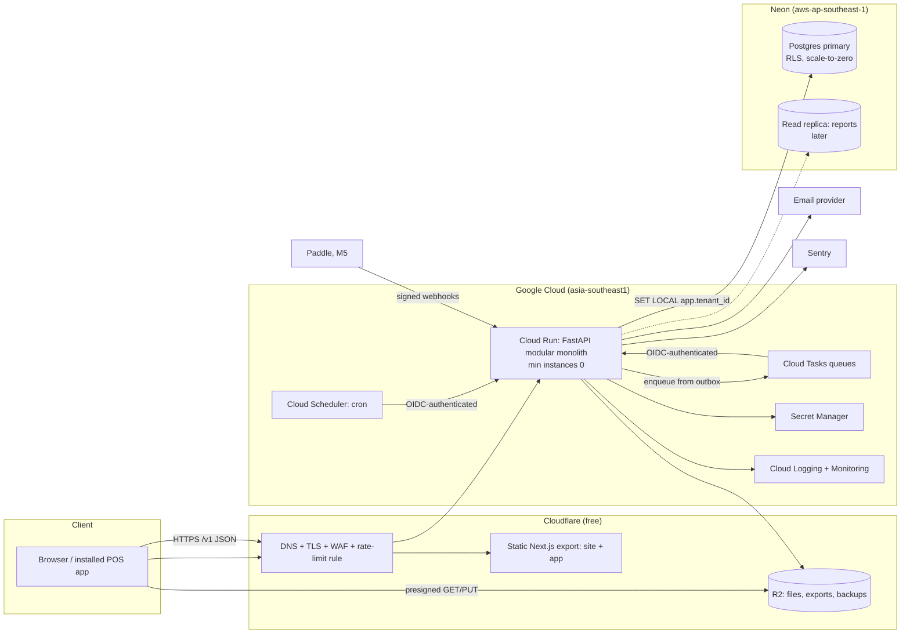
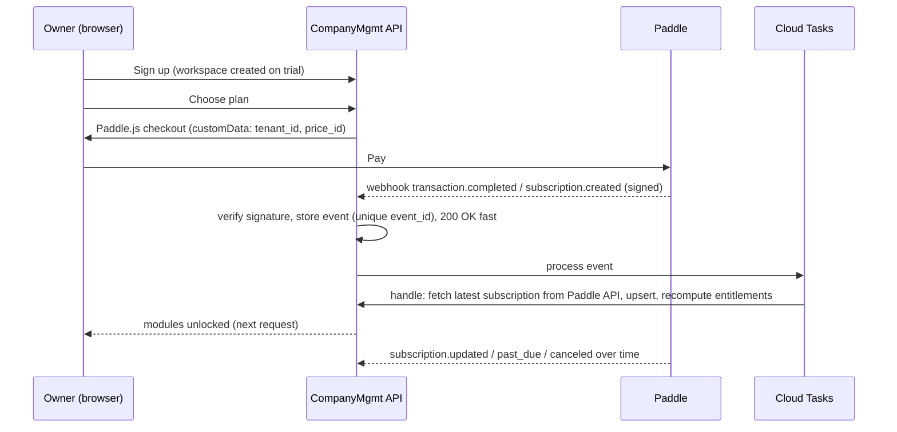

# Implementation Plan: Company Management SaaS

Status: **Approved by the owner on 30 September 2026. M1, M1.5, M1.6 and M2 are done;
M3 is next.** See §9 for every milestone.
Progress is tracked in [`PROGRESS.md`](PROGRESS.md).
Product name: **CompanyMgmt** (repo `companymgmt`). The owner wants a global product, so
the name is in plain English. It can be renamed before launch.

This plan turns the NSU CSE327 group project into a multi-tenant SaaS: a company management
suite that works for a tea stall with 2 staff and for a company with thousands of employees
across branches. It covers the audit of the current code, product scope, architecture,
security (OWASP ASVS 5.0 Level 2), testing, billing, DevOps and cost, the roadmap, and the
open questions only the owner can answer.

Changes made during Phase 0, at the owner's request:

- **New repository.** The product will live in a new repository with fresh history, so
  the old group members are not listed as contributors. This repository becomes the
  read-only archive (§0).
- **Payments come later.** Paddle is confirmed for a Bangladesh-based seller (the owner
  checked this as well). Payment integration moves to a later milestone (now M5), after the product
  works. Until then the product keeps pricing pages, plans and limits, managed through an
  internal subscription model that Paddle plugs into later (§6).

Changes made after M1, at the owner's request:

- **New design (Atlas) and Next.js.** The UI no longer reuses the ResumeX look (§8). The
  web app and marketing site become one Next.js app (§3.1).
- **Location-based attendance.** Clock-in is checked against a geofence around each
  branch (M1.6).
- **AI as a layer over company data.** The architecture is prepared for permission-aware
  AI (§3.7), and the roadmap adds AI milestones (M6–M7).
- **First market.** 20–100 person teams, starting with agencies in Bangladesh (§2.0). The
  roadmap is reordered to serve them first.

---

## Contents

0. [Repository strategy](#0-repository-strategy)
1. [Audit of the current code](#1-audit-of-the-current-code)
2. [Product scope, modules and pricing](#2-product-scope-modules-and-pricing)
3. [Architecture](#3-architecture) (incl. [§3.7 AI-ready architecture](#37-ai-ready-architecture-designed-now-built-in-m6m7))
4. [Security requirements (ASVS L2)](#4-security-requirements-asvs-50-level-2)
5. [Testing strategy](#5-testing-strategy)
6. [Billing and automation with Paddle (M5)](#6-billing-and-automation-with-paddle-m5)
7. [Infrastructure, DevOps and cost](#7-infrastructure-devops-and-cost)
8. [Design system: Atlas](#8-design-system-atlas)
9. [Phased roadmap](#9-phased-roadmap)
10. [Scope honesty: what to cut or defer](#10-scope-honesty-what-to-cut-or-defer)
11. [Risks and open questions](#11-risks-and-open-questions)

---

## 0. Repository strategy

- **The legacy repo** (`327_Company_Management_System`) is frozen as the academic original. It
  gets the `legacy-nsu-327` tag on its current `main` (commit `1482a71`) and a short
  README note pointing to the new product. Nothing else changes here.
- **This repo** (`omikhan4901/companymgmt`, public) starts with a **fresh first commit**. It imports
  no legacy history, so GitHub lists only the owner as a contributor. GitHub builds the
  contributor list from commit authors, so this is enough on its own.
- The rewrite reuses no legacy code (see §1), so nothing is lost by dropping the history.
  The business rules worth keeping are written down in §1.3 and carried into the new
  tests.
- Commits are made as the owner (`omikhan4901 <mehboobehsankhan@gmail.com>`), the same
  identity as in ResumeX. No AI co-author trailers, which would add a second contributor.
- Git rules from the brief apply in the new repo: work on `main` only, push only when CI
  passes locally, small conventional commits, no secrets, and a `.env.example` listing
  every variable.

**Status of the legacy tag.** The tag was created locally on `1482a71`. Pushing it from
this session was refused (HTTP 403): this environment's git access accepts branch pushes
but not tag pushes. The owner needs to push it once from their own machine (Q2).

---

## 1. Audit of the current code

~2,300 lines of Python (1,004 of them in `main.py`), 12 Jinja templates, 15 pytest tests
(**all 15 pass** on Python 3.11 with a fresh database). It is a server-rendered FastAPI
app on SQLite. The design patterns were required by the course, not chosen for the
problem.

### 1.1 Verdict: rewrite in the new repo and keep the domain knowledge

Most modules have at least one structural problem that a multi-tenant SaaS cannot keep:
unsalted SHA-256 passwords, in-memory sessions, float money, string dates, users
referenced by username strings, no tenant concept, and no migrations. Fixing all of
that in place touches every line, so a clean rewrite is faster and safer. Keep the rules
and scenarios, not the code.

### 1.2 File-by-file

| File | Verdict | Why |
|---|---|---|
| `main.py` (1,004 lines) | **Delete** | One file holds every route, HTML rendering, auth checks copied into every handler, and hours calculations repeated 4 times. `GET /logout` changes state. Forms have no CSRF token. The session cookie is not `Secure`. The same rules are enforced differently across pages: managers can see their department's payslips on the payroll page but cannot download them. |
| `authentication.py` | **Delete** | **Critical:** unsalted SHA-256 password hashes. Sessions live in a process dict, so they are lost on restart and cannot scale past one instance. On first run it creates `admin`/`admin`. "User not found" versus "Invalid password" lets anyone check which usernames exist. No rate limiting, MFA, expiry or revocation. It is a singleton by course rule. |
| `database.py` | **Replace** | SQLite. Money stored as `Float`. Dates and times stored as `String`. `employee_id`/`assigned_to` are username strings, not foreign keys. Department names are unique across the whole system. `create_all` instead of migrations. No `tenant_id`. |
| `attendance.py` | **Rewrite, keep concept** | Uses the server's local `datetime.now()` with no timezone. A shift that crosses midnight gives negative hours. Only one check-in per day. Loads every row to sum hours. The Adapter class adds nothing. |
| `payroll.py` | **Rewrite, keep the pluggable pay rules** | A strategy for pay rules is a **real fit** here, because pay types differ. The rest has to change: floats, a hard-coded `base/160` hourly rate, no link to attendance, nothing stopping two payslips for the same month, a catch-all `except` that hides errors, and serialization copied 5 times. |
| `department_manager.py`, `department_composite.py` | **Delete** | The Composite classes rebuild the whole tree in Python (O(n²)) on every request. The loop check on create does nothing. Replace with a parent-id table plus a recursive CTE, or a materialized path. |
| `task_manager.py` | **Delete; tasks return later as a small module** | The Factory Method and subclasses for priority should just be a `priority` column. |
| `notification.py` | **Delete** | An Observer that writes a JSON file. Replace with a notifications table fed by domain events (transactional outbox). |
| `logger.py` | **Delete** | A singleton that appends JSON lines to a local file and loads the whole log into memory. The file is mutable and disappears on serverless restarts. Replace with an append-only, hash-chained table (§4.4). |
| `report_manager.py`, `report_facade.py` | **Delete** | They sum in Python over full tables. Replace with SQL aggregation per module. |
| `pdf_report.py`, `pdf_payslip.py` | **Delete** | `fpdf` 1.7 supports Latin-1 only, so it **cannot render Bangla**. Replace with HTML templates rendered by WeasyPrint (HarfBuzz shaping, Noto Sans Bengali). |
| `templates/`, `static/` | **Delete** | Replaced by the SPA in the ResumeX design language (§8). |
| `attendance.json`, `notifications.json`, `audit.log`, `task_report.pdf`, `test_tasks.json` | **Delete** | Runtime data committed to git. Do not carry it over. |
| `requirements.txt` | **Replace** | Old pins: `uvicorn 0.19` (2022). `python-jose 3.3.0` has known CVEs (CVE-2024-33663 algorithm confusion, CVE-2024-33664). `passlib` is unmaintained. |
| `test_*.py` | **Use as specifications** | Every test shares one on-disk DB file and deletes it between tests. The scenarios are useful: payroll calculations, a manager seeing their department subtree, and "an admin cannot demote another admin". |
| `Readme.md`, `Explaination.md` | **Archive** | They stay in the legacy repo. |

### 1.3 Business rules carried forward (these become tests in the new repo)

1. A manager sees the people, attendance, tasks and payslips of their own department and
   every sub-department, and nothing outside it.
2. An employee sees only their own attendance and payslips.
3. Only the owner (formerly "admin") can change another owner's or admin's role. The last
   owner of a workspace can never be removed or demoted.
4. A department cannot become its own ancestor. A department with sub-departments or
   people cannot be deleted without reassigning them first.
5. Each payslip records which pay rule produced it (hourly, fixed monthly, commission, and
   more later).
6. Payroll, role changes, logins and department changes are audited.

### 1.4 Design patterns: only where they earn their place

| Pattern | Used for | Why |
|---|---|---|
| Strategy | Pay rules, tax rules per country, rounding rules | These rules really do vary, and each one needs its own tests. |
| Repository / unit of work (via SQLAlchemy session) | Tenant-scoped data access | One place to enforce tenant context (§3.3). |
| Transactional outbox + domain events | Cross-module reactions such as a sale posting to the ledger, or a payroll run sending notifications | Modules stay decoupled and events survive crashes. |
| Adapter (ports) | Email, file storage, billing provider, PDF renderer | Lets us swap vendors to control cost, and use fakes in tests. |

Not used: Singleton (dependency injection replaces it), Composite (a tree is data, not a
class hierarchy), Factory Method for tasks, Facade for reports.

---

## 2. Product scope, modules and pricing

### 2.0 Who it is for first

The product works for any size, from a tea stall to a company with branches. But
selling to "companies" in general is how new products lose to Zoho. So the first market
is specific:

- **20–100 person teams, starting with software and IT agencies in Bangladesh**, then
  similar companies in South and Southeast Asia, then small and mid-sized businesses
  anywhere.
- **Positioning**: "the operating system for your 30-person company". A few tools that
  fit together well (people, attendance, leave, payroll, tasks, announcements, documents,
  approvals) instead of forty-seven modules. Onboarding takes minutes.
- **How the first customers are found**: free pilots (M4). "We'll set up your company
  for free for a month and see whether it replaces some of your current tools."
- **What proves it works**: five companies paying $50–200 a month. That shows strangers
  trust the product with real operations. The AI layer (M6–M7) makes a working product
  more powerful; it is not the reason to adopt it.
- **Trust comes first**: tenant isolation, roles, audit log, encryption, backups, export
  and deletion, two-step verification, permission-aware AI, clear AI data handling and
  employee privacy. All of it is built as if a real company will audit it.

Shops and restaurants stay supported (Simple mode, the Shop pack in M8). They are just
not the first sales focus.

### 2.1 Core platform (always on, every plan)

Workspaces (tenants) · branches/locations · members and invites · staff accounts without
email (username + password, or a device PIN for the POS) · built-in roles and permissions ·
audit log · notifications · file storage · settings (currency, timezone, language, fiscal
year, week start) · onboarding checklist · data export · plan limits and module switches ·
English and Bangla UI.

### 2.2 Modules, in dependency and value order

Each module ships as a complete unit with API, UI, permissions, audit events, reports,
Bangla strings, tests, and an entry in the plan matrix.

| # | Module | What it includes | Depends on |
|---|---|---|---|
| 1 | **People** | Employee directory, profiles, department tree, branches, job titles, documents, employment history | Core |
| 2 | **Attendance** | Clock in/out (web, phone, shared kiosk) **checked against a geofence around each branch**, shifts incl. overnight, late/early rules, corrections with approval, holiday calendar, monthly timesheets | People |
| 3 | **Leave** | Leave types and balances, accrual, requests and approvals, calendar | People, Attendance |
| 4 | **Payroll** | Salary structures (basic, house rent, medical, conveyance), pay rules, overtime from attendance, festival bonuses, deductions, advances and loans, tax deducted at source, payroll run (draft → review → finalize → lock), payslips as PDF in English and Bangla, bank/mobile-wallet transfer sheet | People, Attendance, Leave |
| 5 | **Catalog** | Products and services, variants, units (piece, kg, cup), prices per branch, categories | Core |
| 6 | **Sales / POS** | Fast touch POS (installable web app), cart, discounts, payment types (cash, card, bKash/Nagad recorded by hand), receipts, cash drawer and shift close, returns, sales history | Catalog |
| 7 | **Customers & dues** | Customer list, credit sales and dues (the shop "baki khata"), payment collection, statements, reminders to share on WhatsApp, simple pipeline for B2B | Sales |
| 8 | **Expenses** | Expense entry with a photo of the receipt, categories, recurring expenses, petty cash, approvals | Core |
| 9 | **Inventory** | Stock movement ledger, stock by branch, purchases and suppliers, transfers, stock counts, low-stock alerts, cost (weighted average) | Catalog, Sales |
| 10 | **Accounting** | Double-entry ledger underneath. Automatic postings from sales, expenses, payroll and purchases. Cash book, receivables/payables, P&L, balance sheet, trial balance, period close | 6–9 (reads their events) |
| 11 | **Reports & dashboards** | Dashboards across modules, saved reports, scheduled email reports, CSV/XLSX/PDF export | All |
| 12 | **Tasks & projects** | Projects, tasks, assignment, due dates, comments, checklists, onboarding checklists (the legacy feature, reshaped) | People |
| 12a | **Announcements** | Posts to everyone, a branch or a department, read receipts | People |
| 12b | **Documents & policies** | Handbooks, SOPs and policies with visibility by role or department, versions, acknowledgements | People |
| 12c | **Automations** | Trigger → condition → action workflows over domain events; built by hand or from plain language (M7) | Core |
| 13 | **Enterprise controls** | SSO (OIDC/SAML), SCIM provisioning, custom roles with field-level permissions, approval chains, IP allowlist, API keys and outbound webhooks, audit export, dedicated database | Core |

Each module owns its own reports. Module 11 adds dashboards and scheduling on top of them.
The **AI layer** (§3.7) is not a module: it works across all of them, through each
module's capabilities.

### 2.3 Presets for non-technical owners

At sign-up the owner picks a business type. That turns on a small set of modules and
simplifies the UI. They can change it any time.

| Business type | Modules on | UI |
|---|---|---|
| Tea stall / small shop | Sales, Customers & dues, Expenses (+ Attendance if they have staff) | Simple: big buttons, plain words ("Money in / Money out"), no accounting terms |
| Restaurant / café | Sales, Catalog, Inventory, Expenses, Attendance | Simple |
| Retail with branches | Sales, Catalog, Inventory, Customers, Expenses, People, Attendance | Standard |
| Office / services company | People, Attendance, Leave, Payroll, Expenses, Tasks | Standard |
| Factory / enterprise | Everything | Advanced: dense tables, approvals, custom roles |

"Simple" and "Advanced" are a per-workspace setting that changes navigation depth and
defaults. The data model is the same, so a shop can grow without migrating.

### 2.4 Pricing tiers (set from competitor prices, 30 Sep 2026; owner asked me to decide)

**What competitors charge** (list prices found on 30 September 2026):

| Competitor | What it covers | Price |
|---|---|---|
| Zoho One | Whole suite | $37/employee/mo (annual, every employee) or $90/user/mo |
| Odoo | Whole suite | $31.10/user/mo Standard, $61 Custom; regional pricing from $8.95/user/mo |
| Zoho People | HR only | $1.25–9/user/mo |
| Zoho Payroll | Payroll only | $29/mo + $5/employee/mo |
| Connecteam | Attendance, scheduling | Free up to 10 users; $29–119/mo for 30 users |
| Deputy | Attendance, scheduling | $5.50–10/user/mo |
| Loyverse | POS | POS free; employee management and advanced inventory $25/store/mo each |
| Bangladeshi HR SaaS (PiHR, Smart HRM, GreenHR) | HR + payroll | ৳2,000–10,000/mo (~$16–82) by headcount |

**How we price.** A flat price per workspace that includes a number of people, then a
small fee per extra person. This keeps a tea stall at $0–9 and still costs a
2,000-person company far less per head than Zoho One or Odoo, which charge for every user.
Annual billing gets two months free. Regional prices (40–50% lower in lower-income
countries, including Bangladesh) arrive with Paddle in M5, the way Odoo does it.

| | **Free** | **Starter** | **Growth** | **Business** | **Enterprise** |
|---|---|---|---|---|---|
| Price (USD) | $0 | $9/mo or $90/yr | $29/mo or $290/yr | $79/mo or $790/yr, + $1.50/person over 150 | From $499/mo, annual |
| People | 5 | 15 | 50 | 150 included | Custom |
| Branches | 1 | 1 | 3 | Unlimited | Unlimited |
| Modules | Any 2 | Any 4 | All standard (1–12) | All standard | All + Enterprise controls |
| Storage | 200 MB | 1 GB | 10 GB | 50 GB | Custom |
| Custom roles | – | – | Basic | Yes | Field-level |
| Approvals | – | – | Single-step | Multi-step | Multi-step + policies |
| API & webhooks | – | – | – | Yes | Yes |
| SSO / SCIM / dedicated DB | – | – | – | – | Yes |
| Audit log | 30 days | 90 days | 1 year | 3 years | Custom + export |
| Support | Help center | Email | Email | Priority email | SLA |

Notes:

- Every paid plan starts with a 14-day Growth trial, with no card needed while payments
  are deferred.
- **Paddle's fee (5% + $0.50 per transaction)** takes 10.6% of a $9 monthly charge but only
  5.6% of a $90 yearly one. Push Starter customers toward annual billing.
- Why these numbers: Free (5 people, 2 modules) competes with Connecteam's and Loyverse's
  free tiers. Starter at $9 is below one Loyverse add-on. Growth at $29 matches Zoho
  Payroll's base fee but includes attendance, POS and payroll together. Business at $79
  for 150 people works out to $0.53/person, against $1.25–37 at Zoho.
- Prices are the starting point, re-checked against the M4 pilots before billing (M5).
- Limits are data, not code. Plans, modules and limits sit in tables that an internal
  admin console can edit, the same approach as ResumeX's plan settings.

---

## 3. Architecture

### 3.1 Key decisions

| Decision | Choice | Why (and what was rejected) |
|---|---|---|
| Shape | **Modular monolith** (one API service, strict module boundaries enforced by `import-linter`) | One deployable scales to zero, is cheap and simple to run. Modules can be split out later if one ever needs it. Microservices were rejected: they multiply cost and ops for no benefit at this size. |
| Backend | **Python 3.12, FastAPI, Pydantic v2, SQLAlchemy 2 (async) with psycopg 3, Alembic** | Keeps the owner's Python/FastAPI experience. Generates an accurate OpenAPI 3.1 contract. psycopg 3 behaves with Neon's PgBouncer in transaction mode. asyncpg was rejected because it needs its prepared-statement cache disabled. |
| Database | **PostgreSQL on Neon (serverless)** | Scales to zero, has a free tier, branches for previews and tests, point-in-time restore, and read replicas later. Postgres gives transactions, constraints, `NUMERIC`, recursive CTEs and **row-level security**, which are essential for payroll and accounting. MongoDB was rejected (weak for double-entry accounting). Supabase was rejected (free projects pause, paid starts at $25). |
| Tenancy | **Shared database and schema, `tenant_id` on every tenant row, Postgres RLS, plus an application-level guard** | Cheapest and simplest, and it scales to thousands of tenants. RLS gives a database-level backstop. Schema-per-tenant was rejected (N× migrations, pooling problems). A dedicated DB for Enterprise tenants is possible later without a rewrite (§3.6). |
| API | REST + JSON under `/v1`, OpenAPI-first, typed TS client generated from the spec | Simple to reason about, cache and test. GraphQL was rejected (harder to authorize per field, no need). |
| Frontend | **Next.js (App Router) + TypeScript**, exported as static files; TanStack Query, Radix primitives + **Tailwind 4**, lucide icons, i18next | One app serves the marketing pages (pre-rendered, good for SEO) and the product (rendered in the browser, behind sign-in). A static export keeps hosting free and needs no Node server; if server features are ever needed, the same app moves to Cloudflare Workers via OpenNext. The first version was a Vite SPA with antd plus an Astro site; replaced in M1.6 at the owner's request. |
| Hosting (API) | **Google Cloud Run** (request-based billing, min instances 0) in `asia-southeast1` (Singapore) | Scales to zero with a generous free tier, and the owner already runs ResumeX on it. Singapore is close to Bangladesh and to Neon's `aws-ap-southeast-1`. |
| Hosting (web) | **Cloudflare** (static assets; Pages or Workers) with per-page security headers generated at build | Free, unlimited static bandwidth, commercial use allowed. Vercel Hobby was rejected: its terms forbid commercial use. |
| Background jobs | **Cloud Tasks** (queue) + **Cloud Scheduler** (cron), both calling authenticated internal endpoints on the same Cloud Run service; **transactional outbox** in Postgres | No always-on worker. The first 1M Cloud Tasks operations and 3 Scheduler jobs are free. The outbox guarantees events are never lost. Celery/Redis were rejected: always-on and paid. |
| Files | **Cloudflare R2** (S3 API), per-tenant key prefix, short-lived presigned URLs | 10 GB free and zero egress fees. Accessed through a storage port, so GCS works as a drop-in. |
| Cache | No Redis at first. Per-request memoization, a small in-process LRU for plan/permission config (with a version check), and HTTP caching for static data | Redis is an always-on cost. If shared cache or rate-limit state is needed later: Upstash Redis (free tier, pay per request). |
| Rate limiting | Cloudflare free rate-limit rule at the edge + a Postgres counter table (UNLOGGED) in the app | No extra service. |
| Email | Email port. Start with a free transactional provider (Resend or Brevo), move to Amazon SES (~$0.10 per 1,000) at scale | Free at 0 tenants, cheap at scale. |
| PDF | WeasyPrint (HTML/CSS to PDF), Noto Sans Bengali bundled | Correct Bangla shaping. Reuses the design tokens. |
| AI (M6+) | Provider port (Anthropic, OpenAI, Gemini, local model), **pgvector in the same Postgres**, tools over typed capabilities (§3.7) | No new database or vendor lock-in; isolation reuses RLS. A separate vector database was rejected: another place for tenant data to leak. |
| Errors/observability | Sentry (free tier), Cloud Logging (structured JSON), OpenTelemetry traces (sampled), Cloud Monitoring uptime checks | All free at this scale. |
| Infra as code | OpenTofu, with state in a GCS bucket | Reproducible environments, reviewable changes. |

### 3.2 Diagram



### 3.3 Tenant isolation (defense in depth)

1. **Tenant comes from auth, never from input.** The access token carries `tid` (tenant)
   and `sid` (session). Every request reloads the membership row for (`user`, `tid`), so
   a removed member or a changed role takes effect on the next request. Switching
   workspace issues a new token.
2. **Application guard.** A request-scoped `TenantContext` is required to open a DB
   session. Tenant-scoped repositories add `tenant_id` to every query and insert. Code
   that needs cross-tenant access (internal admin, migrations, billing webhooks) uses a
   separate, explicit `SystemContext` that is audited.
3. **Database guard (RLS).** Every tenant table has
   `ENABLE` + `FORCE ROW LEVEL SECURITY` and one policy:
   `USING (tenant_id = current_setting('app.tenant_id', true)::uuid) WITH CHECK (same)`.
   The API connects as `app_rw`, which is not the table owner and has no `BYPASSRLS`.
   Migrations run as `app_owner`. `SET LOCAL app.tenant_id` is issued at the start of
   every transaction, so it is safe with PgBouncer in transaction mode. If the setting is
   missing, the policy compares against `NULL` and **returns no rows (fails closed)**.
4. **Referential guard.** Tenant tables use composite keys: `UNIQUE (tenant_id, id)`, and
   foreign keys reference `(tenant_id, id)`. A row can never point at another tenant's
   row, even through a bug.
5. **IDs** are UUIDv7: no enumeration, and they sort by time for index locality.
6. **Files**: object keys are `t/{tenant_id}/{random}`. Presigned URLs (≤5 min) are issued
   only after a permission check. Uploads go through a pending-file record that must be
   confirmed by the same tenant.
7. **Jobs and events** carry `tenant_id` and set the same context before touching data.
   Cache keys always include the tenant.
8. **CI guard**: a test lists every table from the SQLAlchemy metadata and fails if a
   table has no `tenant_id`, RLS enabled, forced RLS and a policy, unless it is on a short
   reviewed allowlist of global tables (e.g. `plans`).

### 3.4 Data conventions

- **Money**: `BIGINT` minor units + ISO 4217 currency on the row. Python `Decimal` for
  calculations, with explicit rounding (half-even or half-up per rule). Never floats.
- **Quantities**: `NUMERIC(18,3)` (kg of tea leaves, litres of milk). Sign and bounds are
  checked in the database.
- **Time**: all instants in `timestamptz` (UTC). Each branch has an IANA timezone.
  "Business date" (the day a shift or sale belongs to) is stored explicitly, computed in
  the branch timezone at write time.
- **Text**: NFC-normalized. Names in any script, with no ASCII-only assumptions. Search is
  case-insensitive and accent-insensitive where supported. Bangla and English collation
  are tested.
- **Concurrency**: a `version` column on editable records. The API uses `ETag`/`If-Match`
  and answers `412` on a stale write, and the UI offers a merge/reload. Money-moving
  operations use row locks (`SELECT … FOR UPDATE`) inside one transaction.
- **Idempotency**: all `POST`s that create or move money take an `Idempotency-Key`,
  stored per tenant for 24h with a hash of the request. A repeat returns the first
  response. A different body with the same key gets `422`.
- **Soft delete** only where the business needs "undo" or history. Financial documents
  are never deleted, only voided with a reversing entry.

### 3.5 API design

- `/v1/...` resources, JSON, `snake_case`. Cursor pagination (`?cursor=&limit=`, limit
  ≤ 200). Filters and sort from an allowlist.
- Errors: RFC 9457 problem details (`type`, `title`, `status`, `detail`, `errors[]`,
  `request_id`). Never stack traces.
- Auth: `Authorization: Bearer <access JWT>`. The refresh token lives in an httpOnly
  cookie scoped to `/v1/auth/refresh`.
- OpenAPI 3.1 is generated from code. `oasdiff` in CI blocks breaking changes to `/v1`.
  A typed client for the SPA is generated from the spec.
- Rate-limit headers (`RateLimit`, `RateLimit-Policy`) on limited routes.
- Later (Business+): API keys scoped to permissions, outbound webhooks signed with HMAC,
  with retries and a delivery log.

### 3.6 From tiny to large without a rewrite

| Stage | What changes | Code change |
|---|---|---|
| 0–50 tenants | Everything above. Neon free/Launch plan, Cloud Run min 0 | None |
| 50–500 tenants | Neon autoscaling 0.25–2 CU. Cloud Run min instances 1 during Bangladesh business hours (removes cold starts). Read replica for reports | Config only |
| Large tenant (thousands of employees) | Time-partitioned tables for attendance events, audit log and stock movements. Heavy reports and payroll runs as background jobs with progress, not in requests | Planned in the schema from the start; payroll is a job from day 1 |
| Enterprise isolation | A `tenant_routes` table maps a tenant to a database. The session factory picks the DSN per tenant. Same schema and code, own Neon project. Tenants can be moved with a copy-and-switch job | One routing layer, designed in M1, used in M10 |
| Multi-region | Out of scope until revenue justifies it | – |

### 3.7 AI-ready architecture (designed now, built in M6–M7)

AI here is **not a chatbot bolted on**. It is a layer over the company's own data and
workflows. It answers from real records, only within what the person asking may see,
and it can later take actions that a person confirms. Zoho (Zia in Zoho People) and
Atlassian (Rovo: search, answers and agents over organizational data, respecting
existing permissions) are moving the same way.

The AI itself arrives in M6. Its foundations are laid in M3, because they shape how
every module is written.

```text
                 ┌────────────────────────────────────────────┐
                 │ AI layer (M6–M7)                           │
                 │ copilot chat · search · weekly brief ·     │
                 │ actions (propose → confirm) · automations  │
                 │ · early-warning signals                    │
                 └───────────────────┬────────────────────────┘
                                     │
                 ┌───────────────────▼────────────────────────┐
                 │ AI context layer                           │
                 │ context builder (tenant, user, role,       │
                 │ permissions, department scope, branch,     │
                 │ language, time zone) · tool router ·       │
                 │ permission-aware retrieval · guardrails ·  │
                 │ provider port · usage metering             │
                 └───────────────────┬────────────────────────┘
                                     │  calls capabilities as the signed-in person
                 ┌───────────────────▼────────────────────────┐
                 │ Capability registry (M3)                   │
                 │ typed read/write functions per module,     │
                 │ each with input/output schema + permission │
                 └───────────────────┬────────────────────────┘
          ┌──────────────────────────┼──────────────────────────┐
     People & time              Work                       Knowledge
     people, attendance,        tasks, projects,           documents, policies,
     leave, payroll             approvals, automations     announcements, SOPs
          └──────────────────────────┼──────────────────────────┘
                                     │
                   Postgres (row-level security, pgvector)
```

**Rules**

1. **The AI gets tools, never database access.** The model never sees SQL or tables.
   It picks from registered capabilities such as `leave.balance(employee)`,
   `attendance.absences(period, group_by)`, `tasks.overdue(scope)` and
   `documents.search(query)`. The backend runs each one exactly as the REST API would:
   same tenant binding, same row-level security, same permission and department-scope
   check. The model explains the structured result; it doesn't compute it.
2. **One implementation, two front doors.** From M3 on, business logic lives in typed
   service functions. REST routes are thin wrappers over them, and the capability
   registry exposes the same functions to the AI. Nothing the AI can do bypasses a check
   the API has, and a test enforces this (M3 "done when").
3. **Role-aware by construction.** Every AI request starts from the same `Ctx` as an API
   call. "Who is on leave today?" returns the asker's team for a staff member, their
   department for a manager, and the company for HR, because the capabilities already
   scope the query.
4. **Retrieval respects permissions.** Document chunks live in a tenant table with
   forced RLS. Each chunk carries `tenant_id`, `document_id`, and visibility (roles,
   departments). Embeddings sit in **pgvector in the same Postgres**, so the isolation
   that protects every other table protects them too; there is no separate vector store
   that could leak. Filters are applied in SQL before similarity ranking, never after.
5. **Actions: propose → confirm → execute.** Write capabilities return a *proposal*
   (what will change, for whom). Only an explicit confirmation from the person executes
   it, through the normal API path, recorded in the audit log with `via: ai` and the
   conversation ID. Text inside documents or records can never trigger an action.
6. **Automations are data, not code.** A plain-language request becomes a workflow
   definition: JSON with a trigger (schedule or domain event), conditions and actions,
   checked against a schema. A person reviews it before it is saved. The workflow
   engine runs it and keeps a run history.

   ```json
   {"trigger": {"schedule": "MON 09:00"},
    "condition": {"task.status": "overdue"},
    "action": {"type": "notify", "channel": "email", "to": "task.assignee"}}
   ```
7. **The company as a graph, in plain SQL.** The relations already exist: company →
   branches, departments → people → shifts, leave → tasks → projects → documents.
   Capabilities follow them ("Why is the Dhaka team's project late?" → overdue tasks →
   assignees → their leave and attendance). A graph database isn't needed.
8. **Provider port.** One interface:
   `chat(request)`, `structured(request, schema)` and `embed(texts)`.
   - Adapters for Anthropic, OpenAI and Gemini, plus a local model server (vLLM/Ollama)
     for customers whose data must stay in their environment (M10).
   - The model is chosen per task (a small model for routing and summaries, a larger one
     for hard questions) and per workspace.
9. **Predictions support decisions; they don't make them.** Signals start as plain
   statistics (trend changes, outliers against the team's own history) and are explained
   in words. There is no automatic judgment of individuals.
   - Individual-level signals can be switched off per workspace.
   - Employees are told what is computed.
10. **Trust and cost.**
    - AI is off until the owner enables it and accepts the AI terms.
    - Providers are used with zero-retention, no-training settings, and the list of
      providers is published.
    - Only the fields a capability needs are sent to the model.
    - Prompts and answers are logged with redaction, kept for 30 days by default.
    - Each workspace has a monthly AI allowance by plan, with metering, caching and
      budget alerts.
    - An evaluation suite (expected answers, expected refusals, leakage probes) runs in
      CI once M6 starts.

**What this changes before M6**
- M2 onward: new modules (leave, payroll) put their logic in service functions, not in
  routes.
- M3:
  - Move existing attendance and people logic into services.
  - Add the capability registry and context builder.
  - Extend the outbox into a general domain-events stream.
  - Store document visibility metadata.
- M4: reporting aggregates are written as capabilities, so dashboards and the AI share
  them.
- Backend layout: `api/app/ai/` holds `context`, `tools`, `retrieval`, `providers`,
  `prompts`, `guardrails` and `evals`. It depends on module services, never the other
  way round (import-linter enforces this).

---

## 4. Security requirements (ASVS 5.0 Level 2)

The target is **OWASP ASVS 5.0.0 (May 2025), Level 2**. Below, each requirement is
concrete and checkable, and mapped to an ASVS chapter. In Milestone 1 a full checklist,
`docs/security/asvs-l2.md`, lists every L1+L2 requirement with its status, evidence
(test name, config, or doc) and any accepted risk. I map to chapters here rather than
quote requirement IDs from memory. The checklist will cite exact IDs from the official
text.

### 4.1 Tenant isolation (V8 Authorization, V15 Secure Coding and Architecture)

- [ ] S1. RLS enabled, forced and covered by a policy on every tenant table (CI metadata test, §3.3.8).
- [ ] S2. The app DB role has no `BYPASSRLS`, is not the table owner, and has no DDL rights (migration test asserts it).
- [ ] S3. With no tenant context, every tenant table returns 0 rows and rejects inserts (DB-level test).
- [ ] S4. **Cross-tenant test suite**: for every tenant-scoped endpoint in the OpenAPI spec (auto-discovered), tenant B's token on tenant A's resource IDs gets `404` for reads, and writes get `404` with no change. New endpoints are covered automatically and CI fails if one is skipped without a reason.
- [ ] S5. A raw SQL test as `app_rw` with tenant B's context cannot read or update tenant A's rows in any table.
- [ ] S6. Composite foreign keys stop cross-tenant references (a test tries to link A's invoice to B's customer).
- [ ] S7. Presigned file URLs are only issued after authorization, expire in ≤5 minutes, and object keys cannot be guessed. Test: tenant B cannot get a URL for tenant A's file ID.
- [ ] S8. Background jobs refuse to run without a tenant context (test).

### 4.2 Authentication (V6) and sessions (V7, V9 Self-contained Tokens)

- [ ] A1. Passwords hashed with **argon2id** (argon2-cffi; memory ≥ 19 MiB, t ≥ 2, p = 1) and re-hashed on login when parameters change.
- [ ] A2. Password rules: minimum 8, allow at least 64 characters, all Unicode allowed, no composition rules, checked against a bundled list of the top 100k breached passwords (optional online HIBP k-anonymity check, off by default).
- [ ] A3. Email verification before a workspace can invite people or export data.
- [ ] A4. **Access token**: EdDSA-signed JWT with a pinned algorithm, 10-minute lifetime, claims `sub`, `tid`, `sid`, `iat`, `exp`, `aud`, `iss`, kept in memory only (never localStorage).
- [ ] A5. **Refresh token**: 256-bit random, stored only as a SHA-256 hash, httpOnly + Secure + `SameSite=Strict`, path-scoped cookie. **Rotated on every use.** Reuse of an old token revokes the whole token family and emails the user. Idle timeout 7 days, absolute 30 days, both configurable per workspace (shorter for Business+).
- [ ] A6. **Session revocation**: every request checks the session row (`revoked_at`, user disabled, membership removed). A sessions page lists devices and can log out one or all. Password change, MFA reset and member removal revoke sessions.
- [ ] A7. **MFA**: TOTP (RFC 6238, ±1 step drift) with 10 single-use recovery codes stored hashed. The TOTP secret is encrypted with AES-256-GCM. A workspace can require MFA for owners/admins (on by default for Business+). Passkeys (WebAuthn) in M10.
- [ ] A8. **Step-up re-authentication** (password or TOTP within the last 5 minutes) before: changing password or MFA, exporting data, finalizing payroll, changing roles, deleting the workspace.
- [ ] A9. **Brute force**: per-account and per-IP limits with growing delays, and a Cloudflare Turnstile challenge after 5 failures. No hard lockout that an attacker could use to lock out a real user. The same generic error and similar timing whether or not the account exists.
- [ ] A10. Password reset: single-use token, stored hashed, valid for 30 minutes, sessions revoked afterwards, same response for unknown emails.
- [ ] A11. **POS device PIN** (M8): only on a device registered by an admin, only for roles marked "PIN allowed" (e.g. cashier), rate-limited, and never valid on the web.
- [ ] A12. Every auth event (login, fail, MFA, reset, revoke, token reuse) is in the audit log.

### 4.3 Authorization: RBAC + custom roles (V8)

- [ ] R1. Permissions are fine-grained strings (`payroll.run.finalize`, `sales.refund.create`) declared by each module, checked by a dependency on every route. A CI test fails if a route declares no permission (public routes must opt out explicitly).
- [ ] R2. Built-in roles: Owner, Admin, Manager, Accountant, Cashier, Employee. **New members get Employee (least privilege).**
- [ ] R3. Scope: grants can be limited to branches and to a department subtree (the legacy manager rule, §1.3.1).
- [ ] R4. Custom roles per workspace (Growth+): built from the permission catalog. Nobody can grant a permission they don't hold. Owner-only permissions can't go into custom roles.
- [ ] R5. Role changes take effect on the user's next request, with no re-login (the request reloads membership, §3.3.1). Tested.
- [ ] R6. Object-level checks go through each module's policy functions and are tested with a permission matrix (role × action × scope).
- [ ] R7. The last owner cannot be removed or demoted. Ownership transfer needs step-up by both parties.

### 4.4 Immutable audit log (V16 Security Logging and Error Handling)

- [ ] L1. `audit_events` is append-only: `app_rw` has `INSERT` + `SELECT` only, and a trigger rejects `UPDATE`/`DELETE` even for the owner role, except in the retention purge job, which runs as a separate audited role.
- [ ] L2. **Hash chain per tenant**: each row stores `prev_hash` and `hash = SHA-256(prev_hash ‖ canonical_json(row))`, written in the same transaction under a per-tenant advisory lock. A daily job re-checks each chain and writes the chain heads to R2 under a retention lock.
- [ ] L3. Each event records who, on whose behalf (impersonation), tenant, action, target type and ID, before/after diff (sensitive fields redacted), IP, user agent, request ID and time.
- [ ] L4. Logs never contain passwords, tokens, TOTP secrets or full bank numbers. Tested with a log-scrubbing test.
- [ ] L5. Owners and admins can view, filter and export the audit log. Retention follows the plan (§2.4).

### 4.5 Data protection, transport and secrets (V11 Cryptography, V12 Secure Communication, V13 Configuration, V14 Data Protection)

- [ ] D1. TLS 1.2+ everywhere, with HSTS (`max-age=63072000; includeSubDomains; preload` after launch). Neon connections use `sslmode=verify-full`.
- [ ] D2. At rest: Neon storage and R2 are encrypted by the provider. **Field-level AES-256-GCM** for national ID numbers, bank/wallet account numbers, TOTP secrets and salary figures in exports, with a key ID so keys can rotate.
- [ ] D3. Secrets live in Google Secret Manager, read at startup through the runtime service account. Deploys use GitHub OIDC Workload Identity Federation, so there are no JSON keys anywhere. `.env.example` lists every variable with no values.
- [ ] D4. Security headers: a strict CSP (`default-src 'self'`, no inline scripts, `frame-ancestors 'none'`), `X-Content-Type-Options`, `Referrer-Policy: strict-origin-when-cross-origin`, `Permissions-Policy`. Tested in e2e.
- [ ] D5. **Input validation**: every body, query and path is a Pydantic model with lengths, ranges and enums. Unknown fields are rejected. Request body is capped (1 MB JSON, 10 MB uploads). JSON depth is limited.
- [ ] D6. **SQL injection**: ORM or bound parameters only. A Semgrep rule bans string-built SQL.
- [ ] D7. **XSS**: React escaping, no `dangerouslySetInnerHTML` (lint rule), CSP. Any future rich text is sanitized with an allowlist.
- [ ] D8. **CSRF**: the API uses bearer tokens, not cookies. The one cookie endpoint (refresh) requires `SameSite=Strict`, an `Origin` check against an allowlist, and a custom header.
- [ ] D9. **SSRF**: the server never fetches user-supplied URLs until outbound webhooks exist (M10). Those go through an HTTPS-only fetcher that blocks private, link-local and metadata IP ranges, re-checks after DNS resolution, and has timeouts and size limits.
- [ ] D10. **Files**: type checked by magic bytes against an allowlist, images re-encoded, size limits per plan, downloads served with `Content-Disposition: attachment` from a separate origin.
- [ ] D11. CSV/XLSX export escapes formula injection (`=`, `+`, `-`, `@` prefixes).
- [ ] D12. Error responses leak no internals. Debug is off in production (config test).

### 4.6 Supply chain and CI security (V15)

- [ ] C1. Dependencies locked (uv lockfile, npm lockfile). Renovate PRs weekly, grouped.
- [ ] C2. `pip-audit`, `npm audit --omit=dev` / OSV-Scanner, **gitleaks**, Semgrep, CodeQL, and Trivy (container image) run in CI. High/critical findings fail the build.
- [ ] C3. GitHub secret scanning with push protection, and branch protection on `main` (required checks).
- [ ] C4. Container: distroless or slim base, non-root user, read-only filesystem where possible, image pinned by digest.

### 4.7 Privacy, export, deletion, backups (V14)

- [ ] P1. **Workspace export**: the owner can export all data as a ZIP of JSON + CSV + files. It is built in the background, linked from an email, the link expires in 24h, and step-up is required.
- [ ] P2. **Personal data export** for any member (their profile, attendance, payslips, audit events about them).
- [ ] P3. **Workspace deletion**: step-up, then a 30-day grace period (restorable), then a hard purge job across DB rows, R2 objects and search indexes. A signed deletion certificate is emailed. Backups age out within 35 days, and this is stated in the privacy policy.
- [ ] P4. **Member removal** anonymizes personal data that is not needed for legal records. Payroll and accounting records are kept for the legal retention period (value to be confirmed, Q7).
- [ ] P5. **Backups**: Neon point-in-time restore (window depends on plan), plus a nightly `pg_dump` encrypted with `age` and uploaded to R2 by a Cloud Run Job, kept 30 days.
- [ ] P6. **Restore runbook** (`docs/runbooks/restore.md`): full restore to a Neon branch, and single-tenant restore (filter the dump by `tenant_id`, then copy back in a maintenance window). **A quarterly restore drill** checks row counts and re-verifies the audit hash chain.
- [ ] P7. The privacy policy and terms cover Bangladesh's Personal Data Protection Act 2026 (and GDPR-style rights for foreign customers). A one-time legal review is recommended (Q7).

---

## 5. Testing strategy

### 5.1 Layers

| Layer | Tools | What it covers |
|---|---|---|
| Unit | pytest, **Hypothesis** (property-based) | Pay rules, tax slabs, rounding, overtime, leave accrual, stock cost, ledger postings. Invariants: every journal entry balances; stock movements add up to stock on hand; payroll net = gross − deductions; money never rounds to more than was paid |
| Integration | pytest against **real Postgres** (Docker locally, a service container in CI), one transaction per test rolled back afterwards | Repositories, RLS, migrations, outbox, jobs, idempotency, locking |
| API / contract | FastAPI test client, **Schemathesis** (fuzzing from the OpenAPI spec), `oasdiff` | Every endpoint: auth, permissions, validation, problem-details shape. No 500s under fuzzing. No breaking contract changes |
| Isolation | Dedicated suite (§4.1) | Cross-tenant access for every endpoint and table |
| Frontend unit | Vitest + Testing Library | Components, forms, hooks, formatters (Bangla digits, currency) |
| End-to-end | **Playwright** (Chromium + WebKit + mobile viewport), **axe-core** accessibility checks on every page | Sign-up → onboarding → invite → clock-in → payroll run → payslip PDF, POS sale → due → payment; keyboard-only paths |
| Visual | Playwright screenshots of key screens (en + bn) | Layout regressions, Bangla rendering |
| Load | **k6** against staging | See §5.4 |
| Security | ZAP baseline scan against staging (weekly), plus §4.6 | Headers, common web issues |

### 5.2 Coverage targets and CI gates

- API line coverage **≥ 85%** overall and **≥ 95%** for `core/` (auth, tenancy,
  permissions, audit) and money modules (payroll, sales, accounting). Branch coverage
  ≥ 80%. The web app ≥ 70% on logic (hooks, lib).
- **Required checks on every push to `main`** (the rule "only push when tests pass" is
  enforced by running the same script locally before pushing):
  ruff (lint + format) · mypy `--strict` · import-linter (module boundaries) · pytest with
  coverage gate · isolation suite · migrations (upgrade from empty, downgrade one step,
  `alembic check` for drift) · Schemathesis (short run) · oasdiff · eslint · `tsc
  --noEmit` · Vitest · Playwright e2e + axe (runs the built SPA against the API and
  Postgres in Docker Compose) · gitleaks · pip-audit / OSV · Semgrep · Trivy.
- CodeQL and ZAP run on a schedule. k6 runs on demand before each milestone.
- Test runtime budget: API suite < 4 min, e2e < 8 min. Tests stay fast (the owner's
  ResumeX rule).

### 5.3 Edge cases (each becomes at least one named test)

The list lives in `docs/testing/edge-cases.md` and grows with every bug found. Each entry
gets a test ID and the expected behaviour.

**Concurrency and duplicates**
1. Two managers edit the same employee at once → the second save gets `412` and the UI offers reload/merge. No lost update.
2. Double-click on "Finalize payroll" or "Complete sale" → the same idempotency key, one result, the second call returns the first response.
3. The same idempotency key with a different body → `422`, nothing changed.
4. Two cashiers sell the last unit at the same time → one succeeds. The other gets "out of stock", or a negative-stock warning if the workspace allows it.
5. Payroll finalized while someone edits a salary → the finalized run keeps its snapshot, and the edit applies to the next run.
6. Two browser tabs refreshing tokens at once → no false "token reuse" family revocation (a 10-second grace for the same predecessor token).
7. A webhook, job or event delivered twice or out of order → processed once, state never moves backwards.

**Time and dates**
8. Payroll for February in a leap year (29 days) and a normal year. Daily-rate proration on 28/29/30/31-day months.
9. Employee joins or leaves mid-month, including on the 29th of February.
10. An overnight shift (22:00–06:00) counts toward the business date the shift started on. Hours are never negative.
11. DST change inside a shift for a branch in a DST timezone (e.g. Europe/London): hours are counted from UTC instants, not wall clock. Bangladesh (UTC+6, no DST) is the default and is tested too.
12. Branches in different timezones: "today's sales" and "late check-in" use each branch's zone.
13. Client clock skew: device time 3 hours off → the server stamps the time. Offline POS sales keep the device time only as a reported field and flag skew > 5 minutes.
14. Clock-in exactly at midnight, and at 23:59:59.999.
15. Fiscal year July–June (Bangladesh) versus calendar year.
16. A JWT issued a few seconds in the future because of server skew → allowed within 30 seconds of leeway, rejected beyond that.

**Numbers and money**
17. Zero, negative and huge quantities and prices: negative rejected where invalid (price, stock received), zero allowed only where it makes sense (free item), and values over 10¹² rejected with a clear message. No overflow in `BIGINT`.
18. Fractional quantities (0.125 kg) and rounding of line totals versus the document total. Rounding differences are posted to a rounding account.
19. Salary 0 (volunteer/intern), overtime with no base salary, deductions larger than gross → net floors at 0 and the remainder carries forward as a recoverable advance (configurable), never a negative payslip.
20. Currency with no minor unit (JPY) and with three (KWD) in formatting and storage.
21. Discount of 100%, and discount larger than the price → rejected.

**Text and locale**
22. Names in Bangla (মোঃ আব্দুল করিম), Arabic (RTL, عبد الله), emoji (🍵 Cha Ghor), combining marks, zero-width joiners, very long names (200 chars) → stored, searched, sorted, and rendered correctly in the UI and in **PDFs**.
23. Bangla digits (০-৯) typed into number fields → accepted and normalized.
24. Mixed LTR/RTL text in one field does not break table layout (CSS logical properties, `dir="auto"`).
25. Unicode lookalikes in usernames/emails (Cyrillic "а") → email normalization and a confusables check on usernames.
26. The same email in different case → the same account.

**Lifecycle and state**
27. **Tenant deleted mid-request**: a request that started before deletion finishes or fails cleanly. Later requests get `410 Gone` with a restore link for owners during the grace period.
28. **Subscription expires mid-session** (after M5; until then, the plan changes by admin): the next request sees the new entitlements. Writes to locked modules get `402` with an upgrade prompt, and reads and export keep working. No data loss in forms, because the draft is kept client-side.
29. **Role changed while logged in**: the next request uses the new permissions. The UI reacts to `403` by refreshing the permission set and hiding the action.
30. Member removed while clocked in → attendance auto-closes at removal time with a note.
31. Last owner tries to leave or demote themselves → blocked with an explanation.
32. Invite accepted after it expired, after it was revoked, or by a different email → rejected with a clear message.
33. Module switched off while its data exists → the data is hidden, not deleted, and returns when the module is switched back on.

**Partial failure**
34. Payroll run fails halfway through 5,000 employees → the job resumes from a checkpoint, and each employee is processed exactly once (unique key on run + employee).
35. Sale saved but receipt email fails → the sale stands, the email retries through the outbox, and the failure is visible.
36. File uploaded to R2 but DB confirm fails → the orphaned object is removed by the sweeper job.
37. DB cold start (Neon waking up) during a request → retried once transparently, and the latency is recorded.
38. Export job interrupted → restarts, and the link is emailed only when complete.

**Hostile input**
39. Malformed JSON, wrong content type, duplicate keys, deep nesting (depth > 32) → `400`/`415`/`422`, never `500`.
40. Oversized payloads (JSON > 1 MB, files over the plan limit, CSV import > 50k rows) → `413`, or a background import with limits.
41. IDs from another tenant, random UUIDs, non-UUID strings, SQL/HTML/formula payloads in every text field → `404`/`422`, stored safely, exported safely.
42. Unicode in filenames and path traversal (`../`) in upload names → names sanitized, keys server-generated.
43. Replay of an old refresh token → family revoked, user notified.
44. CSV import containing formulas, mixed encodings (UTF-8 BOM, UTF-16), Bangla headers.

### 5.4 Load tests (k6, before each milestone release)

| Scenario | Target (1 Cloud Run instance, 1 vCPU / 1 GiB, Neon 0.25–1 CU) |
|---|---|
| Read-heavy dashboard, 50 req/s across 100 tenants | p95 < 300 ms, 0 errors |
| POS sales, 20 sales/s across 50 branches | p95 < 400 ms, no duplicate sales, stock consistent |
| Morning clock-in burst, 2,000 employees in 5 min, one tenant | p95 < 500 ms |
| Payroll run, 5,000 employees | finishes < 5 min as a background job, API stays responsive |
| Cold start, from zero | first response < 4 s (API + Neon wake); documented, then reduced with min instances when paid |

Targets are starting points. The first run sets a baseline and the targets get tightened.

---

## 6. Billing and automation with Paddle (M5)

**Owner decision (Phase 0): build the product first, then add payment integration.**
Until M5 the product has the pricing page, plans, limits, trials and module
switches, managed through an internal `subscriptions` table and an internal admin
console. No payments are taken.

### 6.1 Paddle for a Bangladesh-based seller: verification

- **Supported.** Bangladesh (BD) is a supported country, and transactions there are in
  USD. Paddle accepts individuals and sole traders: business verification is skipped,
  and they complete identity verification (government ID, proof of address, sometimes a
  liveness check via Sumsub) plus a **domain review**. Payouts go by bank transfer,
  PayPal or Payoneer, monthly, with a $100 minimum threshold. B2B SaaS is Paddle's core
  use case. The fee is 5% + $0.50 per transaction. The owner has also checked this
  independently.
- **Catches to know about (none are blockers):**
  1. **Local customers.** Paddle charges cards and PayPal in USD. Many Bangladeshi shop
     owners pay with bKash/Nagad and don't have an internationally enabled card. Paddle
     suits foreign customers and card-holding local businesses. Reaching tea stalls will
     likely need a local gateway later (SSLCommerz or bKash PGW), which needs a trade
     licence and makes you the merchant, so you handle VAT. The billing layer is a
     provider port so this can be added (Q4).
  2. **Fee on small prices**: see §2.4. Prefer annual billing or a country price for the
     cheapest plan.
  3. **Domain review needs a live site** with product description, pricing, terms,
     privacy and refund policy, and a working product. This fits M5 naturally.
  4. **Receiving foreign payouts in Bangladesh**: bank wires and Payoneer to a BD bank
     account are normal for software exports, but the tax treatment (e.g. ICT/ITES export
     income) should be confirmed with an accountant (Q7).
  5. One Paddle account per seller: if ResumeX already uses a Paddle account, check
     whether a second product and domain can be added to the same account (Q5).

### 6.2 Flow (automated, no manual work)



1. **Sign-up** creates the workspace immediately on a trial, so there is never a paid
   customer without a workspace. Checkout carries `custom_data.tenant_id`.
2. **Webhook intake** (`POST /v1/billing/paddle/webhook`): verify the `Paddle-Signature`
   header (HMAC-SHA256 over `ts:raw_body` with the endpoint secret, constant-time
   compare, reject if `ts` is older than 5 minutes). Insert into `billing_events` with a
   unique `event_id`. Return `200` within milliseconds. Duplicates are no-ops.
3. **Processing** (Cloud Tasks, retried with backoff): for any subscription event,
   **fetch the current subscription from the Paddle API and treat that as the truth**.
   The event is only a trigger. This makes out-of-order and replayed events harmless.
   Updates are also guarded by comparing Paddle's `updated_at`, so state never moves
   backwards.
4. **Provisioning and module activation**: entitlements (plan, modules, limits,
   add-ons) are recomputed from the subscription and cached with a version number. The
   next request sees them.
5. **Renewal**: `transaction.completed` extends the period, and a receipt email comes
   from Paddle.
6. **Failed payment / dunning**: Paddle retries the payment and emails the customer. On
   `subscription.past_due` we show an in-app banner to owners, send our own reminder on
   day 1, 3 and 7, and set a **grace period of 14 days** (configurable).
7. **Suspension** after the grace period: **read-only mode**. Members can log in, view and
   export, but cannot create or edit. POS shows a clear message. Nothing is deleted.
8. **Cancellation**: access stays until the period ends, then read-only for 30 days, then
   **data retained for 90 days** with emails at 30/7/1 days before deletion, then the
   purge job from §4.7 P3. Reactivating at any point restores everything.
9. **Plan changes**: upgrades apply now (prorated by Paddle). Downgrades apply at renewal,
   and if usage exceeds the new limits, extra modules or people become read-only rather
   than deleted.
10. **Reconciliation**: a daily job compares active subscriptions in Paddle with ours and
    alerts on any mismatch.

### 6.3 Sandbox test plan

- Unit tests with **recorded webhook fixtures** re-signed with a test secret: valid,
  bad signature, stale timestamp, duplicate `event_id`, out-of-order
  (`updated` before `created`), replayed old event, unknown event type (ignored and
  logged), and a tenant that doesn't exist.
- Integration tests with a **fake Paddle API** (the port) for each lifecycle path above,
  including a Paddle API outage (retry, never downgrade on error).
- A manual and automated run against the **Paddle sandbox** before go-live: real
  checkout with test cards (success, decline, 3DS), the webhook simulator for each event,
  cancellation, plan change, and past-due to suspension (with the clock sped up through a
  test-only grace setting).
- The go-live checklist follows Paddle's own.

---

## 7. Infrastructure, DevOps and cost

### 7.1 Environments

| Env | API | DB | Web | Purpose |
|---|---|---|---|---|
| Local | Docker Compose (API, Postgres 16, fake R2 via MinIO, Mailpit) | Local Postgres | Vite dev server | Development and all tests |
| CI | GitHub Actions service containers | Postgres container | Built SPA | Gates (§5.2) |
| Staging | Cloud Run `companymgmt-api-staging` (min 0) | Neon branch `staging` (free) | Pages preview | e2e against real cloud, k6, ZAP, demos |
| Production | Cloud Run `companymgmt-api` (min 0 → 1 when paid) | Neon `main` | Pages production | Customers |

Preview environments per branch are unnecessary, because work goes straight to `main`.

### 7.2 Delivery

- **Containers**: multi-stage Dockerfile (uv for Python deps), non-root, slim/distroless,
  about 150–250 MB including WeasyPrint's system libraries.
- **CI/CD (GitHub Actions)**: on push to `main`, run all gates. If they pass, build the
  image, push to Artifact Registry (cleanup policy keeps the last 5 images to stay inside
  the 0.5 GB free tier), run `alembic upgrade` as a Cloud Run Job, deploy to staging,
  smoke-test, then promote the **same image digest** to production. Auth is GitHub OIDC
  with Workload Identity Federation (no keys).
- **Migrations** are backward-compatible (expand, then contract), so the old revision
  keeps working during the rollout. Rollback means redeploying the previous revision.
- **Web**: Cloudflare Pages builds from `main` (the SPA and the Astro site as two
  projects).

### 7.3 Monitoring, logging, errors

- Structured JSON logs with `request_id`, `tenant_id` (never personal data), latency and
  status, sent to Cloud Logging (50 GiB/month free).
- Sentry for API and web errors (free tier), with release tags and PII scrubbing.
- Uptime checks on `/healthz` and `/readyz` (DB reachable) through Cloud Monitoring, with
  email alerts.
- Alerts: error rate > 2% over 5 min, p95 > 1 s over 10 min, failed jobs, audit chain
  verification failure, backup job failure, billing reconciliation mismatch.
- A public status page (free tier of a hosted provider) once there are customers.

### 7.4 Cost

List prices as of September 2026: Cloud Run 180k vCPU-s, 360k GiB-s and 2M requests free
per month, then $0.000024/vCPU-s; Neon Free (0.5 GB storage and 100 CU-hours per project)
and Launch plan ($0.106/CU-hour, $0.35/GB-month, no minimum); R2 10 GB free; Cloudflare
Pages free. **These are estimates. Actual usage is measured in Milestone 1 and the table
updated.** Assumptions: small tenants, mostly Bangladesh business hours, API instance
1 vCPU / 512 MiB with concurrency 40.

| Item | 0 tenants | 10 tenants (~150 users, ~0.3M req/mo) | 100 tenants (~2,000 users, ~5M req/mo) |
|---|---|---|---|
| Cloud Run (API + jobs) | $0 (scaled to zero) | $0 (inside free tier) | ~$8–15 |
| Neon Postgres | $0 (Free plan) | ~$5–9 (Launch: ~75 CU-h + ~1 GB) | ~$20–25 (~200 CU-h at 0.25–1 CU + ~5 GB) |
| Cloudflare Pages + DNS + WAF | $0 | $0 | $0 |
| R2 storage (files + backups) | $0 | $0 (< 10 GB) | ~$0–1 |
| Cloud Tasks / Scheduler / Secret Manager / Logging / Artifact Registry | $0 | $0 | ~$0–1 |
| Email | $0 (free tier) | $0 (free tier) | ~$1 (SES) |
| Sentry, uptime, GitHub Actions (public repo) | $0 | $0 | $0 |
| Domain name | ~$1/mo (≈$12/yr) | ~$1 | ~$1 |
| **Total** | **~$1/mo (domain only)** | **~$6–10/mo** | **~$30–45/mo** |

- **$0 at zero tenants**: all compute and data are $0. The only unavoidable cost is a
  domain (~$12/year), which Paddle's domain review needs anyway. Until launch, the
  `*.pages.dev` and `*.run.app` hosts can be used for free.
- **Budget guardrails**: a GCP budget alert at $10/$25/$40. Neon compute capped at 1 CU
  (raise when revenue allows). Cloud Run `max-instances=4`. Artifact Registry cleanup
  policy. Secrets bundled into ≤ 6 active versions (the free quota).
- **At 100 tenants this is close to the $50 cap.** That point also means revenue (even at
  $10 average, $1,000/month). The plan assumes the cap is raised when revenue exists.
  The levers if not: cache dashboards, move reports to a read replica only when needed,
  and keep min instances at 0.
- Cold starts (Cloud Run + Neon waking) add ~2–4 s to the first request after idle.
  Acceptable for free and trial workspaces. Setting min instances to 1 during business
  hours removes it once paid (Cloud Run bills idle min instances at a reduced rate,
  roughly $5–10/month for this size; to be measured).
- Region pricing tier and exact Neon compute use are to be confirmed in Milestone 1.

---

## 8. Design system: Atlas

The first UI reused the ResumeX design language. The owner asked for a design of the
product's own. Three directions were drawn (`docs/design/directions/`), and the owner
chose **Atlas** with a white default mode, a dark mode option, and four accents that are
neither blue nor neon. Reference screens are in `docs/design/atlas/`.

### 8.1 Tokens

All colours are CSS variables on `<html>` (`web/src/app/globals.css`).

- **Mode**: `.dark` switches every token.
- **Accent**: `data-accent` switches the accent.
- **Where the choice lives**: a person's choice is stored on their device and applied by
  a tiny script before the first paint, so the page never flashes the wrong theme.

| Token | Light (default) | Dark | Use |
|---|---|---|---|
| `bg` | `#f6f6f7` | `#0e0e11` | Page background (grey, not navy, so nothing reads blue) |
| `surface` / `surface-2` | `#ffffff` / `#f8f8f9` | `#16161b` / `#1c1c22` | Cards, inputs / insets |
| `border` | `#e4e4e7` | `#2a2a32` | Hairlines |
| `text` / `muted` | `#16161d` / `#5b5b66` | `#ededf0` / `#a1a1aa` | Text (muted passes AA on every surface) |
| Status | green / amber / red soft pairs | darker fills, lighter text | Approved / waiting / rejected, never the accent |

| Accent | Light: fill, text on it | Dark: fill, text on it | Note |
|---|---|---|---|
| **Plum** (default) | `#6d28d9`, white | `#a78bfa`, near-black | No clash with status colours |
| Saffron | `#b45309`, white | `#f59e0b`, near-black | Warnings shift towards red so they stay distinct |
| Garnet | `#9f1239`, white | `#fb7185`, near-black | Errors keep their icon and label, not only colour |
| Ink | `#18181b`, white | `#e4e4e7`, near-black | Monochrome |

Each accent also has a soft tint and a soft-text colour, used for the active navigation
item, badges and links. Every pair is checked for WCAG AA.

### 8.2 Typography

- **Space Grotesk** 500–700 for headings and big numbers. **IBM Plex Sans** 400–600 for
  text. **Noto Sans Bengali** for Bangla, with line height 1.6.
- All three are self-hosted (no third-party font requests).
- `tabular-nums` for every number in tables, money and timesheets.

### 8.3 Layout

- **Desktop**: a narrow app rail on the left (module icons with labels, an "Apps"
  launcher for the rest, a mode toggle at the bottom) and a content area with a page
  header.
- **Home screen**: a grid of cards of mixed sizes (bento), with one accent-filled hero
  card ("On shift now").
- **Phone**: a bottom tab bar (Today, Hours, Leave, Me). Dialogs become bottom sheets.
  Every screen is designed at 360 px first.
- **Density**: comfortable by default; tables stay readable on phones by scrolling inside
  a focusable region.

### 8.4 Components

A small in-repo kit on **Radix primitives** (dialog, menu, tabs, radio group, switch)
styled with **Tailwind 4**:

- Buttons (primary / secondary / solid / ghost / danger), inputs and native selects
  (the phone's own picker), a labelled field wrapper that wires help and error text to
  the control.
- Cards, badges, avatars, tables, a toast (sonner) and a ⌘K command palette (cmdk).
- Icons: lucide at 16–20 px.

There is no antd any more, so the product doesn't look like a generic admin template.

### 8.5 Tone and look

- Calm and uncluttered: one clear next action per screen, details on demand.
- Short, friendly copy in sentence case.
- Errors say what happened and what to do next ("You're about 420 m from Main branch.
  Clock in when you get there.").
- **Avoid**: gradient washes, glows, illustrated mock-ups and emoji in the UI.

### 8.6 Accessibility (WCAG 2.2 AA)

- Contrast from §8.1 is checked in CI by axe on every e2e page, in light and dark mode.
- Full keyboard use, with visible focus rings (2 px accent, offset). Skip link. Logical
  focus order in dialogs, and focus returns to the trigger on close.
- Touch targets ≥ 44×44 px (POS ≥ 56 px).
- Forms: every input has a visible label, errors are linked with `aria-describedby`, and
  errors are never shown by colour alone.
- `lang` switches to `bn` for Bangla. `dir="auto"` on user-entered text. CSS logical
  properties so RTL names never break layout.
- Screen reader checks with NVDA and VoiceOver on the main flows before each milestone.

### 8.7 Onboarding for non-technical owners

1. First screen: **language choice (বাংলা / English)**, big and obvious.
2. Sign up with name, business name, email and password. Nothing else.
3. "What kind of business?" as picture cards (§2.3). "How many people work with you?" as
   a slider (1, 2–5, 6–20, 21–100, 100+). These choose the preset modules and the
   Simple/Standard/Advanced UI.
4. A dashboard **checklist of 3–5 steps** ("Add your first product", "Add a staff
   member", "Make a test sale"), each opening the exact screen needed.
5. Staff can be added **without email**: the owner sets a username and password or PIN,
   and can share the login by WhatsApp link or QR code (free, no SMS cost).
6. An optional **sample data** switch fills the workspace with demo data that can be
   removed in one click.
7. Plain words everywhere in Simple mode ("Money in / Money out", "Dues", "Who owes you").
   Accounting terms only in Standard/Advanced mode.

---

## 9. Phased roadmap

### 9.1 How to read this roadmap

A **milestone** is a release a real person can use. Each one ends with the product
working end to end, deployed, and better than before. None of them is a pile of
half-finished parts.

Every milestone below uses the same layout:

- **Why**: the problem it solves and why it comes at this point.
- **For whom**: which customers or people it serves.
- **What people can do**: the features, written as what a user can actually do.
- **What gets built**: the technical work behind it.
- **Done when**: checks that must all pass before the milestone is called finished.
- **Effort** and **Status**.

Effort is in **focused working days**: implementation sessions plus the owner's review.
It is a range, not a promise.

Every milestone also carries the same finishing work, not repeated below: all CI gates
green (§5.2), deployed to staging and production, the ASVS checklist and the edge-case
list updated, English and Bangla complete, WCAG 2.2 AA checked in light and dark mode,
and a short demo script.

**Order and why.** The first paying market is **20–100 person teams**, starting with
software and IT agencies in Bangladesh (§2.0). What they need first is people,
attendance, leave, payroll, tasks, announcements and documents. So the order is:

1. Make that core excellent (M1–M3).
2. Put it in front of real pilot companies (M4).
3. Start charging (M5).
4. Add the AI layer on top of real data (M6–M7).
5. Widen to shops and restaurants (M8), then accounting (M9) and large companies (M10).

The data model and security stay the same the whole way, so no step needs a rewrite.

| # | Milestone | In one line | Effort | Status |
|---|---|---|---|---|
| M1 | Demoable slice | Sign up, invite staff, clock in, see timesheets | 12–18 d | **Done** |
| M1.5 | Marketing kit | README, screenshots, case study, resume bullets | 3–4 d | **Done** |
| M1.6 | New design, Next.js, location check-in | Atlas design with themes; one Next.js app; geofenced clock-in | 8–12 d | **Done** |
| M2 | Leave, payroll, data rights | Time off, payslips (Bangladesh preset), export and deletion | 15–20 d | Done |
| M3 | Work and knowledge | Tasks and projects, announcements, documents and policies, approvals, notifications; AI-ready foundations | 15–20 d | Next |
| M4 | Pilot release | Dashboards, spreadsheet import, backups, live deploy, 3–5 free pilot companies | 8–12 d | Planned |
| M5 | Billing | Paddle checkout, renewals, dunning | 8–12 d | Planned |
| M6 | AI copilot (read-only) | "Ask my company", policy Q&A with sources, weekly company brief | 12–16 d | Planned |
| M7 | AI actions and automation | AI proposes, person confirms; plain-language automations; early-warning signals | 15–20 d | Planned |
| M8 | Shop pack | Point of sale, dues ("baki khata"), expenses | 15–20 d | Planned |
| M9 | Inventory and accounting | Stock, purchases, double-entry books | 20–25 d | Planned |
| M10 | Enterprise | SSO, SCIM, API keys, dedicated database, bring-your-own AI model | 20–30 d | Planned |
| M11 | Launch hardening | Full ASVS L2 sign-off, restore drill, runbooks, status page | 7–10 d | Planned |

**Total**: about 160–220 focused days for everything. The product is sellable to its
first market after **M5**, and noticeably different from competitors after **M6**.

---

### M1: Demoable slice: **Done**

**Why.** Prove the foundation (multi-tenancy, security, two useful modules) with
something a stranger can try, and have a resume-ready project early.

**For whom.** Any small team that wants to know who is at work and for how long.

**What people can do**
- Sign up, name the business, choose English or Bangla, and get a workspace with a
  14-day Growth trial.
- Invite people by email, or create staff accounts without email (workspace code +
  username), with a forced password change on first sign-in.
- Clock in and out from a phone. Overnight shifts and branch time zones are handled.
- Ask for a time fix; a manager approves or rejects it.
- See today's attendance, monthly timesheets and CSV exports (safe to open in Excel).
- Keep the account safe: two-step verification, recovery codes, a list of signed-in
  devices, and a tamper-evident audit log.

**What gets built.** FastAPI modular monolith; Postgres with forced row-level security
and composite foreign keys; Argon2id passwords, rotating refresh tokens with reuse
detection, TOTP; roles with department scope; plans and limits as data; People and
Attendance modules; English/Bangla web app; marketing site with pricing; CI with
security scans; OpenTofu and a deploy pipeline (§7).

**Done when** (all met)
- The whole journey above works on phone and desktop, in both languages.
- A test calls every API route that takes an ID with another workspace's IDs, and every
  call is refused.
- 105 API tests at ≥ 85% coverage; browser tests with automated accessibility checks.

**Effort**: 12–18 days. **Status**: done 30 Sep 2026. The live deploy waits on the owner's
cloud accounts (runbook in `docs/runbooks/deploy.md`).

### M1.5: Marketing kit: **Done**

**Why.** Turn M1 into portfolio and resume material while it is fresh.

**What was made.** README with real screenshots, demo video script, one-page case study,
resume bullets, LinkedIn post, architecture one-pager (`docs/marketing/`). Every claim
is about built features and measured numbers.

**Effort**: 3–4 days. **Status**: done.

### M1.6: New design, Next.js, location-based attendance: **Done**

**Why.** The first UI reused the ResumeX look; the owner wants a design of its own. The
owner also asked for Next.js and for attendance to be location-based. Doing this now,
before more screens exist, is the cheapest point.

**For whom.** Everyone who uses the app. Owners who need proof that staff clock in at
work, not from home.

**What people can do**
- Use the **Atlas** design (§8): white mode by default, dark mode as an option, and a
  choice of four accents (Plum by default, Saffron, Garnet, Ink). Each person's choice is
  remembered on their device.
- Owners place each branch on the map ("use my current location") and set a radius.
- Staff can clock in only inside a branch area when location is required. The app
  explains clearly when location is off, too imprecise or too far ("You're about 420 m
  from Main branch").
- Owners choose per workspace: location off, recorded only, or required (default).
- Managers see, for every shift, whether clock-in and clock-out happened inside the
  area, and how far away they were.

**What gets built**
- One **Next.js** app (App Router, TypeScript) for the marketing site and the product,
  exported as static files to Cloudflare, so hosting stays $0. It replaces the separate
  React app and the Astro site.
- Per-page Content Security Policy with script hashes, generated at build time.
- A new component kit (Radix primitives + Tailwind) and theme tokens.
- API: branch coordinates and radius, attendance settings, geofence checks. Positions are
  stored rounded to about 11 m, only at clock-in and clock-out, never tracked in between.

**Done when**
- Every M1 screen exists in the new app, in both modes and all four accents, with no
  serious accessibility findings.
- The browser tests pass against the static build with its real security headers.
- Location tests cover inside, outside, imprecise, missing, unplaced branches and each
  mode. (Done: 11 tests.)

**Effort**: 8–12 days. **Status**: done 1 Oct 2026. Also moved `/v1` behind a same-origin
Cloudflare Pages Function, so the sign-in cookie is first-party and the API can refuse
direct calls.

### M2: Leave, payroll and data rights

**Why.** After attendance, time off and pay are the next things every employer handles
every month. They are also where mistakes cost real money, so they come before anything
else is added.

**For whom.** Offices, agencies and factories with salaried staff, starting with
Bangladesh.

**What people can do**
- **Leave**: request time off (full or half days) and see what's left. Managers approve
  or reject, with no self-approval. Owners set leave types (Bangladesh Labour Act defaults
  such as casual, sick, earned and maternity; editable), holidays per branch and weekly
  days off. Also: a team leave calendar, balances with yearly or monthly accrual,
  carry-over and manual adjustments.
- **Payroll**: set each person's salary structure (basic, house rent, medical,
  conveyance). Run payroll as draft → review → finalize → lock, with overtime from
  attendance, unpaid leave from Leave, two festival bonuses, advances and loans, and tax
  deducted at source from versioned tax tables. Download payslips as PDF in English and
  Bangla, and a bank or mobile-wallet transfer sheet.
- **Data rights**: owners export the whole workspace. Each person exports their own
  data. Workspace deletion has a grace period. Old audit entries are purged by plan.
- **Admin safety**: owners can require two-step verification for admins.

**What gets built.** Leave and Payroll modules; payroll as a background job; PDF
rendering with Bangla shaping; export and deletion jobs; nightly encrypted backups to R2.
New modules follow the AI-ready service pattern (§3.7) from the start.

**Done when**
- Every leave and payroll edge case in §5.3 has a passing test.
- A 500-person sample workspace runs payroll in under a minute.
- Payslips render Bangla names correctly (checked by a visual test).
- An export can be restored into an empty workspace.

**Effort**: 15–20 days.

### M3: Work and knowledge

**Why.** A 30-person agency runs on tasks, announcements and shared documents as much as
on HR. Having them in the same place as people and attendance is what turns separate
tools into one "operating system for the company". These records are also what the AI
layer (M6–M7) needs to be useful, so the foundations for it are laid here.

**For whom.** Agencies, offices and teams of 10–100 people.

**What people can do**
- **Tasks and projects**: create projects, assign tasks with due dates and priorities,
  use comments and checklists, view a board or list, and see "my work" on the home screen.
- **Announcements**: post to everyone, a branch or a department, and see who has read
  each one.
- **Documents and policies**: upload handbooks, SOPs and policies, and choose who can see
  each (everyone, some roles, some departments). Keep versions. Ask people to
  acknowledge a policy.
- **Approvals**: one approvals inbox for leave, time fixes, expenses and purchases, with
  single-step or multi-step chains by plan.
- **Notifications**: an in-app notification center and email digests.
- **Onboarding checklists**: new joiners get a checklist of tasks and documents to read.

**What gets built**
- The modules above.
- A general **domain events** stream: the existing outbox, extended to every important
  change. Automations and the weekly brief will read it.
- **AI-ready foundations, with no AI yet** (§3.7):
  - Business logic moves out of routes into typed service functions.
  - A **capability registry** describes each read or write capability with its input
    and output schemas and the permission it needs.
  - A **context builder** turns a request into tenant, user, role, permissions,
    department scope, branch, language and time zone.
  - The REST API and later the AI both call the same capabilities.
- Documents store their visibility metadata (tenant, roles, departments), ready for
  permission-aware search.

**Done when**
- A 30-person sample agency can run a week of work entirely in the product: tasks,
  announcements, a policy acknowledged by everyone, and leave approved through the inbox.
- A test proves every capability enforces the same permission and department scope as
  its REST route.

**Effort**: 15–20 days.

### M4: Pilot release

**Why.** Real companies will show what matters faster than more building. Offer 3–5
companies a free month: "We'll set up your company for free for a month; let's see if it
replaces some of your current tools." Watch how they use it.

**For whom.** The first pilot companies: 20–100 person agencies in Bangladesh, found
through the owner's network (open question Q8).

**What people can do**
- Import people, departments and leave balances from a spreadsheet, with a preview and
  clear errors.
- See dashboards: attendance rate, lateness, leave taken, overdue tasks, headcount by
  department. Save reports and get them by email on a schedule.
- Get help in the app: a help center, and contact support from any screen.

**What gets built**
- Reporting views (aggregates that later also serve the AI).
- The import tool.
- The **live deploy** on the owner's accounts (runbook), a status page and uptime checks.
- A backup restore drill, and product analytics without personal data.
- A feedback channel and a pilot playbook: setup call, week-1 check-in, week-4 review.

**Done when**
- At least three companies have used the product for two weeks with their real staff.
- Every pilot's top three problems are either fixed or written down with a decision.
- A restore from backup has been tested.

**Effort**: 8–12 days, plus the pilot weeks, which run in parallel with M5.

### M5: Billing with Paddle

**Why.** Pilots that find value should be able to pay without talking to anyone. Billing
comes before the AI because AI has a running cost per use, so it has to sit on paid
plans.

**For whom.** Pilot companies turning into customers; every new sign-up after that.

**What people can do.** Choose a plan and pay by card or other methods through Paddle
(monthly or yearly, with regional prices). Get invoices, upgrade or downgrade, and
cancel. Failed payments get reminders and a grace period, then read-only mode, never
lost data.

**What gets built.** Everything in §6: checkout, signed webhooks, provisioning, dunning,
reconciliation job, sandbox test plan, Paddle domain review, go-live.

**Done when**: every subscription lifecycle path passes in the sandbox, and a week of
test subscriptions shows zero reconciliation mismatches.

**Effort**: 8–12 days.

### M6: AI copilot (read-only)

**Why.** This is where the product becomes more than "Zoho for small teams". An owner
can ask a question instead of clicking through five screens. The answer comes from the
company's own data, only what that person is allowed to see, with sources. It is
read-only first, so trust is earned before the AI can change anything.

**For whom.** Owners, managers and HR on paid plans. Staff get the self-service parts
("How many leave days do I have left?").

**What people can do**
- **Ask my company**: "Who was absent more than twice this month?", "How many days of
  leave do I have left?", "What's outstanding across projects?". The same question gives
  each person a different, correctly scoped answer: staff see their own data, managers
  their department, HR the whole company.
- **Policy Q&A**: "What's our work-from-home policy?" gets an answer with links to the
  exact document passages. If the documents don't say, the answer says so.
- **Search**: one box that finds people, tasks, documents and records by meaning, not
  only by exact words.
- **Company brief**: a weekly summary for owners and managers (joiners, leave, attendance
  rate, overdue tasks, "needs attention"). Every line links to the data behind it.

**What gets built**
- The AI layer in §3.7: provider port, tool router over the M3 capabilities, and
  permission-aware retrieval with pgvector in the same Postgres, under the same row-level
  security.
- Answers must cite their sources.
- Guardrails: retrieved text is treated as data, never as instructions.
- Per-workspace monthly AI allowance by plan, a cost dashboard, and an evaluation suite
  of known questions with expected answers.

**Done when**
- The evaluation suite passes: correct answers, correct refusals, and no answer ever
  contains data outside the asker's scope. There is a dedicated cross-tenant and
  cross-department leakage test, like the M1 isolation test.
- AI is off until the owner turns it on and accepts the AI terms.
- AI cost per active workspace is measured and fits within the plan price.

**Effort**: 12–16 days.

### M7: AI actions and automation

**Why.** Once people trust the answers, let the AI save them work, always with a person
confirming.

**For whom.** Owners, managers and HR on Growth and above.

**What people can do**
- **Actions with confirmation**: "Create a task for Sarah to finish the onboarding
  documents by Friday", "Remind everyone whose onboarding isn't complete". The AI shows
  exactly what it will do; nothing happens until the person confirms.
- **Automations in plain language**: "Every Monday at 9, remind people with overdue
  tasks." The AI turns this into an automation the person reviews and switches on.
  Automations can also be built by hand in the same editor.
- **Early-warning signals**: for example "attendance in Team A dropped 18% this month",
  "Project X has an elevated risk of missing its deadline", or "these three people have
  an unusually heavy workload". These help managers decide; they never judge anyone
  automatically.

**What gets built**
- **Write capabilities** with a propose → confirm → execute flow. Execution runs through
  the same permission checks as the API, and each action is recorded in the audit log as
  "via AI" with the conversation it came from.
- A **workflow engine**: triggers (schedule, domain event), conditions, and actions
  (notify, create task, request approval). Workflow definitions are JSON checked against
  a schema, and run through Cloud Scheduler and Cloud Tasks.
- Signals: simple statistics first (trends, outliers against the team's own history),
  explained in words. Individual-level signals can be switched off by the workspace, and
  people are told they exist.

**Done when**
- No AI-initiated change can happen without a confirmation, and a test proves it.
- Automations are rate-limited, can be paused, and show a run history.
- Signals show why they fired, and can be dismissed.

**Effort**: 15–20 days.

### M8: Shop pack

**Why.** The product is meant to work from a tea stall up. Small shops need selling and
dues more than HR, and Simple mode (§8.7) is designed for them.

**For whom.** Tea stalls, small shops, restaurants and cafés.

**What people can do**
- **Point of sale**: sell from a phone or tablet (an installable web app) with big
  buttons, receipts, a cash drawer, shift close and returns. Short connection drops are
  queued and synced later.
- **Customers and dues** ("baki khata"): who owes what, collecting payments, statements,
  and reminder links to share on WhatsApp.
- **Expenses**: record spending with a photo of the receipt, categories and petty cash.
- **Cashier PINs**: cashiers sign in with a device PIN.

**What gets built.** Catalog, POS, Customers, Expenses modules; idempotent offline sync;
the capabilities for AI questions such as "What were yesterday's sales?".

**Done when**: a real small-shop owner can run a day of sales and dues on a phone
without help.

**Effort**: 15–20 days.

### M9: Inventory and accounting

**Why.** Growing shops and companies need stock and books. Both sit on top of sales,
purchases, expenses and payroll, so they come after those exist.

**For whom.** Retail with branches, restaurants, factories, and any company that wants
its books in one place.

**What people can do**
- **Inventory**: stock by branch, purchases and suppliers, transfers, stock counts,
  low-stock alerts and weighted average cost.
- **Accounting**: books that fill themselves from sales, expenses, payroll and purchases.
  Cash book, profit and loss, balance sheet, trial balance and period close.

**What gets built.** A stock movement ledger and a double-entry ledger with automatic
postings, including backfill for workspaces that turn accounting on later.

**Done when**: property tests prove that the ledger always balances and stock always
reconciles across 10,000 random operations.

**Effort**: 20–25 days.

### M10: Enterprise

**Why.** Large companies need central sign-in, automatic user provisioning, integrations
and stronger isolation, and some need their data to never leave their environment.

**For whom.** Companies with hundreds to thousands of employees; regulated customers.

**What people can do**
- Sign in with the company's identity provider (OIDC, then SAML). Users are created and
  removed automatically (SCIM). Passkeys.
- Field-level custom roles and an IP allowlist.
- API keys and signed outbound webhooks. Audit log export.
- A dedicated database.
- **Bring their own AI model** (their own provider account, or a private model in their
  environment).

**What gets built.** Identity integrations, API keys with scoped permissions, a webhook
delivery service with SSRF protection, tenant-to-database routing and a move job,
time-partitioned big tables, a read replica for reports, and AI provider selection per
workspace. Load tests at 10,000 employees.

**Effort**: 20–30 days.

### M11: Launch hardening

**Why.** Before marketing broadly, everything should hold up to an outside review.

**What gets built.** Full ASVS L2 self-assessment signed off with evidence, a full ZAP
scan, a dependency and permission review, an AI red-team pass (prompt injection, data
leakage, over-broad actions), a restore drill, incident runbooks, a public status page
and final legal pages reviewed by a lawyer (Q7).

**Effort**: 7–10 days.

---

## 10. Scope honesty: what to cut or defer

The goal (tea stall to enterprise, the whole suite, ASVS L2, $50/month) is achievable, but
not all at once, and some parts cost money or time that the budget does not cover.

| Item | Recommendation |
|---|---|
| Enterprise sales readiness (SOC 2, third-party pentest, SLA with on-call) | **Out of budget.** ASVS L2 self-assessment with evidence is realistic. A paid pentest and SOC 2 come only when an enterprise deal pays for them. Don't market to enterprise before M7. |
| Offline-first POS with full sync and conflict resolution | **Cut to** a queue that survives short connection drops (M3). Full offline mode only if customers need it. |
| Bangladesh VAT returns (NBR Mushak forms), multi-country payroll/tax | **Defer.** Bangladesh payroll preset only, with editable tax tables. VAT reports come later with an accountant's review. |
| Native mobile apps | **Cut.** A responsive, installable web app covers phones and tablets. |
| SMS OTP / phone login | **Defer** (per-message cost). Email + TOTP. Staff logins without email instead. |
| "Immutable" audit log | Tamper-evident (hash chain, DB permissions, external anchor), not legally notarized. State it that way. |
| $0 at zero tenants | $0 compute and data. **The domain (~$12/yr) is the one fixed cost.** |
| $50/month cap at 100+ tenants | Achievable to about 100 small tenants. Beyond that, costs scale with revenue, and the cap should rise with it. |
| Payments | Deferred to M5 (owner decision). Local gateways (bKash/SSLCommerz) are a separate decision (Q4). |
| AI | Built on the capability layer (M3), read-only first (M6), actions and automation after (M7). Paid plans only, with a monthly allowance, so AI cost scales with revenue. No fine-tuning or self-hosted models until an enterprise customer pays for it (M10). |

---

## 11. Risks and open questions

### Risks

| Risk | Impact | Mitigation |
|---|---|---|
| Bug in tenant isolation | Critical: data leak | Three layers (app guard, RLS, composite FKs) and an automatic cross-tenant suite for every endpoint and table |
| Wrong payroll or tax calculation | Legal and financial | Versioned rule tables, property tests, owner review screen before finalize, disclaimer, and a request for an accountant's review of the Bangladesh preset |
| Cold starts hurt first impressions | Churn at trial | Measured in M1. Keep the SPA shell instant. Min instances during business hours once paid |
| Local customers can't pay via Paddle | Low conversion in Bangladesh | Provider port. Local gateway decision (Q4) |
| Scope too large for one developer | Slow finish | Strict milestone order, each shippable. Cuts in §10 |
| Vendor free-tier changes (Neon, Cloud Run, Cloudflare) | Cost increase | Ports for storage/email/DB DSN. Budget alerts. Costs re-checked each milestone |
| A Bangla rendering bug in PDFs | Bad payslips | Visual tests of Bangla PDFs in CI |
| AI answer leaks data across people or companies | Critical: loss of trust | AI only calls capabilities that enforce the same checks as the API; retrieval under RLS; leakage probes in the M6 evaluation suite |
| AI takes an unwanted action | Harm, loss of trust | Propose → confirm → execute; nothing written without a person's confirmation; audit entries marked `via: ai` |
| AI cost grows faster than revenue | Budget | AI only on paid plans, monthly allowance per workspace, small models by default, caching, budget alerts |
| Location check-in fooled or unfair | Wrong records, staff complaints | Distance and accuracy are shown to managers; clock-out never blocked; "record only" mode; positions stored rounded, only at clock events |

### Questions for the owner

Answered on 30 September 2026: the name is **CompanyMgmt** (global, plain English), in a
public repo `omikhan4901/companymgmt` created by the owner. Pricing was set from competitor
prices (§2.4). Module order: build all of them, in the order of §9. Still open:

1. **Legacy tag.** From your machine, run
   `git fetch origin && git tag -a legacy-nsu-327 1482a71 -m "Original NSU CSE327 group project" && git push origin legacy-nsu-327`.
   This session cannot push tags.
2. *(answered)*
3. *(answered)*
4. **Local payments.** Should a bKash/SSLCommerz option be planned after M5? It needs a
   trade licence and business bank account in Bangladesh.
5. **Paddle account.** Will this use the same Paddle account as ResumeX, or a new one?
6. *(answered: all modules, in the §9 order)*
7. **Legal and tax.** Will you get a one-time review from a Bangladeshi lawyer/accountant
   (privacy policy under the PDPA 2026, record retention period for payroll and accounts,
   tax on foreign payouts)?
8. **Pilot users.** Do you know a small shop and a small office that could try M1–M3?
   Real use will shape the Simple mode more than any plan.
9. **Domain.** Will you buy a domain now (~$12/yr), or should we use free
   `pages.dev`/`run.app` hosts until M6?
10. **Cloud accounts.** OK to use your existing Google Cloud billing account (with budget
    alerts) and create new Neon and Cloudflare accounts/projects? I'll give exact click
    paths and least-privilege roles, and never need your passwords.
