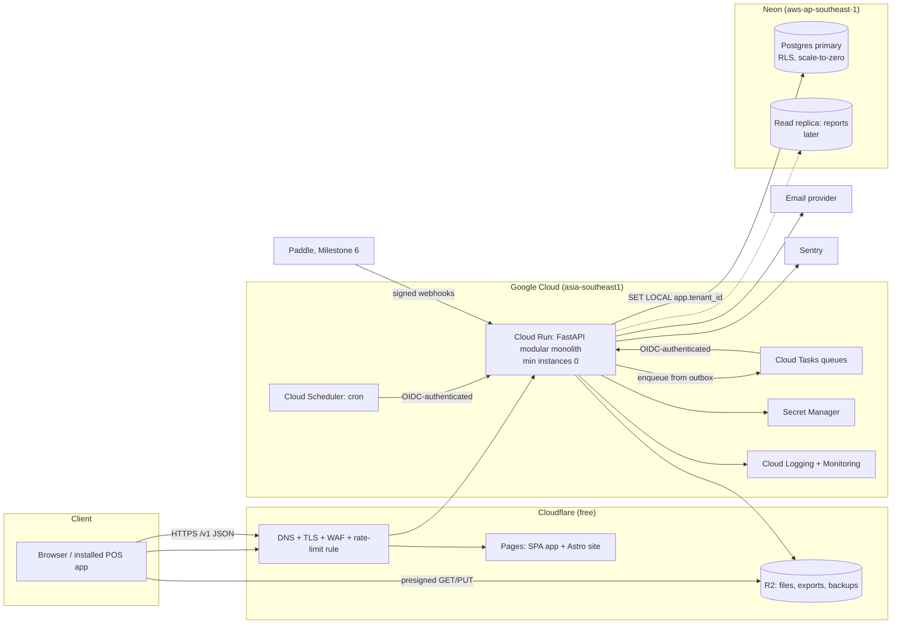
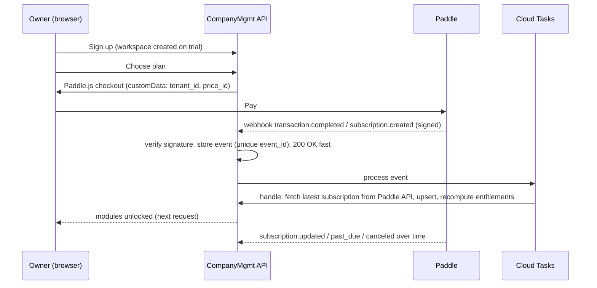

# Implementation Plan: Company Management SaaS

Status: **Approved by the owner on 30 September 2026. Building Milestone 1.**
Progress is tracked in [`PROGRESS.md`](PROGRESS.md).
Product name: **CompanyMgmt** (repo `companymgmt`). The owner wants a global product, so
the name is in plain English. It can be renamed before launch.

This plan turns the NSU CSE327 group project into a multi-tenant SaaS: a company management
suite that works for a tea stall with 2 staff and for a company with thousands of employees
across branches. It covers the audit of the current code, product scope, architecture,
security (OWASP ASVS 5.0 Level 2), testing, billing, DevOps and cost, the roadmap, and the
open questions only the owner can answer.

Changes made during Phase 0, at the owner's request:

- **New repository.** The product will live in a new repository with fresh history, so
  the old group members are not listed as contributors. This repository becomes the
  read-only archive (§0).
- **Payments come later.** Paddle is confirmed for a Bangladesh-based seller (the owner
  checked this as well). Payment integration moves to Milestone 6, after the product
  works. Until then the product keeps pricing pages, plans and limits, managed through an
  internal subscription model that Paddle plugs into later (§6).

---

## Contents

0. [Repository strategy](#0-repository-strategy)
1. [Audit of the current code](#1-audit-of-the-current-code)
2. [Product scope, modules and pricing](#2-product-scope-modules-and-pricing)
3. [Architecture](#3-architecture)
4. [Security requirements (ASVS L2)](#4-security-requirements-asvs-50-level-2)
5. [Testing strategy](#5-testing-strategy)
6. [Billing and automation with Paddle (deferred)](#6-billing-and-automation-with-paddle-deferred-to-milestone-6)
7. [Infrastructure, DevOps and cost](#7-infrastructure-devops-and-cost)
8. [Design system](#8-design-system-from-resumex)
9. [Phased roadmap](#9-phased-roadmap)
10. [Scope honesty: what to cut or defer](#10-scope-honesty-what-to-cut-or-defer)
11. [Risks and open questions](#11-risks-and-open-questions)

---

## 0. Repository strategy

- **The legacy repo** (`327_Company_Management_System`) is frozen as the academic original. It
  gets the `legacy-nsu-327` tag on its current `main` (commit `1482a71`) and a short
  README note pointing to the new product. Nothing else changes here.
- **This repo** (`omikhan4901/companymgmt`, public) starts with a **fresh first commit**. It imports
  no legacy history, so GitHub lists only the owner as a contributor. GitHub builds the
  contributor list from commit authors, so this is enough on its own.
- The rewrite reuses no legacy code (see §1), so nothing is lost by dropping the history.
  The business rules worth keeping are written down in §1.3 and carried into the new
  tests.
- Commits are made as the owner (`omikhan4901 <mehboobehsankhan@gmail.com>`), the same
  identity as in ResumeX. No AI co-author trailers, which would add a second contributor.
- Git rules from the brief apply in the new repo: work on `main` only, push only when CI
  passes locally, small conventional commits, no secrets, and a `.env.example` listing
  every variable.

**Status of the legacy tag.** The tag was created locally on `1482a71`. Pushing it from
this session was refused (HTTP 403): this environment's git access accepts branch pushes
but not tag pushes. The owner needs to push it once from their own machine (Q2).

---

## 1. Audit of the current code

~2,300 lines of Python (1,004 of them in `main.py`), 12 Jinja templates, 15 pytest tests
(**all 15 pass** on Python 3.11 with a fresh database). It is a server-rendered FastAPI
app on SQLite. The design patterns were required by the course, not chosen for the
problem.

### 1.1 Verdict: rewrite in the new repo and keep the domain knowledge

Most modules have at least one structural problem that a multi-tenant SaaS cannot keep:
unsalted SHA-256 passwords, in-memory sessions, float money, string dates, users
referenced by username strings, no tenant concept, and no migrations. Fixing all of
that in place touches every line, so a clean rewrite is faster and safer. Keep the rules
and scenarios, not the code.

### 1.2 File-by-file

| File | Verdict | Why |
|---|---|---|
| `main.py` (1,004 lines) | **Delete** | One file holds every route, HTML rendering, auth checks copied into every handler, and hours calculations repeated 4 times. `GET /logout` changes state. Forms have no CSRF token. The session cookie is not `Secure`. The same rules are enforced differently across pages: managers can see their department's payslips on the payroll page but cannot download them. |
| `authentication.py` | **Delete** | **Critical:** unsalted SHA-256 password hashes. Sessions live in a process dict, so they are lost on restart and cannot scale past one instance. On first run it creates `admin`/`admin`. "User not found" versus "Invalid password" lets anyone check which usernames exist. No rate limiting, MFA, expiry or revocation. It is a singleton by course rule. |
| `database.py` | **Replace** | SQLite. Money stored as `Float`. Dates and times stored as `String`. `employee_id`/`assigned_to` are username strings, not foreign keys. Department names are unique across the whole system. `create_all` instead of migrations. No `tenant_id`. |
| `attendance.py` | **Rewrite, keep concept** | Uses the server's local `datetime.now()` with no timezone. A shift that crosses midnight gives negative hours. Only one check-in per day. Loads every row to sum hours. The Adapter class adds nothing. |
| `payroll.py` | **Rewrite, keep the pluggable pay rules** | A strategy for pay rules is a **real fit** here, because pay types differ. The rest has to change: floats, a hard-coded `base/160` hourly rate, no link to attendance, nothing stopping two payslips for the same month, a catch-all `except` that hides errors, and serialization copied 5 times. |
| `department_manager.py`, `department_composite.py` | **Delete** | The Composite classes rebuild the whole tree in Python (O(n²)) on every request. The loop check on create does nothing. Replace with a parent-id table plus a recursive CTE, or a materialized path. |
| `task_manager.py` | **Delete; tasks return later as a small module** | The Factory Method and subclasses for priority should just be a `priority` column. |
| `notification.py` | **Delete** | An Observer that writes a JSON file. Replace with a notifications table fed by domain events (transactional outbox). |
| `logger.py` | **Delete** | A singleton that appends JSON lines to a local file and loads the whole log into memory. The file is mutable and disappears on serverless restarts. Replace with an append-only, hash-chained table (§4.4). |
| `report_manager.py`, `report_facade.py` | **Delete** | They sum in Python over full tables. Replace with SQL aggregation per module. |
| `pdf_report.py`, `pdf_payslip.py` | **Delete** | `fpdf` 1.7 supports Latin-1 only, so it **cannot render Bangla**. Replace with HTML templates rendered by WeasyPrint (HarfBuzz shaping, Noto Sans Bengali). |
| `templates/`, `static/` | **Delete** | Replaced by the SPA in the ResumeX design language (§8). |
| `attendance.json`, `notifications.json`, `audit.log`, `task_report.pdf`, `test_tasks.json` | **Delete** | Runtime data committed to git. Do not carry it over. |
| `requirements.txt` | **Replace** | Old pins: `uvicorn 0.19` (2022). `python-jose 3.3.0` has known CVEs (CVE-2024-33663 algorithm confusion, CVE-2024-33664). `passlib` is unmaintained. |
| `test_*.py` | **Use as specifications** | Every test shares one on-disk DB file and deletes it between tests. The scenarios are useful: payroll calculations, a manager seeing their department subtree, and "an admin cannot demote another admin". |
| `Readme.md`, `Explaination.md` | **Archive** | They stay in the legacy repo. |

### 1.3 Business rules carried forward (these become tests in the new repo)

1. A manager sees the people, attendance, tasks and payslips of their own department and
   every sub-department, and nothing outside it.
2. An employee sees only their own attendance and payslips.
3. Only the owner (formerly "admin") can change another owner's or admin's role. The last
   owner of a workspace can never be removed or demoted.
4. A department cannot become its own ancestor. A department with sub-departments or
   people cannot be deleted without reassigning them first.
5. Each payslip records which pay rule produced it (hourly, fixed monthly, commission, and
   more later).
6. Payroll, role changes, logins and department changes are audited.

### 1.4 Design patterns: only where they earn their place

| Pattern | Used for | Why |
|---|---|---|
| Strategy | Pay rules, tax rules per country, rounding rules | These rules really do vary, and each one needs its own tests. |
| Repository / unit of work (via SQLAlchemy session) | Tenant-scoped data access | One place to enforce tenant context (§3.3). |
| Transactional outbox + domain events | Cross-module reactions such as a sale posting to the ledger, or a payroll run sending notifications | Modules stay decoupled and events survive crashes. |
| Adapter (ports) | Email, file storage, billing provider, PDF renderer | Lets us swap vendors to control cost, and use fakes in tests. |

Not used: Singleton (dependency injection replaces it), Composite (a tree is data, not a
class hierarchy), Factory Method for tasks, Facade for reports.

---

## 2. Product scope, modules and pricing

### 2.1 Core platform (always on, every plan)

Workspaces (tenants) · branches/locations · members and invites · staff accounts without
email (username + password, or a device PIN for the POS) · built-in roles and permissions ·
audit log · notifications · file storage · settings (currency, timezone, language, fiscal
year, week start) · onboarding checklist · data export · plan limits and module switches ·
English and Bangla UI.

### 2.2 Modules, in dependency and value order

Each module ships as a complete unit with API, UI, permissions, audit events, reports,
Bangla strings, tests, and an entry in the plan matrix.

| # | Module | What it includes | Depends on |
|---|---|---|---|
| 1 | **People** | Employee directory, profiles, department tree, branches, job titles, documents, employment history | Core |
| 2 | **Attendance** | Clock in/out (web, phone, shared kiosk), shifts incl. overnight, late/early rules, corrections with approval, holiday calendar, monthly timesheets | People |
| 3 | **Leave** | Leave types and balances, accrual, requests and approvals, calendar | People, Attendance |
| 4 | **Payroll** | Salary structures (basic, house rent, medical, conveyance), pay rules, overtime from attendance, festival bonuses, deductions, advances and loans, tax deducted at source, payroll run (draft → review → finalize → lock), payslips as PDF in English and Bangla, bank/mobile-wallet transfer sheet | People, Attendance, Leave |
| 5 | **Catalog** | Products and services, variants, units (piece, kg, cup), prices per branch, categories | Core |
| 6 | **Sales / POS** | Fast touch POS (installable web app), cart, discounts, payment types (cash, card, bKash/Nagad recorded by hand), receipts, cash drawer and shift close, returns, sales history | Catalog |
| 7 | **Customers & dues** | Customer list, credit sales and dues (the shop "baki khata"), payment collection, statements, reminders to share on WhatsApp, simple pipeline for B2B | Sales |
| 8 | **Expenses** | Expense entry with a photo of the receipt, categories, recurring expenses, petty cash, approvals | Core |
| 9 | **Inventory** | Stock movement ledger, stock by branch, purchases and suppliers, transfers, stock counts, low-stock alerts, cost (weighted average) | Catalog, Sales |
| 10 | **Accounting** | Double-entry ledger underneath. Automatic postings from sales, expenses, payroll and purchases. Cash book, receivables/payables, P&L, balance sheet, trial balance, period close | 6–9 (reads their events) |
| 11 | **Reports & dashboards** | Dashboards across modules, saved reports, scheduled email reports, CSV/XLSX/PDF export | All |
| 12 | **Tasks** | Tasks, assignment, status, due dates (the legacy feature, reshaped) | People |
| 13 | **Enterprise controls** | SSO (OIDC/SAML), SCIM provisioning, custom roles with field-level permissions, approval chains, IP allowlist, API keys and outbound webhooks, audit export, dedicated database | Core |

Each module owns its own reports. Module 11 adds dashboards and scheduling on top of them.

### 2.3 Presets for non-technical owners

At sign-up the owner picks a business type. That turns on a small set of modules and
simplifies the UI. They can change it any time.

| Business type | Modules on | UI |
|---|---|---|
| Tea stall / small shop | Sales, Customers & dues, Expenses (+ Attendance if they have staff) | Simple: big buttons, plain words ("Money in / Money out"), no accounting terms |
| Restaurant / café | Sales, Catalog, Inventory, Expenses, Attendance | Simple |
| Retail with branches | Sales, Catalog, Inventory, Customers, Expenses, People, Attendance | Standard |
| Office / services company | People, Attendance, Leave, Payroll, Expenses, Tasks | Standard |
| Factory / enterprise | Everything | Advanced: dense tables, approvals, custom roles |

"Simple" and "Advanced" are a per-workspace setting that changes navigation depth and
defaults. The data model is the same, so a shop can grow without migrating.

### 2.4 Pricing tiers (set from competitor prices, 30 Sep 2026; owner asked me to decide)

**What competitors charge** (list prices found on 30 September 2026):

| Competitor | What it covers | Price |
|---|---|---|
| Zoho One | Whole suite | $37/employee/mo (annual, every employee) or $90/user/mo |
| Odoo | Whole suite | $31.10/user/mo Standard, $61 Custom; regional pricing from $8.95/user/mo |
| Zoho People | HR only | $1.25–9/user/mo |
| Zoho Payroll | Payroll only | $29/mo + $5/employee/mo |
| Connecteam | Attendance, scheduling | Free up to 10 users; $29–119/mo for 30 users |
| Deputy | Attendance, scheduling | $5.50–10/user/mo |
| Loyverse | POS | POS free; employee management and advanced inventory $25/store/mo each |
| Bangladeshi HR SaaS (PiHR, Smart HRM, GreenHR) | HR + payroll | ৳2,000–10,000/mo (~$16–82) by headcount |

**How we price.** A flat price per workspace that includes a number of people, then a
small fee per extra person. This keeps a tea stall at $0–9 and still costs a
2,000-person company far less per head than Zoho One or Odoo, which charge for every user.
Annual billing gets two months free. Regional prices (40–50% lower in lower-income
countries, including Bangladesh) arrive with Paddle in M6, the way Odoo does it.

| | **Free** | **Starter** | **Growth** | **Business** | **Enterprise** |
|---|---|---|---|---|---|
| Price (USD) | $0 | $9/mo or $90/yr | $29/mo or $290/yr | $79/mo or $790/yr, + $1.50/person over 150 | From $499/mo, annual |
| People | 5 | 15 | 50 | 150 included | Custom |
| Branches | 1 | 1 | 3 | Unlimited | Unlimited |
| Modules | Any 2 | Any 4 | All standard (1–12) | All standard | All + Enterprise controls |
| Storage | 200 MB | 1 GB | 10 GB | 50 GB | Custom |
| Custom roles | – | – | Basic | Yes | Field-level |
| Approvals | – | – | Single-step | Multi-step | Multi-step + policies |
| API & webhooks | – | – | – | Yes | Yes |
| SSO / SCIM / dedicated DB | – | – | – | – | Yes |
| Audit log | 30 days | 90 days | 1 year | 3 years | Custom + export |
| Support | Help center | Email | Email | Priority email | SLA |

Notes:

- Every paid plan starts with a 14-day Growth trial, with no card needed while payments
  are deferred.
- **Paddle's fee (5% + $0.50 per transaction)** takes 10.6% of a $9 monthly charge but only
  5.6% of a $90 yearly one. Push Starter customers toward annual billing.
- Why these numbers: Free (5 people, 2 modules) competes with Connecteam's and Loyverse's
  free tiers. Starter at $9 is below one Loyverse add-on. Growth at $29 matches Zoho
  Payroll's base fee but includes attendance, POS and payroll together. Business at $79
  for 150 people works out to $0.53/person, against $1.25–37 at Zoho.
- Prices are the starting point, re-checked against real sign-ups before M6.
- Limits are data, not code. Plans, modules and limits sit in tables that an internal
  admin console can edit, the same approach as ResumeX's plan settings.

---

## 3. Architecture

### 3.1 Key decisions

| Decision | Choice | Why (and what was rejected) |
|---|---|---|
| Shape | **Modular monolith** (one API service, strict module boundaries enforced by `import-linter`) | One deployable scales to zero, is cheap and simple to run. Modules can be split out later if one ever needs it. Microservices were rejected: they multiply cost and ops for no benefit at this size. |
| Backend | **Python 3.12, FastAPI, Pydantic v2, SQLAlchemy 2 (async) with psycopg 3, Alembic** | Keeps the owner's Python/FastAPI experience. Generates an accurate OpenAPI 3.1 contract. psycopg 3 behaves with Neon's PgBouncer in transaction mode. asyncpg was rejected because it needs its prepared-statement cache disabled. |
| Database | **PostgreSQL on Neon (serverless)** | Scales to zero, has a free tier, branches for previews and tests, point-in-time restore, and read replicas later. Postgres gives transactions, constraints, `NUMERIC`, recursive CTEs and **row-level security**, which are essential for payroll and accounting. MongoDB was rejected (weak for double-entry accounting). Supabase was rejected (free projects pause, paid starts at $25). |
| Tenancy | **Shared database and schema, `tenant_id` on every tenant row, Postgres RLS, plus an application-level guard** | Cheapest and simplest, and it scales to thousands of tenants. RLS gives a database-level backstop. Schema-per-tenant was rejected (N× migrations, pooling problems). A dedicated DB for Enterprise tenants is possible later without a rewrite (§3.6). |
| API | REST + JSON under `/v1`, OpenAPI-first, typed TS client generated from the spec | Simple to reason about, cache and test. GraphQL was rejected (harder to authorize per field, no need). |
| Frontend app | **React 19 + TypeScript + Vite SPA**, React Router, TanStack Query, **antd 6 + Tailwind 4**, lucide icons, `motion` | Matches the ResumeX design system and component library. A static SPA needs no server, so it is free to host. Next.js SSR was rejected: the app sits behind login, so SSR adds cost and no SEO benefit. |
| Marketing site | **Astro** (static) with the same Tailwind tokens | Fast, SEO-friendly, no JavaScript by default. Hosts the landing, pricing, legal pages and help center. |
| Hosting (API) | **Google Cloud Run** (request-based billing, min instances 0) in `asia-southeast1` (Singapore) | Scales to zero with a generous free tier, and the owner already runs ResumeX on it. Singapore is close to Bangladesh and to Neon's `aws-ap-southeast-1`. |
| Hosting (web) | **Cloudflare Pages** | Free, unlimited static bandwidth, commercial use allowed. Vercel Hobby was rejected: its terms forbid commercial use. |
| Background jobs | **Cloud Tasks** (queue) + **Cloud Scheduler** (cron), both calling authenticated internal endpoints on the same Cloud Run service; **transactional outbox** in Postgres | No always-on worker. The first 1M Cloud Tasks operations and 3 Scheduler jobs are free. The outbox guarantees events are never lost. Celery/Redis were rejected: always-on and paid. |
| Files | **Cloudflare R2** (S3 API), per-tenant key prefix, short-lived presigned URLs | 10 GB free and zero egress fees. Accessed through a storage port, so GCS works as a drop-in. |
| Cache | No Redis at first. Per-request memoization, a small in-process LRU for plan/permission config (with a version check), and HTTP caching for static data | Redis is an always-on cost. If shared cache or rate-limit state is needed later: Upstash Redis (free tier, pay per request). |
| Rate limiting | Cloudflare free rate-limit rule at the edge + a Postgres counter table (UNLOGGED) in the app | No extra service. |
| Email | Email port. Start with a free transactional provider (Resend or Brevo), move to Amazon SES (~$0.10 per 1,000) at scale | Free at 0 tenants, cheap at scale. |
| PDF | WeasyPrint (HTML/CSS to PDF), Noto Sans Bengali bundled | Correct Bangla shaping. Reuses the design tokens. |
| Errors/observability | Sentry (free tier), Cloud Logging (structured JSON), OpenTelemetry traces (sampled), Cloud Monitoring uptime checks | All free at this scale. |
| Infra as code | OpenTofu, with state in a GCS bucket | Reproducible environments, reviewable changes. |

### 3.2 Diagram

### 3.3 Tenant isolation (defense in depth)

1. **Tenant comes from auth, never from input.** The access token carries `tid` (tenant)
   and `sid` (session). Every request reloads the membership row for (`user`, `tid`), so
   a removed member or a changed role takes effect on the next request. Switching
   workspace issues a new token.
2. **Application guard.** A request-scoped `TenantContext` is required to open a DB
   session. Tenant-scoped repositories add `tenant_id` to every query and insert. Code
   that needs cross-tenant access (internal admin, migrations, billing webhooks) uses a
   separate, explicit `SystemContext` that is audited.
3. **Database guard (RLS).** Every tenant table has
   `ENABLE` + `FORCE ROW LEVEL SECURITY` and one policy:
   `USING (tenant_id = current_setting('app.tenant_id', true)::uuid) WITH CHECK (same)`.
   The API connects as `app_rw`, which is not the table owner and has no `BYPASSRLS`.
   Migrations run as `app_owner`. `SET LOCAL app.tenant_id` is issued at the start of
   every transaction, so it is safe with PgBouncer in transaction mode. If the setting is
   missing, the policy compares against `NULL` and **returns no rows (fails closed)**.
4. **Referential guard.** Tenant tables use composite keys: `UNIQUE (tenant_id, id)`, and
   foreign keys reference `(tenant_id, id)`. A row can never point at another tenant's
   row, even through a bug.
5. **IDs** are UUIDv7: no enumeration, and they sort by time for index locality.
6. **Files**: object keys are `t/{tenant_id}/{random}`. Presigned URLs (≤5 min) are issued
   only after a permission check. Uploads go through a pending-file record that must be
   confirmed by the same tenant.
7. **Jobs and events** carry `tenant_id` and set the same context before touching data.
   Cache keys always include the tenant.
8. **CI guard**: a test lists every table from the SQLAlchemy metadata and fails if a
   table has no `tenant_id`, RLS enabled, forced RLS and a policy, unless it is on a short
   reviewed allowlist of global tables (e.g. `plans`).

### 3.4 Data conventions

- **Money**: `BIGINT` minor units + ISO 4217 currency on the row. Python `Decimal` for
  calculations, with explicit rounding (half-even or half-up per rule). Never floats.
- **Quantities**: `NUMERIC(18,3)` (kg of tea leaves, litres of milk). Sign and bounds are
  checked in the database.
- **Time**: all instants in `timestamptz` (UTC). Each branch has an IANA timezone.
  "Business date" (the day a shift or sale belongs to) is stored explicitly, computed in
  the branch timezone at write time.
- **Text**: NFC-normalized. Names in any script, with no ASCII-only assumptions. Search is
  case-insensitive and accent-insensitive where supported. Bangla and English collation
  are tested.
- **Concurrency**: a `version` column on editable records. The API uses `ETag`/`If-Match`
  and answers `412` on a stale write, and the UI offers a merge/reload. Money-moving
  operations use row locks (`SELECT … FOR UPDATE`) inside one transaction.
- **Idempotency**: all `POST`s that create or move money take an `Idempotency-Key`,
  stored per tenant for 24h with a hash of the request. A repeat returns the first
  response. A different body with the same key gets `422`.
- **Soft delete** only where the business needs "undo" or history. Financial documents
  are never deleted, only voided with a reversing entry.

### 3.5 API design

- `/v1/...` resources, JSON, `snake_case`. Cursor pagination (`?cursor=&limit=`, limit
  ≤ 200). Filters and sort from an allowlist.
- Errors: RFC 9457 problem details (`type`, `title`, `status`, `detail`, `errors[]`,
  `request_id`). Never stack traces.
- Auth: `Authorization: Bearer <access JWT>`. The refresh token lives in an httpOnly
  cookie scoped to `/v1/auth/refresh`.
- OpenAPI 3.1 is generated from code. `oasdiff` in CI blocks breaking changes to `/v1`.
  A typed client for the SPA is generated from the spec.
- Rate-limit headers (`RateLimit`, `RateLimit-Policy`) on limited routes.
- Later (Business+): API keys scoped to permissions, outbound webhooks signed with HMAC,
  with retries and a delivery log.

### 3.6 From tiny to large without a rewrite

| Stage | What changes | Code change |
|---|---|---|
| 0–50 tenants | Everything above. Neon free/Launch plan, Cloud Run min 0 | None |
| 50–500 tenants | Neon autoscaling 0.25–2 CU. Cloud Run min instances 1 during Bangladesh business hours (removes cold starts). Read replica for reports | Config only |
| Large tenant (thousands of employees) | Time-partitioned tables for attendance events, audit log and stock movements. Heavy reports and payroll runs as background jobs with progress, not in requests | Planned in the schema from the start; payroll is a job from day 1 |
| Enterprise isolation | A `tenant_routes` table maps a tenant to a database. The session factory picks the DSN per tenant. Same schema and code, own Neon project. Tenants can be moved with a copy-and-switch job | One routing layer, designed in Milestone 1, used in Milestone 7 |
| Multi-region | Out of scope until revenue justifies it | – |

---

## 4. Security requirements (ASVS 5.0 Level 2)

The target is **OWASP ASVS 5.0.0 (May 2025), Level 2**. Below, each requirement is
concrete and checkable, and mapped to an ASVS chapter. In Milestone 1 a full checklist,
`docs/security/asvs-l2.md`, lists every L1+L2 requirement with its status, evidence
(test name, config, or doc) and any accepted risk. I map to chapters here rather than
quote requirement IDs from memory. The checklist will cite exact IDs from the official
text.

### 4.1 Tenant isolation (V8 Authorization, V15 Secure Coding and Architecture)

- [ ] S1. RLS enabled, forced and covered by a policy on every tenant table (CI metadata test, §3.3.8).
- [ ] S2. The app DB role has no `BYPASSRLS`, is not the table owner, and has no DDL rights (migration test asserts it).
- [ ] S3. With no tenant context, every tenant table returns 0 rows and rejects inserts (DB-level test).
- [ ] S4. **Cross-tenant test suite**: for every tenant-scoped endpoint in the OpenAPI spec (auto-discovered), tenant B's token on tenant A's resource IDs gets `404` for reads, and writes get `404` with no change. New endpoints are covered automatically and CI fails if one is skipped without a reason.
- [ ] S5. A raw SQL test as `app_rw` with tenant B's context cannot read or update tenant A's rows in any table.
- [ ] S6. Composite foreign keys stop cross-tenant references (a test tries to link A's invoice to B's customer).
- [ ] S7. Presigned file URLs are only issued after authorization, expire in ≤5 minutes, and object keys cannot be guessed. Test: tenant B cannot get a URL for tenant A's file ID.
- [ ] S8. Background jobs refuse to run without a tenant context (test).

### 4.2 Authentication (V6) and sessions (V7, V9 Self-contained Tokens)

- [ ] A1. Passwords hashed with **argon2id** (argon2-cffi; memory ≥ 19 MiB, t ≥ 2, p = 1) and re-hashed on login when parameters change.
- [ ] A2. Password rules: minimum 8, allow at least 64 characters, all Unicode allowed, no composition rules, checked against a bundled list of the top 100k breached passwords (optional online HIBP k-anonymity check, off by default).
- [ ] A3. Email verification before a workspace can invite people or export data.
- [ ] A4. **Access token**: EdDSA-signed JWT with a pinned algorithm, 10-minute lifetime, claims `sub`, `tid`, `sid`, `iat`, `exp`, `aud`, `iss`, kept in memory only (never localStorage).
- [ ] A5. **Refresh token**: 256-bit random, stored only as a SHA-256 hash, httpOnly + Secure + `SameSite=Strict`, path-scoped cookie. **Rotated on every use.** Reuse of an old token revokes the whole token family and emails the user. Idle timeout 7 days, absolute 30 days, both configurable per workspace (shorter for Business+).
- [ ] A6. **Session revocation**: every request checks the session row (`revoked_at`, user disabled, membership removed). A sessions page lists devices and can log out one or all. Password change, MFA reset and member removal revoke sessions.
- [ ] A7. **MFA**: TOTP (RFC 6238, ±1 step drift) with 10 single-use recovery codes stored hashed. The TOTP secret is encrypted with AES-256-GCM. A workspace can require MFA for owners/admins (on by default for Business+). Passkeys (WebAuthn) in Milestone 7.
- [ ] A8. **Step-up re-authentication** (password or TOTP within the last 5 minutes) before: changing password or MFA, exporting data, finalizing payroll, changing roles, deleting the workspace.
- [ ] A9. **Brute force**: per-account and per-IP limits with growing delays, and a Cloudflare Turnstile challenge after 5 failures. No hard lockout that an attacker could use to lock out a real user. The same generic error and similar timing whether or not the account exists.
- [ ] A10. Password reset: single-use token, stored hashed, valid for 30 minutes, sessions revoked afterwards, same response for unknown emails.
- [ ] A11. **POS device PIN** (Milestone 3): only on a device registered by an admin, only for roles marked "PIN allowed" (e.g. cashier), rate-limited, and never valid on the web.
- [ ] A12. Every auth event (login, fail, MFA, reset, revoke, token reuse) is in the audit log.

### 4.3 Authorization: RBAC + custom roles (V8)

- [ ] R1. Permissions are fine-grained strings (`payroll.run.finalize`, `sales.refund.create`) declared by each module, checked by a dependency on every route. A CI test fails if a route declares no permission (public routes must opt out explicitly).
- [ ] R2. Built-in roles: Owner, Admin, Manager, Accountant, Cashier, Employee. **New members get Employee (least privilege).**
- [ ] R3. Scope: grants can be limited to branches and to a department subtree (the legacy manager rule, §1.3.1).
- [ ] R4. Custom roles per workspace (Growth+): built from the permission catalog. Nobody can grant a permission they don't hold. Owner-only permissions can't go into custom roles.
- [ ] R5. Role changes take effect on the user's next request, with no re-login (the request reloads membership, §3.3.1). Tested.
- [ ] R6. Object-level checks go through each module's policy functions and are tested with a permission matrix (role × action × scope).
- [ ] R7. The last owner cannot be removed or demoted. Ownership transfer needs step-up by both parties.

### 4.4 Immutable audit log (V16 Security Logging and Error Handling)

- [ ] L1. `audit_events` is append-only: `app_rw` has `INSERT` + `SELECT` only, and a trigger rejects `UPDATE`/`DELETE` even for the owner role, except in the retention purge job, which runs as a separate audited role.
- [ ] L2. **Hash chain per tenant**: each row stores `prev_hash` and `hash = SHA-256(prev_hash ‖ canonical_json(row))`, written in the same transaction under a per-tenant advisory lock. A daily job re-checks each chain and writes the chain heads to R2 under a retention lock.
- [ ] L3. Each event records who, on whose behalf (impersonation), tenant, action, target type and ID, before/after diff (sensitive fields redacted), IP, user agent, request ID and time.
- [ ] L4. Logs never contain passwords, tokens, TOTP secrets or full bank numbers. Tested with a log-scrubbing test.
- [ ] L5. Owners and admins can view, filter and export the audit log. Retention follows the plan (§2.4).

### 4.5 Data protection, transport and secrets (V11 Cryptography, V12 Secure Communication, V13 Configuration, V14 Data Protection)

- [ ] D1. TLS 1.2+ everywhere, with HSTS (`max-age=63072000; includeSubDomains; preload` after launch). Neon connections use `sslmode=verify-full`.
- [ ] D2. At rest: Neon storage and R2 are encrypted by the provider. **Field-level AES-256-GCM** for national ID numbers, bank/wallet account numbers, TOTP secrets and salary figures in exports, with a key ID so keys can rotate.
- [ ] D3. Secrets live in Google Secret Manager, read at startup through the runtime service account. Deploys use GitHub OIDC Workload Identity Federation, so there are no JSON keys anywhere. `.env.example` lists every variable with no values.
- [ ] D4. Security headers: a strict CSP (`default-src 'self'`, no inline scripts, `frame-ancestors 'none'`), `X-Content-Type-Options`, `Referrer-Policy: strict-origin-when-cross-origin`, `Permissions-Policy`. Tested in e2e.
- [ ] D5. **Input validation**: every body, query and path is a Pydantic model with lengths, ranges and enums. Unknown fields are rejected. Request body is capped (1 MB JSON, 10 MB uploads). JSON depth is limited.
- [ ] D6. **SQL injection**: ORM or bound parameters only. A Semgrep rule bans string-built SQL.
- [ ] D7. **XSS**: React escaping, no `dangerouslySetInnerHTML` (lint rule), CSP. Any future rich text is sanitized with an allowlist.
- [ ] D8. **CSRF**: the API uses bearer tokens, not cookies. The one cookie endpoint (refresh) requires `SameSite=Strict`, an `Origin` check against an allowlist, and a custom header.
- [ ] D9. **SSRF**: the server never fetches user-supplied URLs until outbound webhooks exist (Milestone 7). Those go through an HTTPS-only fetcher that blocks private, link-local and metadata IP ranges, re-checks after DNS resolution, and has timeouts and size limits.
- [ ] D10. **Files**: type checked by magic bytes against an allowlist, images re-encoded, size limits per plan, downloads served with `Content-Disposition: attachment` from a separate origin.
- [ ] D11. CSV/XLSX export escapes formula injection (`=`, `+`, `-`, `@` prefixes).
- [ ] D12. Error responses leak no internals. Debug is off in production (config test).

### 4.6 Supply chain and CI security (V15)

- [ ] C1. Dependencies locked (uv lockfile, npm lockfile). Renovate PRs weekly, grouped.
- [ ] C2. `pip-audit`, `npm audit --omit=dev` / OSV-Scanner, **gitleaks**, Semgrep, CodeQL, and Trivy (container image) run in CI. High/critical findings fail the build.
- [ ] C3. GitHub secret scanning with push protection, and branch protection on `main` (required checks).
- [ ] C4. Container: distroless or slim base, non-root user, read-only filesystem where possible, image pinned by digest.

### 4.7 Privacy, export, deletion, backups (V14)

- [ ] P1. **Workspace export**: the owner can export all data as a ZIP of JSON + CSV + files. It is built in the background, linked from an email, the link expires in 24h, and step-up is required.
- [ ] P2. **Personal data export** for any member (their profile, attendance, payslips, audit events about them).
- [ ] P3. **Workspace deletion**: step-up, then a 30-day grace period (restorable), then a hard purge job across DB rows, R2 objects and search indexes. A signed deletion certificate is emailed. Backups age out within 35 days, and this is stated in the privacy policy.
- [ ] P4. **Member removal** anonymizes personal data that is not needed for legal records. Payroll and accounting records are kept for the legal retention period (value to be confirmed, Q7).
- [ ] P5. **Backups**: Neon point-in-time restore (window depends on plan), plus a nightly `pg_dump` encrypted with `age` and uploaded to R2 by a Cloud Run Job, kept 30 days.
- [ ] P6. **Restore runbook** (`docs/runbooks/restore.md`): full restore to a Neon branch, and single-tenant restore (filter the dump by `tenant_id`, then copy back in a maintenance window). **A quarterly restore drill** checks row counts and re-verifies the audit hash chain.
- [ ] P7. The privacy policy and terms cover Bangladesh's Personal Data Protection Act 2026 (and GDPR-style rights for foreign customers). A one-time legal review is recommended (Q7).

---

## 5. Testing strategy

### 5.1 Layers

| Layer | Tools | What it covers |
|---|---|---|
| Unit | pytest, **Hypothesis** (property-based) | Pay rules, tax slabs, rounding, overtime, leave accrual, stock cost, ledger postings. Invariants: every journal entry balances; stock movements add up to stock on hand; payroll net = gross − deductions; money never rounds to more than was paid |
| Integration | pytest against **real Postgres** (Docker locally, a service container in CI), one transaction per test rolled back afterwards | Repositories, RLS, migrations, outbox, jobs, idempotency, locking |
| API / contract | FastAPI test client, **Schemathesis** (fuzzing from the OpenAPI spec), `oasdiff` | Every endpoint: auth, permissions, validation, problem-details shape. No 500s under fuzzing. No breaking contract changes |
| Isolation | Dedicated suite (§4.1) | Cross-tenant access for every endpoint and table |
| Frontend unit | Vitest + Testing Library | Components, forms, hooks, formatters (Bangla digits, currency) |
| End-to-end | **Playwright** (Chromium + WebKit + mobile viewport), **axe-core** accessibility checks on every page | Sign-up → onboarding → invite → clock-in → payroll run → payslip PDF, POS sale → due → payment; keyboard-only paths |
| Visual | Playwright screenshots of key screens (en + bn) | Layout regressions, Bangla rendering |
| Load | **k6** against staging | See §5.4 |
| Security | ZAP baseline scan against staging (weekly), plus §4.6 | Headers, common web issues |

### 5.2 Coverage targets and CI gates

- API line coverage **≥ 85%** overall and **≥ 95%** for `core/` (auth, tenancy,
  permissions, audit) and money modules (payroll, sales, accounting). Branch coverage
  ≥ 80%. The web app ≥ 70% on logic (hooks, lib).
- **Required checks on every push to `main`** (the rule "only push when tests pass" is
  enforced by running the same script locally before pushing):
  ruff (lint + format) · mypy `--strict` · import-linter (module boundaries) · pytest with
  coverage gate · isolation suite · migrations (upgrade from empty, downgrade one step,
  `alembic check` for drift) · Schemathesis (short run) · oasdiff · eslint · `tsc
  --noEmit` · Vitest · Playwright e2e + axe (runs the built SPA against the API and
  Postgres in Docker Compose) · gitleaks · pip-audit / OSV · Semgrep · Trivy.
- CodeQL and ZAP run on a schedule. k6 runs on demand before each milestone.
- Test runtime budget: API suite < 4 min, e2e < 8 min. Tests stay fast (the owner's
  ResumeX rule).

### 5.3 Edge cases (each becomes at least one named test)

The list lives in `docs/testing/edge-cases.md` and grows with every bug found. Each entry
gets a test ID and the expected behaviour.

**Concurrency and duplicates**
1. Two managers edit the same employee at once → the second save gets `412` and the UI offers reload/merge. No lost update.
2. Double-click on "Finalize payroll" or "Complete sale" → the same idempotency key, one result, the second call returns the first response.
3. The same idempotency key with a different body → `422`, nothing changed.
4. Two cashiers sell the last unit at the same time → one succeeds. The other gets "out of stock", or a negative-stock warning if the workspace allows it.
5. Payroll finalized while someone edits a salary → the finalized run keeps its snapshot, and the edit applies to the next run.
6. Two browser tabs refreshing tokens at once → no false "token reuse" family revocation (a 10-second grace for the same predecessor token).
7. A webhook, job or event delivered twice or out of order → processed once, state never moves backwards.

**Time and dates**
8. Payroll for February in a leap year (29 days) and a normal year. Daily-rate proration on 28/29/30/31-day months.
9. Employee joins or leaves mid-month, including on the 29th of February.
10. An overnight shift (22:00–06:00) counts toward the business date the shift started on. Hours are never negative.
11. DST change inside a shift for a branch in a DST timezone (e.g. Europe/London): hours are counted from UTC instants, not wall clock. Bangladesh (UTC+6, no DST) is the default and is tested too.
12. Branches in different timezones: "today's sales" and "late check-in" use each branch's zone.
13. Client clock skew: device time 3 hours off → the server stamps the time. Offline POS sales keep the device time only as a reported field and flag skew > 5 minutes.
14. Clock-in exactly at midnight, and at 23:59:59.999.
15. Fiscal year July–June (Bangladesh) versus calendar year.
16. A JWT issued a few seconds in the future because of server skew → allowed within 30 seconds of leeway, rejected beyond that.

**Numbers and money**
17. Zero, negative and huge quantities and prices: negative rejected where invalid (price, stock received), zero allowed only where it makes sense (free item), and values over 10¹² rejected with a clear message. No overflow in `BIGINT`.
18. Fractional quantities (0.125 kg) and rounding of line totals versus the document total. Rounding differences are posted to a rounding account.
19. Salary 0 (volunteer/intern), overtime with no base salary, deductions larger than gross → net floors at 0 and the remainder carries forward as a recoverable advance (configurable), never a negative payslip.
20. Currency with no minor unit (JPY) and with three (KWD) in formatting and storage.
21. Discount of 100%, and discount larger than the price → rejected.

**Text and locale**
22. Names in Bangla (মোঃ আব্দুল করিম), Arabic (RTL, عبد الله), emoji (🍵 Cha Ghor), combining marks, zero-width joiners, very long names (200 chars) → stored, searched, sorted, and rendered correctly in the UI and in **PDFs**.
23. Bangla digits (০-৯) typed into number fields → accepted and normalized.
24. Mixed LTR/RTL text in one field does not break table layout (CSS logical properties, `dir="auto"`).
25. Unicode lookalikes in usernames/emails (Cyrillic "а") → email normalization and a confusables check on usernames.
26. The same email in different case → the same account.

**Lifecycle and state**
27. **Tenant deleted mid-request**: a request that started before deletion finishes or fails cleanly. Later requests get `410 Gone` with a restore link for owners during the grace period.
28. **Subscription expires mid-session** (after Milestone 6; until then, the plan changes by admin): the next request sees the new entitlements. Writes to locked modules get `402` with an upgrade prompt, and reads and export keep working. No data loss in forms, because the draft is kept client-side.
29. **Role changed while logged in**: the next request uses the new permissions. The UI reacts to `403` by refreshing the permission set and hiding the action.
30. Member removed while clocked in → attendance auto-closes at removal time with a note.
31. Last owner tries to leave or demote themselves → blocked with an explanation.
32. Invite accepted after it expired, after it was revoked, or by a different email → rejected with a clear message.
33. Module switched off while its data exists → the data is hidden, not deleted, and returns when the module is switched back on.

**Partial failure**
34. Payroll run fails halfway through 5,000 employees → the job resumes from a checkpoint, and each employee is processed exactly once (unique key on run + employee).
35. Sale saved but receipt email fails → the sale stands, the email retries through the outbox, and the failure is visible.
36. File uploaded to R2 but DB confirm fails → the orphaned object is removed by the sweeper job.
37. DB cold start (Neon waking up) during a request → retried once transparently, and the latency is recorded.
38. Export job interrupted → restarts, and the link is emailed only when complete.

**Hostile input**
39. Malformed JSON, wrong content type, duplicate keys, deep nesting (depth > 32) → `400`/`415`/`422`, never `500`.
40. Oversized payloads (JSON > 1 MB, files over the plan limit, CSV import > 50k rows) → `413`, or a background import with limits.
41. IDs from another tenant, random UUIDs, non-UUID strings, SQL/HTML/formula payloads in every text field → `404`/`422`, stored safely, exported safely.
42. Unicode in filenames and path traversal (`../`) in upload names → names sanitized, keys server-generated.
43. Replay of an old refresh token → family revoked, user notified.
44. CSV import containing formulas, mixed encodings (UTF-8 BOM, UTF-16), Bangla headers.

### 5.4 Load tests (k6, before each milestone release)

| Scenario | Target (1 Cloud Run instance, 1 vCPU / 1 GiB, Neon 0.25–1 CU) |
|---|---|
| Read-heavy dashboard, 50 req/s across 100 tenants | p95 < 300 ms, 0 errors |
| POS sales, 20 sales/s across 50 branches | p95 < 400 ms, no duplicate sales, stock consistent |
| Morning clock-in burst, 2,000 employees in 5 min, one tenant | p95 < 500 ms |
| Payroll run, 5,000 employees | finishes < 5 min as a background job, API stays responsive |
| Cold start, from zero | first response < 4 s (API + Neon wake); documented, then reduced with min instances when paid |

Targets are starting points. The first run sets a baseline and the targets get tightened.

---

## 6. Billing and automation with Paddle (deferred to Milestone 6)

**Owner decision (Phase 0): build the product first, then add payment integration.**
Until Milestone 6 the product has the pricing page, plans, limits, trials and module
switches, managed through an internal `subscriptions` table and an internal admin
console. No payments are taken.

### 6.1 Paddle for a Bangladesh-based seller: verification

- **Supported.** Bangladesh (BD) is a supported country, and transactions there are in
  USD. Paddle accepts individuals and sole traders: business verification is skipped,
  and they complete identity verification (government ID, proof of address, sometimes a
  liveness check via Sumsub) plus a **domain review**. Payouts go by bank transfer,
  PayPal or Payoneer, monthly, with a $100 minimum threshold. B2B SaaS is Paddle's core
  use case. The fee is 5% + $0.50 per transaction. The owner has also checked this
  independently.
- **Catches to know about (none are blockers):**
  1. **Local customers.** Paddle charges cards and PayPal in USD. Many Bangladeshi shop
     owners pay with bKash/Nagad and don't have an internationally enabled card. Paddle
     suits foreign customers and card-holding local businesses. Reaching tea stalls will
     likely need a local gateway later (SSLCommerz or bKash PGW), which needs a trade
     licence and makes you the merchant, so you handle VAT. The billing layer is a
     provider port so this can be added (Q4).
  2. **Fee on small prices**: see §2.4. Prefer annual billing or a country price for the
     cheapest plan.
  3. **Domain review needs a live site** with product description, pricing, terms,
     privacy and refund policy, and a working product. This fits Milestone 6 naturally.
  4. **Receiving foreign payouts in Bangladesh**: bank wires and Payoneer to a BD bank
     account are normal for software exports, but the tax treatment (e.g. ICT/ITES export
     income) should be confirmed with an accountant (Q7).
  5. One Paddle account per seller: if ResumeX already uses a Paddle account, check
     whether a second product and domain can be added to the same account (Q5).

### 6.2 Flow (automated, no manual work)

1. **Sign-up** creates the workspace immediately on a trial, so there is never a paid
   customer without a workspace. Checkout carries `custom_data.tenant_id`.
2. **Webhook intake** (`POST /v1/billing/paddle/webhook`): verify the `Paddle-Signature`
   header (HMAC-SHA256 over `ts:raw_body` with the endpoint secret, constant-time
   compare, reject if `ts` is older than 5 minutes). Insert into `billing_events` with a
   unique `event_id`. Return `200` within milliseconds. Duplicates are no-ops.
3. **Processing** (Cloud Tasks, retried with backoff): for any subscription event,
   **fetch the current subscription from the Paddle API and treat that as the truth**.
   The event is only a trigger. This makes out-of-order and replayed events harmless.
   Updates are also guarded by comparing Paddle's `updated_at`, so state never moves
   backwards.
4. **Provisioning and module activation**: entitlements (plan, modules, limits,
   add-ons) are recomputed from the subscription and cached with a version number. The
   next request sees them.
5. **Renewal**: `transaction.completed` extends the period, and a receipt email comes
   from Paddle.
6. **Failed payment / dunning**: Paddle retries the payment and emails the customer. On
   `subscription.past_due` we show an in-app banner to owners, send our own reminder on
   day 1, 3 and 7, and set a **grace period of 14 days** (configurable).
7. **Suspension** after the grace period: **read-only mode**. Members can log in, view and
   export, but cannot create or edit. POS shows a clear message. Nothing is deleted.
8. **Cancellation**: access stays until the period ends, then read-only for 30 days, then
   **data retained for 90 days** with emails at 30/7/1 days before deletion, then the
   purge job from §4.7 P3. Reactivating at any point restores everything.
9. **Plan changes**: upgrades apply now (prorated by Paddle). Downgrades apply at renewal,
   and if usage exceeds the new limits, extra modules or people become read-only rather
   than deleted.
10. **Reconciliation**: a daily job compares active subscriptions in Paddle with ours and
    alerts on any mismatch.

### 6.3 Sandbox test plan

- Unit tests with **recorded webhook fixtures** re-signed with a test secret: valid,
  bad signature, stale timestamp, duplicate `event_id`, out-of-order
  (`updated` before `created`), replayed old event, unknown event type (ignored and
  logged), and a tenant that doesn't exist.
- Integration tests with a **fake Paddle API** (the port) for each lifecycle path above,
  including a Paddle API outage (retry, never downgrade on error).
- A manual and automated run against the **Paddle sandbox** before go-live: real
  checkout with test cards (success, decline, 3DS), the webhook simulator for each event,
  cancellation, plan change, and past-due to suspension (with the clock sped up through a
  test-only grace setting).
- The go-live checklist follows Paddle's own.

---

## 7. Infrastructure, DevOps and cost

### 7.1 Environments

| Env | API | DB | Web | Purpose |
|---|---|---|---|---|
| Local | Docker Compose (API, Postgres 16, fake R2 via MinIO, Mailpit) | Local Postgres | Vite dev server | Development and all tests |
| CI | GitHub Actions service containers | Postgres container | Built SPA | Gates (§5.2) |
| Staging | Cloud Run `companymgmt-api-staging` (min 0) | Neon branch `staging` (free) | Pages preview | e2e against real cloud, k6, ZAP, demos |
| Production | Cloud Run `companymgmt-api` (min 0 → 1 when paid) | Neon `main` | Pages production | Customers |

Preview environments per branch are unnecessary, because work goes straight to `main`.

### 7.2 Delivery

- **Containers**: multi-stage Dockerfile (uv for Python deps), non-root, slim/distroless,
  about 150–250 MB including WeasyPrint's system libraries.
- **CI/CD (GitHub Actions)**: on push to `main`, run all gates. If they pass, build the
  image, push to Artifact Registry (cleanup policy keeps the last 5 images to stay inside
  the 0.5 GB free tier), run `alembic upgrade` as a Cloud Run Job, deploy to staging,
  smoke-test, then promote the **same image digest** to production. Auth is GitHub OIDC
  with Workload Identity Federation (no keys).
- **Migrations** are backward-compatible (expand, then contract), so the old revision
  keeps working during the rollout. Rollback means redeploying the previous revision.
- **Web**: Cloudflare Pages builds from `main` (the SPA and the Astro site as two
  projects).

### 7.3 Monitoring, logging, errors

- Structured JSON logs with `request_id`, `tenant_id` (never personal data), latency and
  status, sent to Cloud Logging (50 GiB/month free).
- Sentry for API and web errors (free tier), with release tags and PII scrubbing.
- Uptime checks on `/healthz` and `/readyz` (DB reachable) through Cloud Monitoring, with
  email alerts.
- Alerts: error rate > 2% over 5 min, p95 > 1 s over 10 min, failed jobs, audit chain
  verification failure, backup job failure, billing reconciliation mismatch.
- A public status page (free tier of a hosted provider) once there are customers.

### 7.4 Cost

List prices as of September 2026: Cloud Run 180k vCPU-s, 360k GiB-s and 2M requests free
per month, then $0.000024/vCPU-s; Neon Free (0.5 GB storage and 100 CU-hours per project)
and Launch plan ($0.106/CU-hour, $0.35/GB-month, no minimum); R2 10 GB free; Cloudflare
Pages free. **These are estimates. Actual usage is measured in Milestone 1 and the table
updated.** Assumptions: small tenants, mostly Bangladesh business hours, API instance
1 vCPU / 512 MiB with concurrency 40.

| Item | 0 tenants | 10 tenants (~150 users, ~0.3M req/mo) | 100 tenants (~2,000 users, ~5M req/mo) |
|---|---|---|---|
| Cloud Run (API + jobs) | $0 (scaled to zero) | $0 (inside free tier) | ~$8–15 |
| Neon Postgres | $0 (Free plan) | ~$5–9 (Launch: ~75 CU-h + ~1 GB) | ~$20–25 (~200 CU-h at 0.25–1 CU + ~5 GB) |
| Cloudflare Pages + DNS + WAF | $0 | $0 | $0 |
| R2 storage (files + backups) | $0 | $0 (< 10 GB) | ~$0–1 |
| Cloud Tasks / Scheduler / Secret Manager / Logging / Artifact Registry | $0 | $0 | ~$0–1 |
| Email | $0 (free tier) | $0 (free tier) | ~$1 (SES) |
| Sentry, uptime, GitHub Actions (public repo) | $0 | $0 | $0 |
| Domain name | ~$1/mo (≈$12/yr) | ~$1 | ~$1 |
| **Total** | **~$1/mo (domain only)** | **~$6–10/mo** | **~$30–45/mo** |

- **$0 at zero tenants**: all compute and data are $0. The only unavoidable cost is a
  domain (~$12/year), which Paddle's domain review needs anyway. Until launch, the
  `*.pages.dev` and `*.run.app` hosts can be used for free.
- **Budget guardrails**: a GCP budget alert at $10/$25/$40. Neon compute capped at 1 CU
  (raise when revenue allows). Cloud Run `max-instances=4`. Artifact Registry cleanup
  policy. Secrets bundled into ≤ 6 active versions (the free quota).
- **At 100 tenants this is close to the $50 cap.** That point also means revenue (even at
  $10 average, $1,000/month). The plan assumes the cap is raised when revenue exists.
  The levers if not: cache dashboards, move reports to a read replica only when needed,
  and keep min instances at 0.
- Cold starts (Cloud Run + Neon waking) add ~2–4 s to the first request after idle.
  Acceptable for free and trial workspaces. Setting min instances to 1 during business
  hours removes it once paid (Cloud Run bills idle min instances at a reduced rate,
  roughly $5–10/month for this size; to be measured).
- Region pricing tier and exact Neon compute use are to be confirmed in Milestone 1.

---

## 8. Design system (from ResumeX)

Taken from `omikhan4901/cse299` (ResumeX): `client/src/app/globals.css`,
`components/Providers.jsx`, `Navbar.jsx`, `Dashboard.jsx`, the home page and its
`CLAUDE.md`. The new app follows it for most of the UI and adapts it where a data-heavy
business app needs something different.

### 8.1 Tokens

| Token | Value | Use | Contrast (checked) |
|---|---|---|---|
| `brand` | `#007B7B` (teal) | Primary buttons, links, active nav, focus rings | 5.10:1 on white (AA text); white on brand 5.10:1 |
| `brand-dark` | `#006262` | Hover/pressed | 7.18:1 on white |
| `brand-50 / 100 / 200` | `#EFFAFA` / `#D5F2F1` / `#A9E3E1` | Icon tiles, active pill, soft borders | brand on brand-50: 4.79:1 |
| `ink` | `#0F1F2A` | Body text and headings | 16.8:1 on white |
| `navy` | `#002A3A` | Avatars, dark accents | – |
| Neutrals | Tailwind `slate` (50 bands, 200 borders, 500 secondary text, 600 nav text) | Surfaces and text | slate-500 on white 4.76:1, on slate-50 4.55:1 (AA). **slate-400 (2.56:1) only for decorative icons, never text** |
| Accent | `#5EEAD4` (logo dot), amber (highlights/warnings: `amber-50` bg, `amber-900` text) | Rare | amber-900 on amber-50 8.75:1 |
| Radius | antd `borderRadius: 10`. Cards `rounded-2xl`, icon tiles `rounded-xl`, pills `rounded-full` | | |
| Shadow | Primary button `0 6px 16px -6px rgba(0,123,123,.5)`. Cards flat, `hover:shadow-xl` | | |

### 8.2 Typography

- **Inter** for body and UI. **Plus Jakarta Sans** 600/700/800 (`font-display`) for
  headings, with tight tracking.
- App page title: `font-display text-3xl font-bold text-ink`, with one short subtitle in
  `text-slate-500`. Hero (marketing only): `text-4xl → 6xl font-extrabold`,
  `leading-[1.08]`.
- **New for this product**: **Noto Sans Bengali** (UI and PDFs) as the Bangla font, with
  line height raised to 1.6 for Bangla. `tabular-nums` for every number in tables, money
  and timesheets.

### 8.3 Layout and spacing

- `container-x`: max width 1200 px, side padding 1.25 rem (2 rem from `md`). App pages use
  `py-8 md:py-12`. Card grids use `gap-6`, 1 → 2 (`sm`) → 4 (`lg`) columns.
- Sticky header: `h-16`, `bg-white/85 backdrop-blur-md`, bottom border `slate-200/70`.
- **Adapted for the suite**: ResumeX uses a top nav. With up to 12 modules the app uses a
  **collapsible left sidebar** on desktop (module icons + labels, active item on a
  `brand-50` pill), and a **bottom tab bar** on phones with the 4 most-used modules plus
  "More". Data-heavy screens (Business/Enterprise) can widen to full width with a compact
  table density toggle.
- Breakpoints: Tailwind defaults. Every screen is designed phone-first at 360 px. POS is
  designed for a 7–10" tablet in landscape and a phone in portrait.

### 8.4 Components and patterns

- **antd 6** components themed through `ConfigProvider` (primary `#007B7B`, text
  `#0F1F2A`, radius 10), with **Tailwind** for layout and one-off styling. Icons:
  **lucide** at 15–18 px. Motion: `motion` library.
- Cards: `rounded-2xl border border-slate-200 bg-white`, hover `shadow-xl`.
- Icon tile: `size-10 rounded-xl bg-brand-50 text-brand`.
- Call-to-action row: a bordered card with icon tile, title, one-line description and
  an arrow that nudges right on hover.
- "Create new" tile: dashed `border-2 border-slate-300` that turns brand on hover.
- Banners: `rounded-2xl` with a matching `-200` border and `-50` background (amber for
  "needs attention", brand for "next step").
- Status pills: `rounded-full px-2 py-0.5 text-[11px] font-semibold`.
- Loading uses skeletons that match the final layout. Empty and error states use antd
  `Result` with **one clear action**.
- Dialogs never fill the screen: capped height, scroll inside.
- Motion: spring entrances (stiffness 260–400, damping 26–32), short staggers, the
  animated active nav pill (`layoutId`). Everything respects
  `prefers-reduced-motion` (`MotionConfig reducedMotion="user"`).

### 8.5 Tone and look

- **Calm, uncluttered, little text.** One clear next action per screen. Details appear
  only when needed (progressive disclosure).
- Short, friendly, second-person copy in sentence case ("Keep a version for every kind
  of job" in ResumeX; here, "Add the people who work with you").
- Errors say what happened and what to do next. Destructive actions confirm with the
  object's name, and "undo" is preferred where possible.
- **Avoid** (the owner's rule): dark gradient bands, glows, illustrated mock-ups. They
  read as "AI-looking". Marketing may use the subtle brand-50 grid and the one animated
  gradient headline word, as ResumeX does.

### 8.6 Accessibility (WCAG 2.2 AA)

- Contrast from §8.1 is checked in CI by axe on every e2e page.
- Full keyboard use, with visible focus rings (2 px brand, offset). Skip link. Logical
  focus order in dialogs, and focus returns to the trigger on close.
- Touch targets ≥ 44×44 px (POS ≥ 56 px).
- Forms: every input has a visible label, errors are linked with `aria-describedby`, and
  errors are never shown by colour alone.
- `lang` switches to `bn` for Bangla. `dir="auto"` on user-entered text. CSS logical
  properties so RTL names never break layout.
- Screen reader checks with NVDA and VoiceOver on the main flows before each milestone.

### 8.7 Onboarding for non-technical owners

1. First screen: **language choice (বাংলা / English)**, big and obvious.
2. Sign up with name, business name, email and password. Nothing else.
3. "What kind of business?" as picture cards (§2.3). "How many people work with you?" as
   a slider (1, 2–5, 6–20, 21–100, 100+). These choose the preset modules and the
   Simple/Standard/Advanced UI.
4. A dashboard **checklist of 3–5 steps** ("Add your first product", "Add a staff
   member", "Make a test sale"), each opening the exact screen needed.
5. Staff can be added **without email**: the owner sets a username and password or PIN,
   and can share the login by WhatsApp link or QR code (free, no SMS cost).
6. An optional **sample data** switch fills the workspace with demo data that can be
   removed in one click.
7. Plain words everywhere in Simple mode ("Money in / Money out", "Dues", "Who owes you").
   Accounting terms only in Standard/Advanced mode.

---

## 9. Phased roadmap

Effort is in **focused working days** (implementation sessions plus owner review). It is
a range, not a promise. Every milestone ends with all CI gates green, a deploy to
staging and production, an updated ASVS checklist, an updated edge-case list, and a
short demo script.

### M1: Demoable slice (resume-ready), ~12–18 days

**Scope**
- New repo, monorepo layout (`api/`, `web/`, `site/`, `infra/`, `docs/`), CI gates
  (§5.2), Docker Compose, OpenTofu for staging and prod, deploy pipeline.
- Core: workspace sign-up and onboarding (§8.7), email verification, login, refresh
  rotation, **TOTP MFA**, sessions page with revoke, password reset, rate limiting,
  Turnstile, invites, branches, built-in roles and permissions, **audit log with hash
  chain**, plans/limits/module switches (internal, no payment), English + Bangla.
- Modules: **People** (directory, department tree, branches) and **Attendance**
  (clock in/out, overnight shifts, corrections with approval, monthly timesheet, CSV
  export).
- Marketing site: landing, **pricing page** (plans from §2.4, "Start free trial"),
  terms, privacy.
- Tests: the isolation suite, the M1 part of the edge-case list, e2e for
  sign-up → invite → clock-in → timesheet, axe on every page, baseline k6 run.

**Done when**
- A stranger can sign up at the production URL, create a workspace, invite a staff member
  (with or without email), both clock in and out, and the owner sees the timesheet, in
  English and in Bangla, on phone and desktop.
- The cross-tenant suite passes for 100% of endpoints and tables. All M1 ASVS items in
  §4.1–4.5 are checked off with evidence.
- Coverage gates met. Zero high/critical findings in scans.
- Measured infra cost at idle is $0 (plus domain).

### M1.5: Marketing kit (as requested, after M1 exists), ~3–4 days

Polished README with real screenshots/GIFs, landing page polish, demo video script,
one-page case study, honest quantified resume bullets (from measured numbers: test
counts, coverage, isolation suite size, cold start and p95 from k6, cost at idle),
LinkedIn post, architecture one-pager. Only built features are claimed.

### M2: Leave + Payroll, ~15–20 days

Leave types, balances, approvals. Payroll with the Bangladesh preset (basic/house
rent/medical/conveyance, overtime from attendance, two festival bonuses, deductions,
advances, tax deducted at source with **versioned, editable tax tables**), payroll run as a
background job (draft → review → finalize → lock), payslip PDFs in English and Bangla,
bank/wallet transfer sheet, custom roles (basic), workspace and personal data export.
**Done when** a 500-employee sample workspace runs payroll in < 1 minute with every
payroll edge case in §5.3 passing, and payslips render Bangla names correctly.

### M3: Shop pack (tea-stall ready), ~15–20 days

Catalog, **POS** (installable web app, receipts, cash drawer, shift close, returns),
**Customers & dues** (baki khata, statements, WhatsApp reminder links), **Expenses**
(photo receipts, categories, petty cash), device PIN for cashiers, Simple mode
throughout. Queued offline sales (short connection drops) with idempotent sync.
**Done when** a real small-shop owner (Q8) can run a day of sales and dues on a phone
without help.

### M4: Inventory + Accounting, ~20–25 days

Stock ledger, purchases and suppliers, transfers, counts, low-stock alerts, weighted
average cost. Double-entry ledger with automatic postings from sales, expenses, payroll
and purchases (with backfill for workspaces that turn it on later). Cash book, P&L,
balance sheet, trial balance, period close. **Done when** property tests prove the
ledger always balances and stock always reconciles across 10k random operations.

### M5: Reports, dashboards, approvals, tasks, ~10–14 days

Dashboards across modules, saved and scheduled reports, XLSX/PDF export, an approvals
engine used by leave, expenses and purchases, the Tasks module, a notification center
with email digests.

### M6: Billing with Paddle, ~8–12 days

Everything in §6: checkout, webhooks, provisioning, renewals, dunning, suspension,
cancellation and retention, reconciliation, sandbox test plan, Paddle domain review,
go-live. **Done when** every lifecycle path passes in the sandbox and the reconciliation
job shows zero mismatches over a week of test subscriptions.

### M7: Enterprise, ~20–30 days

SSO (OIDC, then SAML), SCIM, passkeys, field-level custom roles, IP allowlist, API keys
and outbound webhooks (with SSRF guard), audit export, dedicated-database routing and
tenant move job, time-partitioned big tables, read replica for reports, k6 at
enterprise size (10k employees).

### M8: Launch hardening, ~7–10 days

Full ASVS L2 self-assessment signed off, ZAP full scan, dependency and permission
review, restore drill, incident runbooks, status page, final legal pages.

**Total**: roughly 125–170 focused days for the full suite. **M1 is the first resume
milestone**. M1–M3 make a complete product for small businesses. M4–M8 make it complete
for larger companies.

---

## 10. Scope honesty: what to cut or defer

The goal (tea stall to enterprise, the whole suite, ASVS L2, $50/month) is achievable, but
not all at once, and some parts cost money or time that the budget does not cover.

| Item | Recommendation |
|---|---|
| Enterprise sales readiness (SOC 2, third-party pentest, SLA with on-call) | **Out of budget.** ASVS L2 self-assessment with evidence is realistic. A paid pentest and SOC 2 come only when an enterprise deal pays for them. Don't market to enterprise before M7. |
| Offline-first POS with full sync and conflict resolution | **Cut to** a queue that survives short connection drops (M3). Full offline mode only if customers need it. |
| Bangladesh VAT returns (NBR Mushak forms), multi-country payroll/tax | **Defer.** Bangladesh payroll preset only, with editable tax tables. VAT reports come later with an accountant's review. |
| Native mobile apps | **Cut.** A responsive, installable web app covers phones and tablets. |
| SMS OTP / phone login | **Defer** (per-message cost). Email + TOTP. Staff logins without email instead. |
| "Immutable" audit log | Tamper-evident (hash chain, DB permissions, external anchor), not legally notarized. State it that way. |
| $0 at zero tenants | $0 compute and data. **The domain (~$12/yr) is the one fixed cost.** |
| $50/month cap at 100+ tenants | Achievable to about 100 small tenants. Beyond that, costs scale with revenue, and the cap should rise with it. |
| Payments | Deferred to M6 (owner decision). Local gateways (bKash/SSLCommerz) are a separate decision (Q4). |

---

## 11. Risks and open questions

### Risks

| Risk | Impact | Mitigation |
|---|---|---|
| Bug in tenant isolation | Critical: data leak | Three layers (app guard, RLS, composite FKs) and an automatic cross-tenant suite for every endpoint and table |
| Wrong payroll or tax calculation | Legal and financial | Versioned rule tables, property tests, owner review screen before finalize, disclaimer, and a request for an accountant's review of the Bangladesh preset |
| Cold starts hurt first impressions | Churn at trial | Measured in M1. Keep the SPA shell instant. Min instances during business hours once paid |
| Local customers can't pay via Paddle | Low conversion in Bangladesh | Provider port. Local gateway decision (Q4) |
| Scope too large for one developer | Slow finish | Strict milestone order, each shippable. Cuts in §10 |
| Vendor free-tier changes (Neon, Cloud Run, Cloudflare) | Cost increase | Ports for storage/email/DB DSN. Budget alerts. Costs re-checked each milestone |
| A Bangla rendering bug in PDFs | Bad payslips | Visual tests of Bangla PDFs in CI |

### Questions for the owner

Answered on 30 September 2026: the name is **CompanyMgmt** (global, plain English), in a
public repo `omikhan4901/companymgmt` created by the owner. Pricing was set from competitor
prices (§2.4). Module order: build all of them, in the order of §9. Still open:

1. **Legacy tag.** From your machine, run
   `git fetch origin && git tag -a legacy-nsu-327 1482a71 -m "Original NSU CSE327 group project" && git push origin legacy-nsu-327`.
   This session cannot push tags.
2. *(answered)*
3. *(answered)*
4. **Local payments.** Should a bKash/SSLCommerz option be planned after M6? It needs a
   trade licence and business bank account in Bangladesh.
5. **Paddle account.** Will this use the same Paddle account as ResumeX, or a new one?
6. *(answered: all modules, in the §9 order)*
7. **Legal and tax.** Will you get a one-time review from a Bangladeshi lawyer/accountant
   (privacy policy under the PDPA 2026, record retention period for payroll and accounts,
   tax on foreign payouts)?
8. **Pilot users.** Do you know a small shop and a small office that could try M1–M3?
   Real use will shape the Simple mode more than any plan.
9. **Domain.** Will you buy a domain now (~$12/yr), or should we use free
   `pages.dev`/`run.app` hosts until M6?
10. **Cloud accounts.** OK to use your existing Google Cloud billing account (with budget
    alerts) and create new Neon and Cloudflare accounts/projects? I'll give exact click
    paths and least-privilege roles, and never need your passwords.
