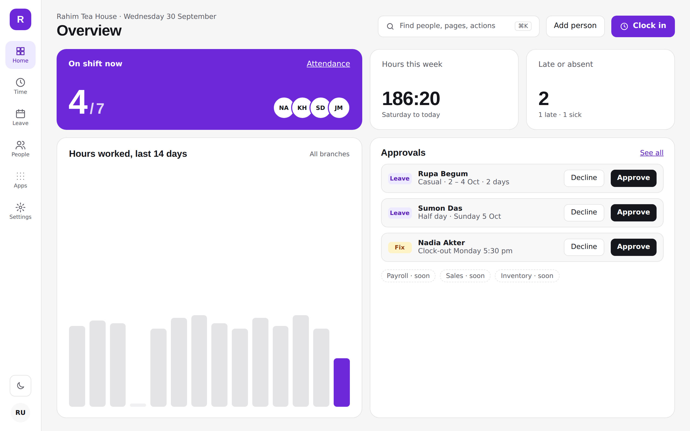
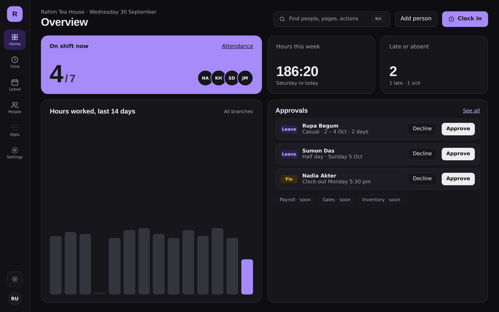
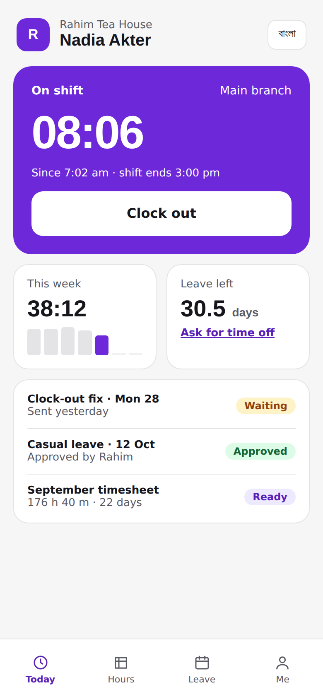
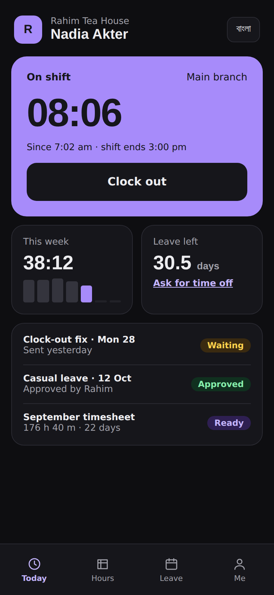

# Atlas: the chosen design (September 2026)

The owner picked direction C (Atlas) from `../directions/`, with two changes:

- **White mode is the default**; dark mode is an option (toggle in the app rail, and
  follows the system setting until the person chooses).
- **No neon green and no blue.** The accent must look professional.

| | Light (default) | Dark |
|---|---|---|
| Manager |  |  |
| Staff phone |  |  |

## Accent

Candidates, each with a light and a dark value (see `accents.png`):

| Name | Light | Dark | Note |
|---|---|---|---|
| Plum (default for now) | `#6d28d9` on white text | `#a78bfa` with dark text | No clash with status colours |
| Saffron | `#b45309` | `#f59e0b` | Clashes with amber warnings |
| Garnet | `#9f1239` | `#fb7185` | Close to error red |
| Ink | `#18181b` | `#e4e4e7` | Monochrome |

The accent is one design token, so switching later is a one-line change.

## Rules

- Type: Space Grotesk for headings and big numbers, IBM Plex Sans for text, Noto Sans
  Bengali for Bangla.
- Neutrals are grey, not navy (the dark mode background is `#0e0e11`), so nothing reads blue.
- The home screen is a grid of mixed-size cards; the app rail holds the modules and an
  "Apps" launcher for the rest.
- Status colours stay separate from the accent: green = approved, amber = waiting,
  red = rejected or error.
- Every text/background pair meets WCAG AA in both modes.

The screenshots use a fallback font; the real faces load in the app.
