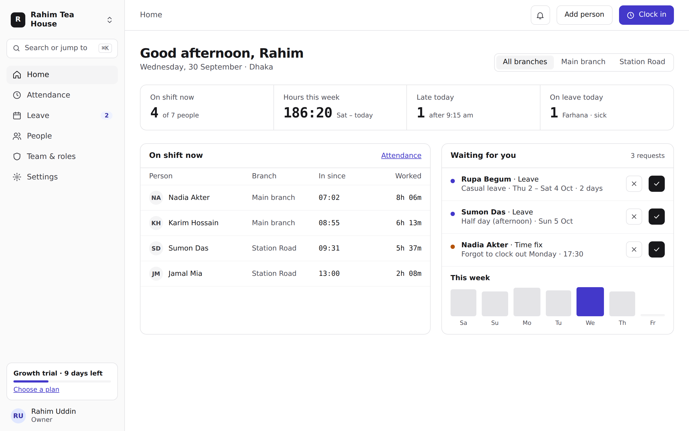
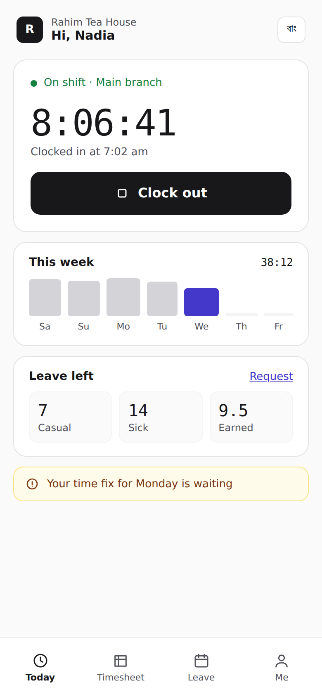
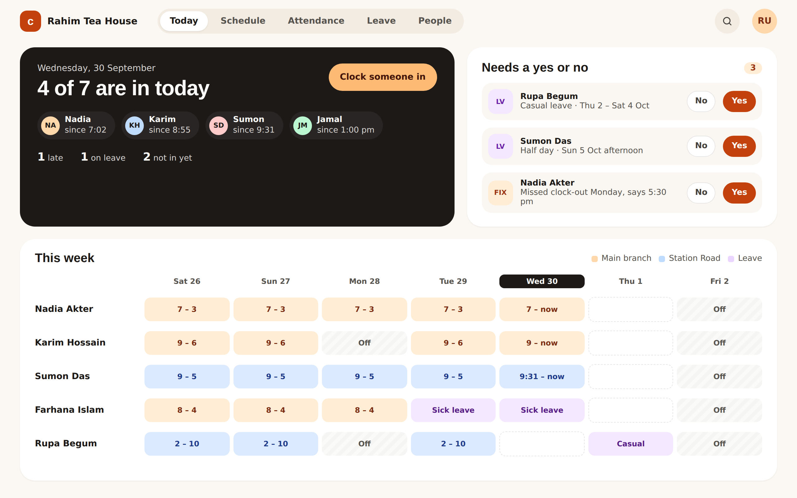
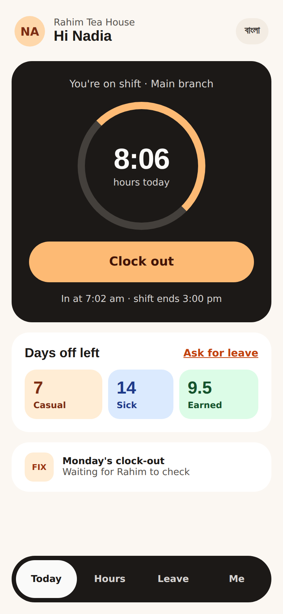
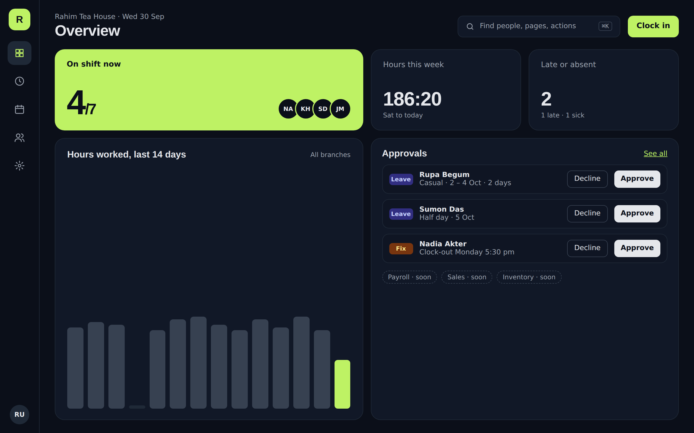
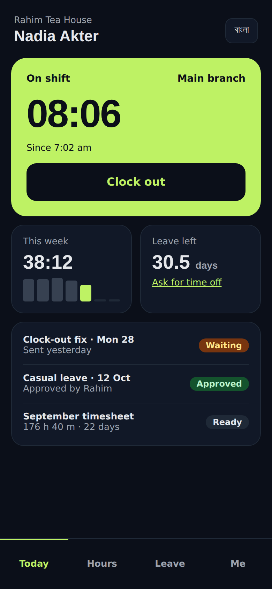

# Design directions (September 2026)

Three candidate looks to replace the first UI, which reused the ResumeX design language.
Each has a manager desktop screen and a staff phone screen, filled with the demo workspace.
References: Connecteam, Deputy, Zoho People, Odoo and HR dashboards on Dribbble.

| Direction | Feel | Desktop | Phone |
|---|---|---|---|
| A · Graphite | Calm and dense: neutral greys, one indigo accent, ⌘K search, tables |  |  |
| B · Shift | Warm and friendly: cream, burnt orange, schedule board, big touch targets |  |  |
| C · Atlas | Dark suite: navy, lime highlights, bento cards, app rail |  |  |

The screenshots use a fallback font; the intended faces are Geist (A), Bricolage Grotesque
with Figtree (B) and Space Grotesk with IBM Plex Sans (C).

Decision: C (Atlas), with a white default mode and a new accent. See `../atlas/`.
