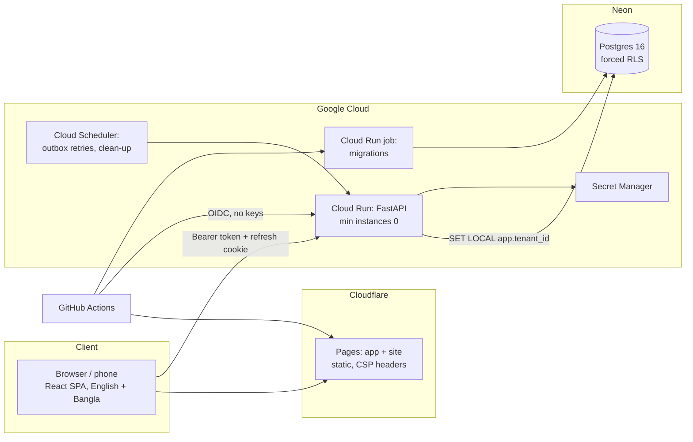

# CompanyMgmt architecture, on one page

**Request path.** The SPA holds a 10-minute access token in memory. The API checks the
session, reloads the membership and role, and binds the session to the workspace. Every
transaction then runs `set_config('app.tenant_id', …)`, and Postgres policies compare
against it. Writes that matter append to a per-workspace hash-chained audit log in the
same transaction. Emails go through a transactional outbox and are sent after commit;
anything that fails is retried by the scheduler.

**Modules.** `platform` (accounts, sessions, workspaces, roles, members, branches, plans) →
`people` → `attendance`. Higher modules may use lower ones, never the reverse (checked by
import-linter). Platform events such as "member joined" reach higher modules through
hooks.

**Data rules.** UUIDv7 ids · `timestamptz` in UTC, business dates computed in the branch's
time zone · `version` columns with `If-Match` → 412 on stale edits · exclusion constraint
so shifts never overlap · a partial unique index for one open shift per person.

**Cost.** Everything scales to zero; about $1/month with no customers (the domain), about
$6–10 at 10 workspaces, about $30–45 at 100 (estimates, plan §7.4).

**Quality gates.** ruff, mypy `--strict`, import-linter, migration drift, 105 pytest tests
(≥85% coverage gate), API contract diff, ESLint, TypeScript, Vitest, Playwright + axe,
gitleaks, pip-audit, npm audit, Trivy, CodeQL.
